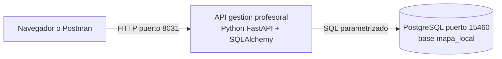
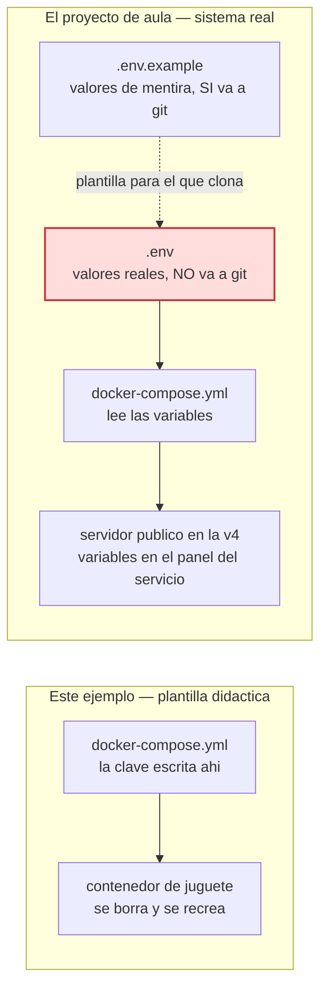
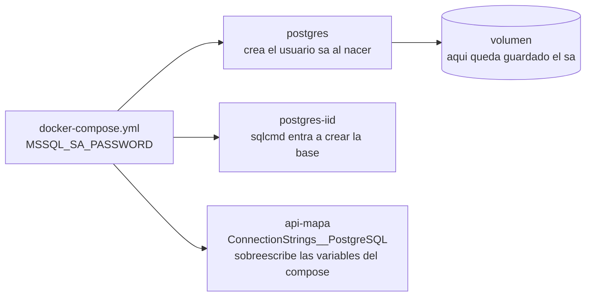
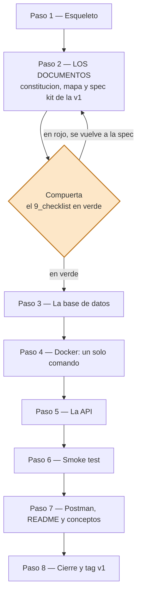
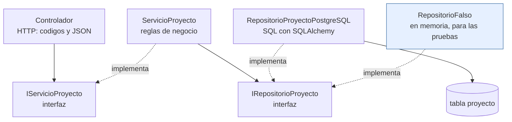
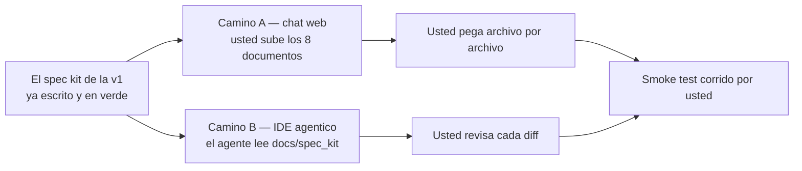

# Plan — construir la v1 del módulo Mapa de Conocimiento con la plantilla del curso

> **Qué es este documento.** El plan de trabajo para producir, en este
> repositorio, el **ejemplo de referencia** del módulo Mapa de Conocimiento: su
> versión 1 funcionando, con su spec kit completo — usando como molde
> [`proyecto_aplicacion_y_servicios_web1`](https://github.com/ccastro2050/proyecto_aplicacion_y_servicios_web1).
>
> **Nada de esto se ha ejecutado todavía.** Aquí solo está el plan, para
> revisarlo y aprobarlo antes de tocar un archivo.

---


---

> ## Antes de leer: este plan tiene un gemelo
>
> El **mismo módulo** existe en otro repositorio construido con **otro
> lenguaje**. Los dos siguen el mismo método, escriben los mismos ocho
> documentos y se cierran con los mismos criterios de aceptación.
>
> **Eso no es repetir trabajo: es la demostración.** Si la metodología
> sirviera solo para un stack, sería una receta de ese stack. Lo que este par
> de repositorios enseña es que **el método y los contratos van por encima
> del lenguaje** — y que lo que cambia son las decisiones que cada stack
> obliga a tomar, no las reglas.
>
> Este plan es el de la versión en **Python + FastAPI + PostgreSQL**. Donde
> el gemelo tomó una decisión distinta, aquí está dicho por qué.

---

## 0. Lo que queda al terminar



Un solo comando lo levanta todo, y el CRUD completo de una tabla responde
en el navegador con su documentación interactiva.

## 1. Los insumos

| Insumo | Qué aporta |
|---|---|
| `ProyectosDeAula/docs/modulo_mapa_conocimiento.md` | El **QUÉ**: las 21 tablas, la ruta de 4 versiones, qué entra en cada una |
| `ProyectosDeAula/db_scripts/postgresql/mapa_conocimiento.pg.sql` | El **DDL**: 223 líneas, 19 `CREATE TABLE`, 19 claves foráneas |
| `ProyectosDeAula/Mapa_conocimiento/…/Base de Datos v6.xlsx` | Los **datos de referencia** de los catálogos |
| `proyecto_aplicacion_y_servicios_web1` | El **molde de método**: estructura, spec kit, guía de IA, documentos conceptuales |
| `…web2`, `…web3` y `…web4` | Cómo crece el molde: cada uno agrega **una versión** con su propia carpeta de spec kit, sin tocar las anteriores |
| `ProyectosDeAula/docs/0_METODOLOGIA.md` | Las reglas del juego: SDD por versiones, las tres compuertas, la rúbrica |

## 2. Lo que encontré al revisar los insumos

Verificado contra el `.sql` y el Excel, no es opinión:

| # | Hallazgo | Consecuencia |
|---|---|---|
| 1 | `area_conocimiento.id` está declarado `INT`, pero los datos del Excel son códigos alfanuméricos (`1A01`) | El script **no puede cargar sus propios datos**. Arrastra a `estudio_ac`, que lo referencia |
| 2 | `area_conocimiento.disciplina` es `VARCHAR(60)`; el valor más largo tiene **124** caracteres | Desborda |
| 3 | Ninguna de las 18 tablas del módulo tiene columna `activo` (solo `rol` y `usuario`) | La metodología y la rúbrica exigen **borrado lógico** |
| 4 | El `.sql` no trae **ni un `INSERT`** | Sin semillas no hay smoke test verificable |
| 5 | El catálogo trae **`Cienias Naturales`** —sin la `c`— en 48 de las 218 filas | Se vería así en cada listado y en cada informe |
| 6 | **El Excel tiene 191 proyectos, pero solo cuatro de las once columnas de la tabla** —y seis de las que faltan no admiten nulos: `nivel`, `fecha_creacion`, `numero_cohortes`, `cant_graduados`, `fecha_actualizacion` y `ciudad` | **No se puede sembrar sin inventar datos.** La tabla de la v1 arranca vacía |
| 7 | **Las fechas están declaradas `VARCHAR(45)`, no `DATE`** | La base no puede ordenar ni comparar fechas. La v1 no lo necesita; queda como deuda anotada |
| 8 | **`proyecto.facultad` es un `INT` que apunta a una tabla que no existe en este módulo** | No hay integridad referencial que imponer: es un número más |
| 9 | Tres de las cinco tablas de la v1 no tienen hoja en el Excel: `termino_clave`, `linea_investigacion` y `red` | Solo `area_conocimiento` se puede sembrar |

> Los hallazgos no son estorbos: son **material didáctico**. Son
> ambigüedades y defectos reales que se resuelven en la **compuerta 1** y
> quedan registrados como Clarificaciones en `2_spec.md`, con su razón.
> Los dos últimos son especialmente interesantes, porque la decisión
> correcta fue **no corregirlos**: el esquema es artefacto dado y esta
> versión no necesita ni aritmética de fechas ni esa integridad.

## 3. Decisiones que hay que tomar antes de empezar

| # | Decisión | Recomendación |
|---|---|---|
| A | ¿Se corrigen los cuatro defectos del `.sql` (tipos, tamaños y `activo`)? | **Sí.** Sin las tres primeras la BD no carga su Excel; sin `activo` la v1 contradice su propia rúbrica. Cada corrección queda documentada en la cabecera del script y como Clarificación |
| B | Alcance de la v1 | **Una sola tabla sin clave foránea: la que más campos tiene.** Ver la sección 3.1 |
| C | Dónde vive el ejemplo | **En la raíz de este repositorio**, con la misma forma que `aplicacion_y_servicios_web1`. `ProyectosDeAula/` se queda intacta: los estudiantes ya la conocen |
| D | Stack | El mismo del molde: **Python / FastAPI 10 + SQLAlchemy + PostgreSQL**, sin ORM y con el SQL a la vista |

### 3.1 La v1 son cinco tablas; el ejemplo construye `proyecto`

Dos cosas distintas que conviene no mezclar:

| | Alcance |
|---|---|
| **La versión 1** (lo que especifica el spec kit) | Las **5 tablas sin clave foránea**, con su CRUD completo |
| **Este ejemplo** (lo que trae el código) | **Una** de esas cinco, construida de punta a punta |

**Cuál se construye.** La de **más campos**, para que el CRUD tenga
sustancia — y aquí la diferencia es enorme:

| Tabla sin FK | Campos | Filas de semilla |
|---|---|---|
| **`proyecto`** | **11** | 0 (el Excel trae 191, pero incompletos — hallazgo 6) |
| `area_conocimiento` | 4 | 218 |
| `red` | 4 | 0 |
| `linea_investigacion` | 3 | 0 |
| `termino_clave` | 2 | 0 |

Gana **`proyecto`** con once campos contra cuatro. Y es, además, la tabla
más interesante de los tres módulos construidos hasta ahora:

1. **Tiene un campo opcional entre diez obligatorios** (`fecha_cierre`: un
   proyecto abierto no la tiene). Eso hace que el contraste `PUT`/`PATCH`
   sea más rico que con una tabla de campos uniformes.
2. **Arrastra dos rarezas del esquema** —fechas como texto y una referencia
   a una tabla inexistente— que obligan a decidir **no corregir**, y a
   dejarlo escrito. Saber cuándo no tocar es tan importante como saber
   corregir.
3. **`area_conocimiento` ya está construida** en el ejemplo de
   Investigación: repetirla haría que dos ejemplos fueran el mismo código.

Arranca vacía, y eso da el mismo smoke test completo que en Innovación:
**204 → crear → total 1 → borrar → 204 otra vez**.

### 3.2 La consecuencia: el ejemplo NO cierra la v1

Si la v1 son cinco tablas y el ejemplo trae una, **el ejemplo no cumple su
propia especificación**. Sus criterios quedan parcialmente en verde: los
del patrón, el borrado lógico y los códigos de respuesta pasan; los que
exigirían las cinco tablas, no. El equipo pone el tag `v1` en su propio
repositorio cuando las cinco pasen el smoke test.

## 4. Los puertos

Este proyecto usa un **bloque de puertos propio**, verificado libre para que
pueda correr **al mismo tiempo** que los ejemplos del curso (`web1` … `web4`)
sin pelearse con ninguno:

| Servicio | Puerto | Desde |
|---|---|---|
| API gestión profesoral | **8031** | v1 |
| PostgreSQL | **15460** | v1 |
| Front | **8077** | reservado para la v4 |

Quedan escritos en el artículo de convenciones de la constitución —incluido
el del front, que todavía no existe— para que ninguna versión futura los pise.

> **La regla, y aplica también a los equipos:** dos proyectos que puedan
> estar encendidos a la vez **nunca** publican el mismo puerto del host. Si
> su proyecto de aula levanta la API en el mismo puerto que el ejemplo del
> curso, el segundo que arranque falla — y el error no se parece en nada a
> un choque de puertos, así que se pierden horas buscando donde no es.

## 5. Los secretos: por qué este ejemplo los lleva a la vista y el suyo NO

Hay que decir esto antes de que alguien copie lo que no debe.

**La regla del proyecto de aula** está en la sección 5 de
`0_METODOLOGIA.md` y no admite matices: ningún secreto —la cadena de
conexión, la contraseña de la base, el secreto de firma del JWT— va
escrito en el código ni en archivos versionados. En la rúbrica, **un
secreto quemado anula el criterio de seguridad de la versión completa**.

**Y sin embargo este ejemplo va a llevar la contraseña de PostgreSQL
escrita en el `docker-compose.yml`.** A propósito, y por la misma razón
que la llevan `web1` … `web4`:

| | Este ejemplo | El proyecto de aula de ustedes |
|---|---|---|
| Qué es | Una **plantilla didáctica** | Un sistema **real** |
| Dónde corre | En su PC, en contenedores de juguete | En su PC **y en un servidor público desde la v4** |
| Quién lo ve | Quien clona el repositorio del curso | Cualquiera en internet |
| Qué se busca | Que un `git clone` y **un solo comando** basten, sin configurar nada antes | Que el sistema sea defendible |
| Los secretos | A la vista, acotados y desechables | **Variables de entorno, siempre** |

La contraseña de este ejemplo es de juguete: sirve para un contenedor que
se borra con `docker compose down -v` y se recrea idéntico. No protege
nada. Ponerla en un `.env` solo agregaría un paso antes del "un solo
comando", que es justo lo que la plantilla quiere demostrar.

**En el proyecto de aula eso no aplica**, porque en la v4 se publica. Ahí
la regla va completa desde la v1:



1. El código lee los secretos de **variables de entorno**
   (`DB_CONNECTION`, `JWT_SECRET`, …).
2. El `.env` **nunca** se sube: va en el `.gitignore` desde el primer
   commit. (En este repositorio ya está puesto, aunque el ejemplo no lo
   use: higiene desde el día uno.)
3. El repositorio **sí** incluye un `.env.example` con valores de mentira,
   para que cualquiera sepa qué configurar.
4. En el servidor de la v4, los secretos se cargan en el panel de
   variables de entorno del servicio — jamás en el código desplegado.
5. **Si un secreto se sube por error, se ROTA.** Borrarlo del último
   commit no sirve: quedó en la historia y ahí lo encuentra cualquiera.

> **La frase para clase:** de este ejemplo se copia el **método**, no las
> credenciales. Es el mismo criterio con el que un cirujano practica en un
> maniquí: la técnica es la misma, el maniquí no sangra.

### 5.1 Cómo se registra la contraseña, y cómo se cambia

La contraseña de esta plantilla es **`Aplicacionweb123!`**. PostgreSQL exige
al menos 8 caracteres y tres de las cuatro categorías —mayúscula,
minúscula, dígito y símbolo—; si no las cumple, el contenedor **no
arranca** y el error no menciona la contraseña.

No se "registra" en ninguna parte: **se le entrega al motor cuando nace.**
PostgreSQL crea el usuario `sa` con lo que encuentre en la variable
`MSSQL_SA_PASSWORD` la **primera vez** que se levanta.

```yaml
services:
  postgres:
    image: mcr.microsoft.com/mssql/server:2022-latest
    environment:
      ACCEPT_EULA: "Y"
      MSSQL_SA_PASSWORD: "Aplicacionweb123!"   # aqui NACE el usuario sa
```

De ahí viaja a otros dos lugares del mismo archivo: el contenedor
`postgres-iid` —para que `sqlcmd` pueda entrar a crear la base— y la
cadena de conexión que se le inyecta a la API:

```yaml
  api-mapa:
    environment:
      ConnectionStrings__PostgreSQL: "Server=postgres,1433;Database=mapa_local;User Id=sa;Password=Aplicacionweb123!;TrustServerCertificate=True;"
```

Ese **doble guion bajo** no es un adorno: FastAPI traduce
`ConnectionStrings__PostgreSQL` a la sección `ConnectionStrings:PostgreSQL`
del `las variables del compose` y la **sobreescribe**. Por eso el `las variables del compose`
puede quedar con un valor de desarrollo y el compose manda en tiempo de
ejecución.



#### Cómo la cambia quien clone esto — y la trampa

```powershell
# 1. edita el docker-compose.yml y pone su propia clave
# 2. y OBLIGATORIAMENTE:
docker compose down -v        # -v borra el volumen: la BD olvida el sa viejo
docker compose up -d --build
```

**Si solo cambia el compose y hace `up -d`, no funciona.** El usuario `sa`
ya existe **dentro del volumen** con la clave vieja, y `MSSQL_SA_PASSWORD`
solo se aplica cuando el motor nace. El síntoma es un `Login failed for
user 'sa'` que no dice una palabra sobre volúmenes — y todo el mundo se va
a revisar la cadena de conexión, que está bien.

#### Cómo se hace en el proyecto de aula: con variables de entorno

Tres archivos, y ningún secreto en el repositorio:

**`.env`** — en la raíz, **nunca** a git:

```
MSSQL_SA_PASSWORD=Aplicacionweb123!
```

**`.env.example`** — sí va a git, con valor de mentira:

```
MSSQL_SA_PASSWORD=CambieEstaClave123!
```

**`docker-compose.yml`** — deja de tener el valor y lo pide:

```yaml
    environment:
      MSSQL_SA_PASSWORD: ${MSSQL_SA_PASSWORD}
      ConnectionStrings__PostgreSQL: "Server=postgres,1433;Database=mapa_local;User Id=sa;Password=${MSSQL_SA_PASSWORD};TrustServerCertificate=True;"
```

**Docker Compose lee el `.env` solo**, por estar en la misma carpeta: no
hay que configurar nada. Para comprobar que resolvió bien:

```powershell
docker compose config     # muestra el compose con los valores ya puestos
```

> **Ojo con ese comando:** ahí la contraseña **sí se ve**. Sirve para
> depurar, pero esa salida no se pega en un chat, ni en una captura, ni en
> el informe. Es el mismo cuidado del comando de verificación del Paso 4,
> que la lee de la variable en vez de escribirla.

En la v4, cuando el sistema se publique, esas mismas variables se cargan en
el **panel de variables de entorno del servicio** y el `.env` no viaja a
ningún lado.

## 6. El plan, en 8 pasos



**Primero se escribe TODO lo que se va a construir, y solo después se
construye.** No hay base de datos, ni Docker, ni una línea de código antes
de que el `9_checklist.md` esté en verde. Ese es el orden del método, y es
lo que se evalúa en la rúbrica.

### Paso 1 — Esqueleto: primero las carpetas, después los archivos

Todo desde la **terminal integrada de VS Code** (*Terminal → New Terminal*,
PowerShell), parado en la raíz del proyecto.

**Las carpetas no son manía de orden: SON la arquitectura.** Por eso se
crean antes de escribir nada — la estructura queda decidida antes de
proyector, que es justo lo que evita el "después lo acomodo". Esto es lo
que debe quedar:

```
proyecto_paradigmas_mapa_conocimiento1/
├── db/                                 ← el script y su inicializador (artefacto DADO)
├── api_mapa/
│   ├── controllers/                    ← CAPA 1: HTTP — códigos de estado y JSON
│   ├── models/                     ← la frontera de entrada: valida el cuerpo → 422
│   ├── models/                        ← la entidad, lo que viaja entre capas
│   ├── servicios/                      ← CAPA 2: negocio — no conoce HTTP ni el motor
│   ├── repositorios/                   ← CAPA 3: datos — el SQL con SQLAlchemy
│   ├── excepciones/                    ← cómo el negocio avisa un 404 sin hablar de HTTP
│   └── pruebas/                        ← el servicio con un repositorio FALSO, SIN base de datos
├── docs/
│   └── spec_kit/
│       ├── 1_constitution.md           ← permanente: rige TODAS las versiones
│       └── versiones/
│           ├── 0_mapa_versiones.md     ← la ruta v1 → v4
│           └── v1_proyecto/   ← 2_spec … 8_tasks · 9_checklist · GUIA_IA1
├── postman/                            ← la colección para probar con clics
├── docker-compose.yml                  ← TODO el sistema declarado en un archivo
├── README.md
└── ProyectosDeAula/                    ← el material del curso: NO se toca
```

Las tres capas, en detalle, y las carpetas que se confunden con ellas:

| Carpeta | Qué va adentro | Papel |
|---|---|---|
| `api_mapa\Controllers` | Los endpoints | **Capa 1 — HTTP**: traduce a códigos de estado y JSON |
| `api_mapa\Peticiones` | Una clase por verbo (crear, reemplazo, actualizar) | La **frontera de entrada**: lo que valida el cuerpo y produce los 422 |
| `api_mapa\Modelos` | La entidad `Proyecto` | Lo que viaja entre capas |
| `api_mapa\Servicios` | La interfaz y las reglas de negocio | **Capa 2 — negocio**: no conoce HTTP ni el motor |
| `api_mapa\Repositorios` | La interfaz y el SQL con SQLAlchemy | **Capa 3 — datos**: no conoce HTTP |
| `api_mapa\Excepciones` | `NoEncontradoExcepcion` | Cómo el negocio avisa un 404 sin hablar de HTTP |
| `api_mapa\pruebas` | La prueba de capas | Corre el servicio con un repositorio FALSO, **sin base de datos** |
| `db` | El script y su inicializador | Artefacto **dado**: se copia, no se especifica |
| `docs\spec_kit` | La constitución y las versiones | La fuente de verdad del proyecto |
| `postman` | La colección | Probar los endpoints con clics |

Primero el esqueleto de carpetas, con la misma forma que el molde:

```powershell
mkdir db, postman,
      api_mapa\Controllers, api_mapa\Modelos,
      api_mapa\Peticiones, api_mapa\Servicios,
      api_mapa\Repositorios, api_mapa\Excepciones,
      api_mapa\pruebas,
      docs\spec_kit\versiones\v1_proyecto
```

Y ahora los **archivos vacíos**, que se irán llenando en los pasos
siguientes. Crearlos de una vez tiene una ventaja concreta: el árbol
completo queda a la vista en VS Code desde el minuto uno, y nadie inventa
rutas nuevas a mitad de camino.

```powershell
# raíz del proyecto
#   (si su repositorio ya trae .gitignore y .gitattributes, no los cree:
#    ajústeles el contenido — ver más abajo)
New-Item -ItemType File docker-compose.yml, README.md

# la base de datos (paso 2)
New-Item -ItemType File db\investigacion.sql, db\iid.sh

# la API (paso 5)
New-Item -ItemType File `
  api_mapa\ApiMapa/requirements.txt, api_mapa\Dockerfile,
  api_mapa\main.py, api_mapa\las variables del compose,
  api_mapa\Modelos\Proyecto.py,
  api_mapa\Peticiones\ProyectoCrear.py,
  api_mapa\Peticiones\ProyectoReemplazo.py,
  api_mapa\Peticiones\ProyectoActualizar.py,
  api_mapa\Repositorios\IRepositorioProyecto.py,
  api_mapa\Repositorios\RepositorioProyectoPostgreSQL.py,
  api_mapa\Servicios\IServicioProyecto.py,
  api_mapa\Servicios\ServicioProyecto.py,
  api_mapa\Controllers\ProyectoController.py,
  api_mapa\Excepciones\NoEncontradoExcepcion.py,
  api_mapa\pruebas\PruebaCapas/requirements.txt,
  api_mapa\pruebas\Proyecto.py

# el spec kit (pasos 3 y 4)
New-Item -ItemType File `
  docs\spec_kit\1_constitution.md,
  docs\spec_kit\versiones\0_mapa_versiones.md,
  docs\spec_kit\versiones\v1_proyecto\2_spec.md,
  docs\spec_kit\versiones\v1_proyecto\3_plan.md,
  docs\spec_kit\versiones\v1_proyecto\4_research.md,
  docs\spec_kit\versiones\v1_proyecto\5_data_model.md,
  docs\spec_kit\versiones\v1_proyecto\6_contracts.md,
  docs\spec_kit\versiones\v1_proyecto\7_quickstart.md,
  docs\spec_kit\versiones\v1_proyecto\8_tasks.md,
  docs\spec_kit\versiones\v1_proyecto\9_checklist.md,
  docs\spec_kit\versiones\v1_proyecto\GUIA_IA1.md

# la colección de pruebas (paso 7)
New-Item -ItemType File postman\coleccion_v1.postman_collection.json
```

> **Dos detalles de PowerShell que ahorran un rato:** el acento grave
> (`` ` ``) al final de una línea significa "el comando sigue abajo"; y
> `-ItemType File` es obligatorio — sin él, PowerShell se queda preguntando
> qué tipo de elemento quiere crear.

#### Los dos archivos de configuración de Git, y por qué importan aquí

`.gitignore` y `.gitattributes` se suelen despachar como trámite: se copian
de cualquier lado y listo. Para un proyecto .NET que corre en contenedores
eso no alcanza, y **las dos cosas que faltan cuando se copian sin pensar
son de las que hacen perder una tarde entera**.

**`.gitattributes` — cómo guarda Git los finales de línea.** Windows
termina cada renglón con dos caracteres (CR LF) y Linux con uno (LF). Da
igual… hasta que un archivo escrito en Windows se ejecuta dentro de un
contenedor Linux. Este proyecto tiene exactamente ese caso:
**`db/iid.sh`**, el inicializador de PostgreSQL. Si Git lo entrega con
finales de Windows, el contenedor responde:

```
/bin/bash^M: bad interpreter: No such file or directory
```

Un error que no se parece en nada a su causa, y que manda al estudiante a
buscar el problema en Docker o en el script. La línea que lo previene:

```gitattributes
# Normalizar finales de línea: en el repositorio siempre LF
* text=auto

# Los scripts de bash DEBEN ir con LF (corren dentro de contenedores Linux)
*.sh text eol=lf

# La documentación también, para que los diff no se llenen de ruido
*.md text eol=lf
```

**`.gitignore` — lo que NUNCA entra al repositorio.** Tres familias:

```gitignore
# 1. Compilados de .NET: los genera 'python -m compileall', jamás se versionan
bin/
obj/

# 2. Basura de IDE y borradores personales
*.user
.vs/
*.session.sql
Thumbs.db

# 3. SECRETOS: el archivo de variables de entorno nunca se sube
.env

# Lo que ya estaba: los originales del profesor no se publican
ProyectosDeAula/docs/_originales_no_subir/
```

> **Sobre el `.env`, y esto hay que decirlo en voz alta:** este ejemplo
> lleva la contraseña de la base de datos **escrita en el
> `docker-compose.yml`**, igual que los repositorios del curso, y eso es
> **solo por didáctica** — para que un `git clone` y un comando basten. A
> los equipos el método les exige lo contrario: cadena de conexión y
> `JWT_SECRET` por variables de entorno, `.env` en el `.gitignore` y un
> `.env.example` en el repositorio. **Esa parte del ejemplo no se copia.**

**Verificación:** deben quedar **14 carpetas** y **32 archivos nuevos** en
0 bytes, más los dos archivos de configuración actualizados. `git status`
los debe listar a todos. Si algún archivo nuevo trae contenido, se ejecutó
de más.

### Paso 2 — Los documentos: primero se escribe lo que se va a construir

**Ni una línea de código, ni un contenedor, ni una tabla.** En este paso
solo se llenan archivos `.md`, y salen de la documentación del proyecto de
aula: `modulo_mapa_conocimiento.md` dice el QUÉ y `0_METODOLOGIA.md` dice CÓMO
se trabaja.

| Archivo | De dónde sale |
|---|---|
| `docs/spec_kit/1_constitution.md` | Las reglas permanentes: stack, las tres capas con interfaces, español, **borrado lógico**, la regla de secretos (§5), un solo comando y los puertos (§4) |
| `docs/spec_kit/versiones/0_mapa_versiones.md` | La ruta v1→v4 que ya define `modulo_mapa_conocimiento.md`, con el estado de cada versión |
| `v1_proyecto/2_spec.md` | El QUÉ de la v1: propósito, alcance con su NO incluye, requisitos, criterios medibles, **Clarificaciones** y definición de TERMINADA |
| `…/3_plan.md` | El CÓMO: estructura, diseño de las capas y el **Chequeo de constitución** |
| `…/4_research.md` | Las decisiones, cada una con la alternativa que se descartó |
| `…/5_data_model.md` | La tabla con sus columnas ya corregidas, las semillas exactas y quién tiene prohibido escribir qué |
| `…/6_contracts.md` | Los endpoints con TODOS sus códigos de respuesta, incluidos los de error |
| `…/7_quickstart.md` | El arranque y el smoke test, comando por comando |
| `…/8_tasks.md` | Las fases de construcción, cada una con su "Verificar:" |
| `…/9_checklist.md` | La lista con la que se revisa esta spec antes de proyector |
| `…/GUIA_IA1.md` | Cómo reconstruir la v1 con ayuda de IA |

Las **tres compuertas** quedan puestas aquí:

- **Clarificaciones** en `2_spec.md`: los hallazgos **1, 2 y 4** de la
  sección 2 —los que tocan a `proyecto`— cada uno con su
  pregunta, su respuesta y su razón. Ninguna inventada. Los hallazgos 3, 6
  y 7 quedan anotados para las versiones que usen esas tablas.
- **Chequeo de constitución** en `3_plan.md`, artículo por artículo.
- **`9_checklist.md`**, para firmar antes de proyector.

> **¿Y los números del smoke test, si la base de datos todavía no existe?**
> Salen del Excel de referencia, que ya se revisó: 218 áreas de
> conocimiento, 17 ODS, 21 áreas de aplicación y 6 universidades. Se
> escriben en la spec porque **están verificados en la fuente**, y el Paso
> 4 los confirma contra la base ya cargada. Escribir cifras sin haberlas
> mirado sería justo lo que el método prohíbe.

**Verificación:** el `9_checklist.md` pasa en verde y lo firma una persona.
**Este es el paso que hay que revisar antes de seguir**, y el único que no
se puede saltar: si la spec está mal, el error se multiplica en todo lo que
viene después.

### Paso 3 — La base de datos

Recién ahora se toca el motor, y solo para escribir dos archivos.
`db/init.sql` = el DDL dado **+ las cuatro correcciones +
`activo`** en las 18 tablas del módulo **+ las semillas del Excel**, con
cada corrección documentada en la cabecera del propio script. Más
`db/iid.sh`, el inicializador.

> La base de datos se crea **completa, con sus 21 tablas**, aunque la v1
> solo toque una. Es la regla del molde: la BD es infraestructura **dada**
> y lo que crece por versiones es la API. Lo que la spec sí prohíbe es que
> el código de la v1 **nombre** cualquier otra tabla.

**Verificación:** el script se lee de arriba abajo y sus conteos declarados
coinciden con los que el `5_data_model.md` escribió en el Paso 2. Todavía
no se ejecuta nada: eso es el Paso 4.

### Paso 4 — Docker: un solo comando

`docker-compose.yml` con los tres servicios: PostgreSQL, el inicializador y
la API.

> **Este es el primer paso que EJECUTA algo, y ahí está lo que se juega.**
> Hasta aquí todo fue escribir: la spec dice "218 filas" porque ese número
> se leyó en el Excel, y el script dice "218" porque así se generó. Son dos
> promesas que **nadie ha comprobado contra un motor encendido**.
>
> Cuando este paso corra, esas promesas se vuelven un hecho — o se caen. Y
> si se caen, se cae aquí: **antes de que exista una sola línea de código
> que las dé por ciertas**. Un error en el script descubierto en la Fase 5,
> con la API a medio construir, cuesta diez veces más.

Un detalle de PostgreSQL que vale la pena explicar: **no ejecuta los
scripts que uno le monte** — alguien tiene que conectarse al motor y
correrlos. Por eso existe `postgres-iid`: un contenedor que espera a que
el motor **responda consultas** (no que "exista"), crea la base si no
existe, corre el script y se muere. Es idempotente: correrlo mil veces no
daña nada.

El compose de esta fase declara **solo los dos servicios de base de
datos** — la API entra en el Paso 5, cuando exista su `Dockerfile`. Por
eso el comando es el de siempre, sin nombrar nada:

```powershell
docker compose up -d --build

# ¿quedaron las 21 tablas y los datos?
#   La clave NO se escribe en el comando: se toma de la variable que el
#   propio contenedor ya tiene. Por eso va entre comillas simples y
#   ejecutada por el bash de adentro — si se pusiera en comillas dobles,
#   PowerShell intentaría resolverla aquí afuera, donde no existe.
docker compose exec postgres bash -c '/opt/mssql-tools18/bin/sqlcmd `
  -S localhost -U sa -P "$MSSQL_SA_PASSWORD" -C -d mapa_local `
  -Q "SELECT ''proyecto'' t, COUNT(*) n FROM proyecto
      UNION ALL SELECT ''ODS'', COUNT(*) FROM objetivo_desarrollo_sostenible
      UNION ALL SELECT ''area_aplicacion'', COUNT(*) FROM area_aplicacion
      UNION ALL SELECT ''universidad'', COUNT(*) FROM universidad"'
```

**Verificación:** ese comando debe responder **218 · 17 · 21 · 6**, los
mismos números que la spec escribió en el Paso 2. Si uno no cuadra, el paso
no está terminado.

#### Antes de correrlo: hágale espacio

**PostgreSQL pide alrededor de 2 GB de RAM** y tarda entre 30 y 60
segundos en responder consultas. No es un motor liviano, y si la máquina
anda apretada el contenedor **se reinicia solo en un bucle** — con un
error en los registros que habla de memoria, no de su proyecto.

```powershell
docker ps                    # ¿qué hay encendido ahora mismo?
docker compose down          # ejecútelo DENTRO de cada proyecto que sobre
```

Bajar un proyecto **no borra sus datos**: viven en su volumen y vuelven
intactos al siguiente `up`. Lo que sí borra es `down -v`, y eso es otra
cosa.

Si aun así se reinicia, revise cuánta memoria le concedió a Docker
Desktop: *Settings → Resources*. Con menos de 4 GB asignados, PostgreSQL
va a sufrir.

**Y si algo falla**, la tabla de síntomas y causas probables está en
[`7_quickstart.md`](docs/spec_kit/versiones/v1_proyecto/7_quickstart.md)
§4 — no hay que adivinar: ese documento se escribió justo para este
momento.
>
> **Y una costumbre que sí se copia:** aunque esta plantilla tenga la
> contraseña a la vista en el `docker-compose.yml` (la excepción de la
> sección 5), **el comando no la repite**: la lee de la variable de
> entorno del contenedor. Escribir un secreto en un comando lo manda al
> historial de la terminal, a las capturas de pantalla y a los apuntes de
> quien esté mirando. Cuesta lo mismo hacerlo bien.

### Paso 5 — La API
Python / FastAPI + SQLAlchemy, capas con interfaces, para `proyecto`: el modelo, las tres peticiones (crear / reemplazo / actualizar), la interfaz y el repositorio, la interfaz y el servicio, y el controlador con los siete endpoints. Más `main.py` con el ensamblador, `Dockerfile` y el proyecto `pruebas/` con un repositorio falso en memoria. **Unos 12 archivos**, no 45: esa es la ganancia de haber escogido una sola tabla.


Las flechas son las **únicas** dependencias permitidas. Y fíjese en el
repositorio falso: como el servicio solo conoce la interfaz, se le puede
enchufar uno de mentiras y probarlo **sin base de datos**. Eso es lo que
demuestra que las capas están de verdad desacopladas.

```powershell
python -m compileall api_mapa
uvicorn --project api_mapa\pruebas
```

**Verificación:** compila, y la prueba de capas corre **sin** base de datos.

### Paso 6 — Un solo comando y smoke test real
```powershell
docker compose up -d --build

curl http://localhost:8031/                                  # diagnostico: version v1
curl http://localhost:8031/api/proyecto             # total: 218
curl "http://localhost:8031/api/proyecto?limite=3"  # exactamente 3
curl http://localhost:8031/api/proyecto/1A01        # una fila
curl -i http://localhost:8031/api/proyecto/9Z99     # 404 con mensaje claro
```

Y la pareja que enseña la diferencia entre los dos verbos de actualización:
un `PUT` sin uno de los campos responde **422**, y el **mismo** cuerpo
enviado por `PATCH` responde **200**.

**Verificación:** los criterios de aceptación en verde, con la salida real
pegada — no de palabra.

### Paso 7 — Material de apoyo
Colección de Postman, `README.md` con el arranque en un comando, y los documentos conceptuales del curso adaptados (mismo stack: solo cambian nombres y puertos).

### Paso 8 — Cierre
`9_checklist.md` firmado, commit, **tag `v1`** y push.

```powershell
git add -A
git commit -m "v1: CRUD de proyecto con capas e interfaces"
git tag v1
git push origin main --tags
```

**Verificación:** el tag `v1` aparece en GitHub y el repositorio clonado en
limpio levanta con un solo comando.

## 7. El prompt para construir la v1

El paso 5 no se hace a pulso: se construye con IA, **siguiendo la spec**.
Hay dos caminos y el prompt cambia según cuál se use. En ambos vale la
misma regla: la IA propone, usted verifica.



### 7.1 Camino A — chat web (Gemini, DeepSeek, ChatGPT…)

Se le suben **8 documentos**: `1_constitution.md` y los siete de
`v1_proyecto/` (`2_spec` a `8_tasks`). El `9_checklist.md` **no**
se sube: es la lista con la que usted revisó la spec, no material para la
IA. Y `db/init.sql` tampoco: ya está hecho y se copia tal cual.

```text
Actúa como mi asistente de proyectoción para construir la VERSIÓN 1 de un
proyecto universitario, partiendo de cero. Te adjunto 8 documentos: una
constitución (reglas permanentes) y el spec kit de la versión 1 (spec,
plan, research con las decisiones, modelo de datos, contratos, quickstart
y tareas).

El proyecto es Python sobre FastAPI + PostgreSQL, con SQLAlchemy y
el SQL escrito a mano — así lo fija 3_plan.md. Si en tu respuesta aparece
OTRO lenguaje o framework, significa que no leíste los adjuntos: detente y
dímelo en vez de continuar.

REGLAS DE TRABAJO (no negociables):

1. La especificación manda. No agregues NADA que los documentos no pidan:
   ni paquetes extra, ni Entity Framework, ni tablas de más, ni "mejoras"
   de tu cosecha. Si crees que falta algo, o si un documento admite dos
   lecturas, PREGÚNTAME antes: no lo resuelvas por tu cuenta ni "asumas"
   nada. Yo anotaré la respuesta en la sección de Clarificaciones de mi
   2_spec.md.
2. Vamos a seguir 8_tasks.md FASE POR FASE, en orden. En cada fase:
   a. Me explicas en 3-5 líneas qué vamos a hacer y por qué.
   b. Me entregas los archivos DE A UNO: primero la ruta exacta y el
      contenido COMPLETO de UN solo archivo, con los comentarios en
      español que exige la constitución: explican POR QUE está hecho así,
      no qué hace cada palabra del lenguaje. Esperas mi "listo"
      y solo entonces me das el siguiente.
   c. Al cerrar la fase me dices su comando de verificación y qué salida
      esperar.
   NOTA: la estructura de carpetas y los archivos vacíos YA EXISTEN en mi
   proyecto — no me des comandos para crearlos; tu trabajo es dictarme el
   CONTENIDO de cada archivo.
3. Los errores NO nos frenan. Si te pego un error, lo diagnosticas y me
   das el archivo completo corregido; si no sale rápido, seguimos con las
   fases siguientes y lo retomamos al final. Al terminar todas las fases
   me guías para correr el smoke test de 7_quickstart.md y corregimos
   juntos lo que salga.
4. La base de datos YA VIENE DADA en db/init.sql + db/iid.sh —
   se montan tal cual en el compose; no escribas ni modifiques SQL de
   creación de tablas. OJO: el docker-compose.yml TODAVÍA NO EXISTE y
   escribirlo es tu primera tarea (Fase 0). La tabla proyecto ya
   tiene sus 218 filas y su llave primaria es un CÓDIGO DE TEXTO (por
   ejemplo '1A01'), no un entero.
5. El borrado es LÓGICO: DELETE marca activo = FALSE, y los listados filtran
   los inactivos. Nunca se borra la fila.
6. El código debe cumplir 6_contracts.md al pie de la letra: mismos
   verbos, mismas rutas, mismos códigos de estado y formatos de respuesta,
   incluido el contraste PUT (reemplazo completo → 422 si falta un campo)
   vs PATCH (parcial → 200 con el mismo cuerpo).
7. Todo en español: nombres, comentarios y mensajes.
8. Trabajo en Windows con VS Code (terminal integrada de PowerShell) y
   Docker Desktop. Dame los comandos para ese entorno. La API publica el
   puerto 8031 y PostgreSQL el 15460.

Al final, la versión 1 está TERMINADA solo cuando pasan los criterios de
aceptación de 2_spec.md, verificados con el smoke test de 7_quickstart.md.

Empieza: resume en máximo 10 líneas qué vamos a construir (para confirmar
que entendiste el alcance) y luego arranca con la Fase 0.
```

### 7.2 Camino B — IDE agéntico (Antigravity, Cursor, Claude Code…)

Aquí no se sube nada: el agente **lee la carpeta**. El prompt es más corto
porque el contexto ya está en el disco.

```text
Construye la VERSIÓN 1 de este proyecto.

Primero lee, en este orden, los documentos que están bajo docs/spec_kit/
(1_constitution.md en la raíz; los demás en versiones/v1_proyecto/):
1_constitution, 2_spec, 3_plan, 4_research, 5_data_model, 6_contracts,
7_quickstart y 8_tasks. Después resume en máximo 10 líneas qué vas a
construir y espera mi confirmación antes de tocar nada.

El código va en api_mapa/ según la estructura de 3_plan.md.
docs/ y db/ son SOLO LECTURA: no los modifiques. La base de datos YA VIENE
DADA en db/init.sql + db/iid.sh — úsalos tal cual para montar
PostgreSQL. OJO: el docker-compose.yml todavía NO EXISTE y escribirlo es
tu primera tarea (Fase 0).

REGLAS (no negociables):

1. La especificación manda. No agregues nada que los documentos no pidan.
   Si crees que falta algo, o si un documento admite dos lecturas,
   PREGÚNTAME antes: no lo resuelvas por tu cuenta ni "asumas" nada. Yo
   anotaré la respuesta en la sección de Clarificaciones de 2_spec.md.
2. Sigue 8_tasks.md fase por fase. Al terminar cada fase EJECUTA su
   verificación, muéstrame la salida real, y espera mi OK antes de seguir.
3. El borrado es LÓGICO (activo = FALSE) y los listados filtran inactivos.
4. Cumple 6_contracts.md al pie de la letra, incluido PUT=422 vs
   PATCH=200 con el mismo cuerpo.
5. Todo en español, Python sobre FastAPI con SQLAlchemy y el SQL a
   la vista. API en el puerto 8031, PostgreSQL en el 15460.
6. Al final, corre el smoke test completo de 7_quickstart.md y muéstrame
   la evidencia de cada criterio de aceptación. La versión no está
   terminada hasta que todos estén en verde.
```

> **Lo que hay que vigilar, en los dos caminos.** Cuando la IA diga "asumo
> que…" o "por defecto voy a…", **párela**. Eso no es un detalle de
> implementación: es una ambigüedad de la especificación disfrazada. Se
> decide, y la respuesta se escribe en las Clarificaciones de `2_spec.md`
> — no solo en el chat. El chat se cierra; la spec queda.

### 7.3 Cómo se ajusta el prompt — y cuándo no se toca

El prompt no se corrige cada vez que la IA falla. Cada error tiene **uno
de tres destinos**, y confundirlos es lo que arruina un prompt:

| Si el error es… | La corrección va a… | Cómo se reconoce |
|---|---|---|
| **La IA no podía saberlo**: la spec no lo dice, o lo dice de dos maneras | **La spec**, como una Clarificación nueva | Usted mismo duda al contestarle. Si tiene que pensar la respuesta, no estaba escrita |
| **La spec lo dice, la IA lo ignoró — y vuelve a pasar** | **El prompt** | Se repite con otra IA, en otro chat, después de empezar de cero |
| **La spec lo dice claro y la IA falló una vez** | **Usted**: le señala el documento y sigue | Al corregirlo, no vuelve a ocurrir |

**La prueba del segundo destino es la repetición:** si el error aparece
con otra IA y en otro chat empezando de cero, la causa está en lo que se
le dio. Si no vuelve a aparecer, era ruido.

> Si por cada tropiezo se agrega una regla, el prompt termina con treinta
> y deja de leerse. **Un prompt que crece sin control dejó de funcionar.**

**El cuarto camino, que nunca se toma:** arreglar el código para que
funcione sin tocar la spec ni el prompt. Eso deja el documento diciendo
una cosa y el sistema haciendo otra.

#### Cómo se prueba, y cómo queda registrado

1. Se le entregan a una IA los 8 documentos y el prompt tal cual, **sin
   ayudarla**: cualquier aclaración que uno le dé por fuera falsea la
   prueba, porque el estudiante no la va a tener.
2. Se anota cada diferencia con lo que la spec pedía, y se clasifica en
   uno de los tres destinos.
3. **Los cambios al prompt se hacen citando la evidencia**: "esto se
   agregó porque en la prueba del tal día, la IA hizo tal cosa". Un cambio
   sin evidencia es una corazonada, y las corazonadas son las que inflan
   los prompts.
4. El resultado queda en un **informe de la prueba**, en el repositorio.
   No en un chat: los chats se cierran.

## 8. Qué se copia, qué se adapta y qué se escribe de cero

Si de todo este plan hay que quedarse con una sola tabla, es esta:

| Se copia tal cual | Se adapta | Se escribe de cero |
|---|---|---|
| La estructura de carpetas · `9_checklist.md` · la `GUIA_IA1.md` · los documentos conceptuales · `.gitignore` | `1_constitution.md` (stack y convenciones) · `0_mapa_versiones.md` (las 4 versiones del módulo) · `docker-compose.yml` (nombres y puertos) | `2_spec` … `8_tasks` de la v1 · `db/init.sql` · toda la API |

**El mensaje:** del repositorio del curso se replica el **método**, no el
contenido. La carpeta `api_facturas/` es lo de menos; lo que se copia es
`docs/`.

## 9. Riesgos

- **El paso 5 es el largo** (~45 archivos). Conviene revisar el paso 4 antes, porque un error en la spec se multiplica por seis tablas.
- **Las semillas pueden traer sorpresas** además de las ya detectadas (tildes, filas fantasma). Los conteos se verifican contra el documento del módulo y **cualquier diferencia se reporta, no se acomoda**.
- **Los secretos**: este ejemplo lleva la contraseña a la vista, como plantilla didáctica que es (sección 5). El riesgo real es que alguien copie **esa** parte: por eso la excepción queda escrita en la constitución del ejemplo, en el `README.md` y en el propio `docker-compose.yml`, no solo aquí.

## 10. Dónde vamos

**La v1 está TERMINADA y etiquetada `v1`.** Los criterios de aceptación se
verificaron contra el sistema corriendo, no de palabra.

| Paso | Estado |
|---|---|
| 1 — Esqueleto | ✅ hecho |
| 2 — Los documentos | ✅ hecho |
| 3 — La base de datos | ✅ hecho |
| 4 — Docker | ✅ hecho — `docker compose up -d --build` |
| 5 — La API | ✅ hecho — 3 capas con interfaces |
| 6 — Smoke test | ✅ **todos los criterios en verde** |
| 7 — Material de apoyo | ✅ hecho |
| 8 — Cierre y tag `v1` | ✅ hecho |

## 11. Lo que cambió respecto al gemelo, y por qué

Tres decisiones **las obligó el stack**, y ninguna se tomó "porque sí":

| | En el gemelo | Aquí | La razón |
|---|---|---|---|
| El borrado lógico | `activo BIT`, se compara con `1` | **`activo BOOLEAN`**, se compara con `TRUE` | Es el tipo de este motor. Calcar el de otro dialecto porque "así estaba" es como se acumulan las rarezas que después nadie sabe explicar |
| El arranque de la base | Un contenedor **inicializador** que se conecta y corre el script | **Nada**: el script se monta y el motor lo ejecuta solo | PostgreSQL corre lo que encuentre en `docker-entrypoint-initdb.d` la primera vez. Menos piezas para el mismo resultado |
| El acceso a datos | Un micro-ejecutor sobre el cliente del motor | **SQLAlchemy en modo Core**, con `text()` | En los dos casos **el SQL se escribe a mano**. Lo que NO se usa, ni allá ni aquí, es un ORM: el punto del curso es ver ese SQL |

Y una cuarta que **no la obligó el stack sino el sistema operativo**:

> **Los nombres de contenedor también son únicos.** Al levantar esto por
> primera vez, Docker lo rechazó: el nombre ya lo usaba el gemelo. **Es la
> misma regla de los puertos**, y no la teníamos escrita. Los contenedores de
> aquí llevan el prefijo `paradigmas-mapa-`, y la regla quedó en las convenciones
> de la constitución.

**Lo único que queda abierto, y a propósito:** el `9_checklist.md` está sin
firmar. Ese documento dice que **las casillas las marca una persona**, y esa
firma no la puede poner quien construyó.
