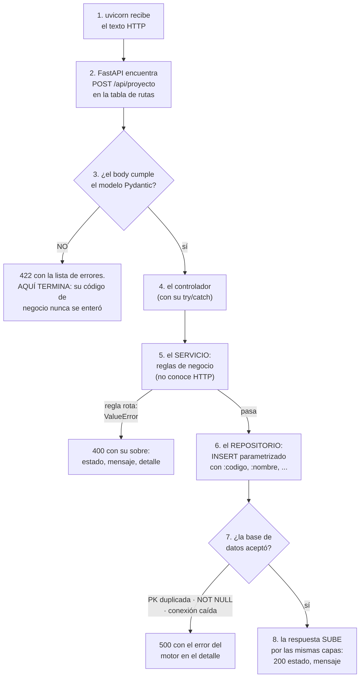
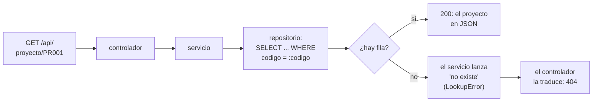

# El flujo de una petición — dónde está el GET, quién captura el body

> Documento para leer CON el código abierto. Responde las preguntas que todo
> el mundo se hace la primera vez: ¿dónde "está" el GET? ¿quién captura el
> body del POST? ¿cómo termina ejecutándose mi función del controller?

---

## 1. Lo primero: el verbo NO lo pone su código — lo manda el cliente

Cuando el navegador (o PowerShell, o Swagger) hace una petición, por la red
viaja un texto que empieza así:

```
GET /api/proyecto HTTP/1.1          ← un GET: verbo + ruta, sin body
```

```
POST /api/proyecto HTTP/1.1         ← un POST: verbo + ruta...
Content-Type: application/json

{"codigo":"PR009","nombre":"Webcam","stock":10,"valorunitario":350000}   ← ...y body
```

El verbo (GET, POST, PUT, PATCH, DELETE) **viene de afuera**. Su código no
lo declara: lo **registra** para que el framework sepa a quién llamar.

> El navegador solo sabe mandar GET desde la barra de direcciones. Para
> mandar POST/PUT/PATCH/DELETE se usa Swagger (`/docs`), PowerShell
> (`Invoke-RestMethod`), `curl` o la colección de Postman de `postman/`.

## 2. ¿Dónde está el GET? En el DECORADOR

En FastAPI usted no compara el verbo — lo **declara** con un decorador, y el
framework hace la comparación por dentro:

```python
@router.get("/proyecto")            # ← ESTO es "el GET de la colección"
async def listar_proyectos(limite: int = 1000):
    ...

@router.post("/proyecto")           # ← y ESTO es "el POST"
async def crear_proyecto(proyecto: Proyecto):
    ...
```

El decorador registra la pareja **(verbo, ruta) → función** en una tabla de
rutas. Cuando uvicorn recibe `POST /api/proyecto`, FastAPI busca esa pareja
en la tabla y llama `crear_proyecto(...)`. Su función es "el POST"
únicamente porque quedó registrada bajo ese verbo.

> Si programara **sin framework** (PHP puro, o el módulo `http` de Node),
> esa comparación la escribiría usted a mano: `if metodo == "POST" and
> ruta == "/api/proyecto": ...`. FastAPI la esconde — el decorador es
> azúcar sobre esa misma tabla de decisiones.

La cadena completa del registro está en dos archivos:

| Pieza | Archivo | Línea clave |
|---|---|---|
| Las 6 rutas de proyecto | `controllers/proyecto_controller.py` | `router = APIRouter(prefix="/api", tags=["Proyecto"])` + un decorador por endpoint |
| El router se conecta a la app | `main.py` | `app.include_router(router)` |

## 3. Las tres capturas (FastAPI las hace por la FIRMA de la función)

Aquí está la diferencia grande con programar a mano: usted no "lee" nada —
**declara parámetros tipados y FastAPI los llena** mirando de dónde viene
cada uno:

| Qué se captura | Cómo se declara | Ejemplo real |
|---|---|---|
| **Parámetro de ruta** | Aparece en la ruta entre llaves Y como argumento | `@router.get("/proyecto/{codigo}")` + `def obtener_proyecto(codigo: str)` |
| **Query string** | Argumento con valor por defecto que NO está en la ruta | `def listar_proyectos(limite: int = 1000)` captura `?limite=3` |
| **El body JSON** | Argumento tipado con un modelo Pydantic | `def crear_proyecto(proyecto: Proyecto)` |

Lo del body es lo más importante: FastAPI lee el JSON crudo, lo **valida
contra el modelo Pydantic** (tipos, obligatorios, `ge=0`) y le entrega a su
función un objeto `Proyecto` ya construido. Si el body no cumple, responde
**422 él solo** — su función del controller **jamás llega a ejecutarse**.
En un GET no hay body y no se declara ninguno.

## 4. El viaje completo de un POST, capa por capa

`POST /api/proyecto` con `{"codigo":"PR009","nombre":"Webcam","stock":10,"valorunitario":350000}`:

```
1. uvicorn           recibe el texto HTTP y se lo pasa a FastAPI
2. FastAPI           busca (POST, /api/proyecto) en la tabla de rutas
3. FastAPI/Pydantic  valida el body contra el modelo Proyecto
      ├─ ¿inválido?  → responde 422 con la lista de errores y AQUÍ TERMINA
      └─ ¿válido?    → llama crear_proyecto(proyecto)
4. proyecto_controller.crear_proyecto
      try: servicio.crear(proyecto.model_dump()) …
5. ServicioProyecto.crear      (reglas de negocio; no conoce HTTP)
6. RepositorioProyectoPostgreSQL.crear
      INSERT INTO proyecto (...) VALUES (:codigo, :nombre, ...)  ← parametrizado
7. PostgreSQL        inserta la fila (y aplica SUS reglas: PK, NOT NULL…)
8. La respuesta sube: el controller responde 200 {estado, mensaje}
```

Si algo falla en 5, 6 o 7, la excepción sube hasta el `try/except` del
controller, que la traduce a un código HTTP:

| Qué pasó | Excepción | Código |
|---|---|---|
| El body venía mal formado | (no llega al controller: la atrapa Pydantic) | **422** |
| Regla de negocio rota (límite ≤ 0, PATCH sin campos) | `ValueError` | **400** |
| El código no existe en la tabla | `LookupError` | **404** |
| La BD rechazó (código duplicado, conexión caída…) | cualquier otra | **500** |


**El mismo viaje, como diagrama de flujo** — fíjese en que la gracia son
las SALIDAS TEMPRANAS: cada capa puede terminar la película sin molestar a
las de abajo:



**Guía de lectura:** el camino feliz es la columna del centro; cada rombo
es una defensa y cada salida lateral, un código HTTP distinto. Por eso el
error también es contrato: se sabe QUIÉN lo decide (la frontera → 422, el
servicio → 400, la BD → 500) y QUIÉN le pone el número (el controlador).


## 5. El viaje de un GET (más corto: no hay body ni validación de forma)

`GET /api/proyecto/PR001`:

```
1. FastAPI busca (GET, /api/proyecto/{codigo}) y extrae codigo="PR001"
2. proyecto_controller.obtener_proyecto("PR001")
3. ServicioProyecto.obtener   pide al repositorio; si llega None → lanza
                              LookupError (el except la vuelve 404)
4. RepositorioProyectoPostgreSQL   SELECT ... WHERE codigo = :codigo
5. La fila vuelve como dict y sale como JSON
```


**Y el del GET, en diagrama de flujo** (la defensa aquí es una sola: ¿existe?):




## 6. Véalo usted mismo (5 minutos)

En la terminal de VS Code (PowerShell), con el proyecto corriendo
(`docker compose up -d`):

```powershell
# GET (el navegador también sirve para estos dos)
Invoke-RestMethod "http://localhost:8031/api/proyecto"
Invoke-RestMethod "http://localhost:8031/api/proyecto/PR001"

# POST — crear
Invoke-RestMethod -Method Post -Uri "http://localhost:8031/api/proyecto" -ContentType "application/json" -Body '{"codigo":"PR009","nombre":"Webcam","stock":10,"valorunitario":350000}'

# PUT con body incompleto → error 422 (PUT exige TODO)
Invoke-RestMethod -Method Put -Uri "http://localhost:8031/api/proyecto/PR009" -ContentType "application/json" -Body '{"stock":25}'

# PATCH con el MISMO body → 200 (PATCH es parcial)
Invoke-RestMethod -Method Patch -Uri "http://localhost:8031/api/proyecto/PR009" -ContentType "application/json" -Body '{"stock":25}'

# DELETE — limpiar
Invoke-RestMethod -Method Delete -Uri "http://localhost:8031/api/proyecto/PR009"
```

> Si está probando **SU reconstrucción** (la de la [GUIA_IA](GUIA_IA.md),
> que corre con puertos +100): cambie `8031` por `8105`.

La pareja PUT/PATCH con el mismo body es la lección más importante del
flujo: el MISMO dato, dos verbos, dos resultados — porque cada verbo tiene
su semántica y la API la hace cumplir. Y todo esto también se puede recorrer
con clics en **http://localhost:8031/docs** (Swagger) o con la colección de
[postman/](../postman/README.md).
