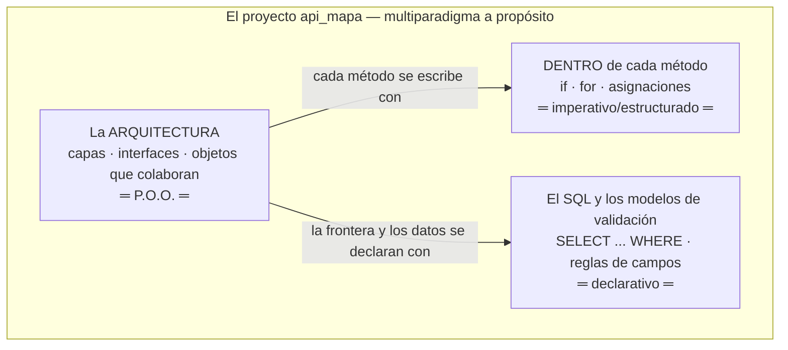
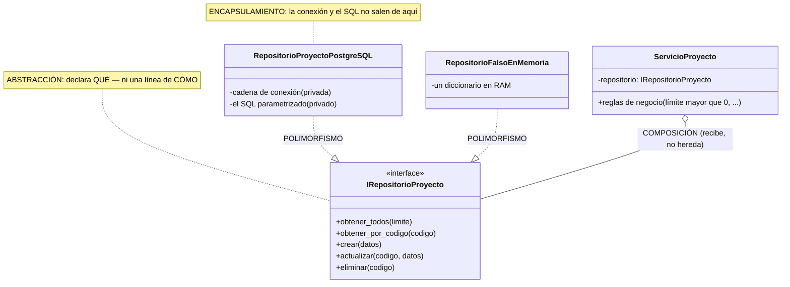
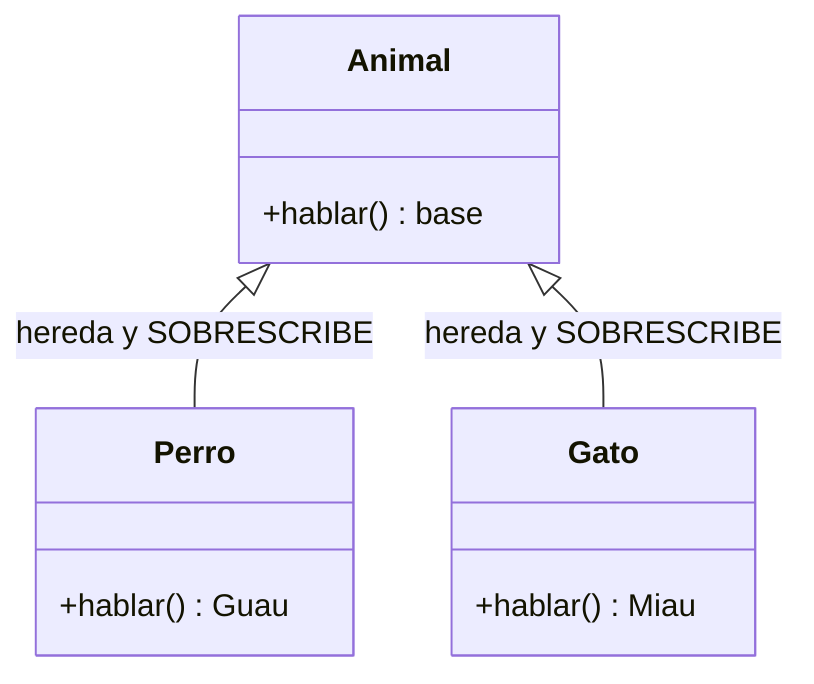
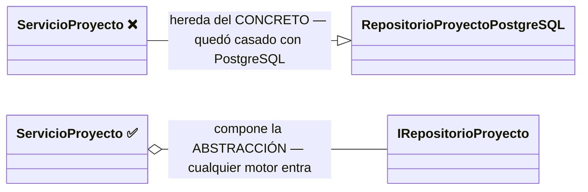
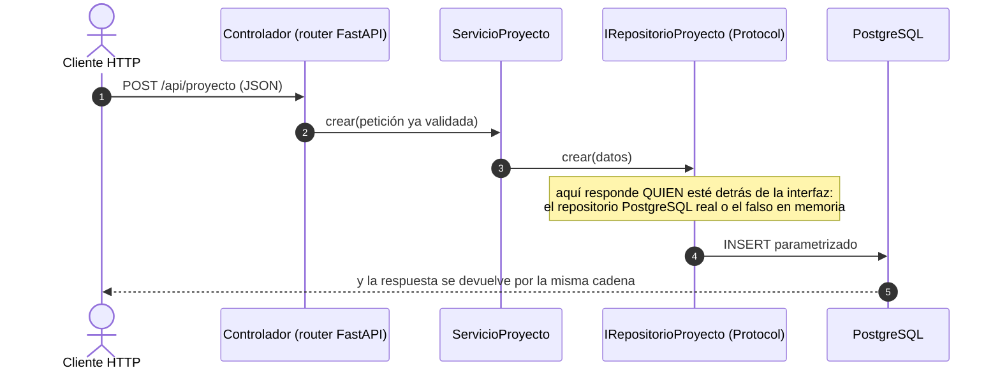

# El paradigma de Programación Orientada a Objetos (P.O.O.)

> Documento conceptual del curso. Qué es un paradigma, qué propone la P.O.O.,
> por qué este proyecto la usa, y dónde verla funcionando en la versión 1.

---

## 1. ¿Qué es un paradigma de programación?

Un paradigma es una **forma de pensar y organizar los programas**: qué es la
unidad básica de construcción y cómo se combinan. Los grandes paradigmas:

| Paradigma | Unidad básica | Idea central | Ejemplo |
|---|---|---|---|
| **Imperativo/estructurado** | la instrucción y el procedimiento | Secuencia, decisión, ciclo | C, Pascal |
| **Orientado a objetos** | el **objeto** (datos + comportamiento) | Objetos que colaboran enviándose mensajes | Java, C#, Python |
| **Funcional** | la función pura | Transformar datos sin estado mutable | Haskell, Elixir |
| **Declarativo** | la descripción del resultado | Decir QUÉ, no CÓMO | SQL, HTML |

Python es **multiparadigma**: en este proyecto se escribe código estructurado
(dentro de los métodos), orientado a objetos (la arquitectura), declarativo
(el SQL y los modelos Pydantic) y ocasionalmente funcional (comprehensions).
Saber elegir el paradigma para cada problema ES la competencia del curso.

### 1.1 El MISMO problema en tres paradigmas (ejemplo comparado)

Problema: saber cuánto suman los presupuestos de proyectos activos. Mírelo tres veces:

```python
// IMPERATIVO: el CÓMO, paso a paso (así se ve DENTRO de un método)
total = 0
for f in filas:
    total += f["presupuesto"]
```

```sql
-- DECLARATIVO: el QUÉ, sin pasos — el motor decide el CÓMO
SELECT SUM(presupuesto) FROM proyecto WHERE activo = TRUE;
```

```python
// P.O.O.: objetos que colaboran — cada uno con SU responsabilidad
$servicio->sumarPresupuestos();   // el servicio le PIDE al repositorio;
                       // nadie de afuera ve SQL ni conexiones
```

> **Ese último método todavía no existe**, y se dice para que nadie lo
> busque: la v1 solo lista, obtiene, crea, reemplaza, actualiza y retira.
> Está escrito así para mostrar **dónde viviría** el día que se necesite —
> en el servicio, no en el controlador ni en la pantalla.

Los tres resuelven lo mismo. La diferencia es QUIÉN carga con el detalle:
en el imperativo usted; en el declarativo el motor; en la P.O.O. cada
objeto carga con SU parte — y eso es lo que permite cambiar una pieza sin
tocar las demás.

### 1.2 Dónde vive cada paradigma en ESTE proyecto (Mermaid)



**Guía de lectura:** los paradigmas no compiten — conviven por niveles. La
P.O.O. organiza el edificio; el imperativo pone los ladrillos dentro de
cada método; el declarativo describe datos y consultas. Saber CUÁL usar en
cada nivel es la competencia, no militar en uno.

## 2. Los cuatro pilares de la P.O.O.

### 2.1 Abstracción
Quedarse con lo esencial y esconder el detalle. `IRepositorioProyecto` es una
abstracción: define QUÉ se puede hacer con proyectos (obtener, crear,
actualizar, eliminar) sin decir CÓMO ni DÓNDE se guardan.

### 2.2 Encapsulamiento
Cada objeto guarda su estado y expone solo operaciones. En la v1,
`RepositorioProyectoPostgreSQL` encapsula el engine de conexión y el SQL: nadie
más en el sistema sabe que existe una cadena de conexión.

### 2.3 Herencia (y por qué aquí casi no se usa)
Reutilizar definiendo una clase a partir de otra ("es-un"). Es el pilar más
famoso y el más **sobreutilizado**: la herencia acopla fuerte. La regla moderna
es **composición sobre herencia** — y este proyecto la sigue: `ServicioProyecto`
no HEREDA de un repositorio, RECIBE un repositorio (composición + inyección).

### 2.4 Polimorfismo
Distintas clases responden al mismo mensaje, cada una a su manera. Es el pilar
que sostiene todo el proyecto: cualquier clase que cumpla
`IRepositorioProyecto` puede ocupar el lugar de otra — el PostgreSQL real, el
falso en memoria de las pruebas, o el MariaDB que llegará en la v3.

### 2.5 Los cuatro pilares, dibujados sobre la v1 (Mermaid)



**Guía de lectura:** los cuatro pilares están en UN dibujo. La interfaz es
la abstracción; los atributos privados del repositorio son el
encapsulamiento; las dos flechas punteadas que llegan a la misma interfaz
son el polimorfismo (piezas intercambiables); y el rombo del servicio es
composición: recibe el repositorio por constructor en vez de heredarlo.

**Las DOS caras del polimorfismo (aclaración importante).** La
definición es una sola: **el MISMO mensaje, respuestas DIFERENTES**. Pero
se logra de dos maneras, y conviene distinguirlas:

**Cara A — la del libro: herencia + sobrescritura.** Un método existe en
la clase PADRE y la clase hija lo vuelve a programar a su manera
(sobrescribir / override):

```python
class Animal:
    def hablar(self):            # el método vive en el PADRE...
        return "..."

class Perro(Animal):
    def hablar(self):            # ...y la hija lo SOBRESCRIBE
        return "¡Guau!"

class Gato(Animal):
    def hablar(self):
        return "¡Miau!"

for a in [Perro(), Gato()]:
    print(a.hablar())            # el MISMO mensaje, DOS respuestas
```



**Cara B — la de ESTE proyecto: contrato + implementaciones.** Aquí NO hay
clase padre con código: hay una **interfaz**, que declara el mensaje pero
no trae ninguna programación. Dos clases sin parentesco entre sí lo
responden, cada una a su modo:

```python
# El contrato NO tiene código: solo declara el mensaje
class IRepositorioProyecto(Protocol):
    async def crear(self, datos: dict) -> bool: ...

# Dos clases SIN parentesco responden el MISMO mensaje, cada una a su modo:
class RepositorioProyectoPostgreSQL:
    async def crear(self, datos):
        ...ejecuta un INSERT parametrizado en PostgreSQL...

class RepositorioFalsoEnMemoria:
    async def crear(self, datos):
        self._filas[datos["codigo"]] = datos   # un diccionario en RAM
```

Cuando `ServicioProyecto` manda el mensaje `crear(datos)`, NO sabe (ni le
importa) cuál de las dos clases contesta — una escribe en PostgreSQL, la otra en
un diccionario. **Eso es el polimorfismo del diagrama de arriba:** las dos
flechas punteadas que llegan a la interfaz son las dos respuestas
posibles al mismo mensaje.

| | Cara A (herencia) | Cara B (contrato — la del proyecto) |
|---|---|---|
| ¿Dónde se declara el mensaje? | En la clase PADRE (con código propio) | En la INTERFAZ (sin una línea de código) |
| ¿Las clases se emparentan? | Sí: hija ES-UN padre | No: solo firman el mismo contrato |
| ¿Qué se comparte? | Código heredado + el mensaje | SOLO el mensaje |
| Riesgo | Acopla: la hija arrastra TODO lo del padre | Ninguno de acoplamiento: por eso el curso la prefiere |

Las dos son polimorfismo legítimo. El proyecto usa la cara B porque
necesita piezas intercambiables SIN compartir código (un repositorio real
y uno falso no tienen nada en común por dentro) — y porque es la que
permite cambiar de motor sin tocar el servicio.

**¿Y la herencia DE VERDAD, dónde está en este proyecto?** En cada
modelo Pydantic: `class Proyecto(BaseModel)` — Proyecto ES-UN BaseModel y
hereda completo el motor de validación (por eso validar no cuesta ni una
línea). Herencia bien usada: se hereda un MOTOR, no un repositorio.

**Herencia vs composición — el error clásico, dibujado:**



**Guía de lectura:** si el servicio HEREDA del repositorio concreto, cambiar
de motor exige tocar el servicio (y probar sin BD es imposible). Si lo
COMPONE a través de la interfaz, el motor se cambia por fuera — esa
decisión de un solo rombo es la que paga todo el proyecto.

**"Objetos que se mandan mensajes" — la v1 como conversación.**
¿Quién es **Alan Kay**? El científico que ACUÑÓ el término "orientado a
objetos": creó Smalltalk en Xerox PARC (años 70) y recibió el premio
Turing (2003). Y dijo algo sorprendente: se arrepentía de haberlo llamado
"objetos", porque *"la gran idea es el ENVÍO DE MENSAJES"* — cada objeto
es una cajita cerrada que recibe un mensaje, lo resuelve por dentro como
quiera y responde, sin que el remitente sepa CÓMO. En la práctica, cada
llamada a un método ES un mensaje. Mire la v1 con esos ojos:



**Guía de lectura:** cada flecha es un MENSAJE entre objetos — ninguno sabe
CÓMO trabaja el siguiente, solo QUÉ mensaje entiende. Esa era la idea
original de Alan Kay al acuñar "orientado a objetos": menos árboles de
herencia, más objetos conversando.

## 3. La P.O.O. en Python: particularidades que este proyecto explota

- **Todo es un objeto** (números, funciones, clases, módulos).
- **Duck typing:** a Python no le importa el árbol de herencia sino que el
  objeto "sepa responder" — si tiene los métodos, sirve.
- **`typing.Protocol` (PEP 544) = polimorfismo estructural verificable:** un
  contrato que las clases cumplen SIN heredar. Es la versión formal del duck
  typing y la forma en que este proyecto declara sus interfaces:

```python
class IRepositorioProyecto(Protocol):
    async def obtener_todos(self, limite: int) -> list[dict]: ...
    async def obtener_por_codigo(self, codigo: str) -> dict | None: ...
    async def crear(self, datos: dict) -> bool: ...
    async def actualizar(self, codigo: str, datos: dict) -> int: ...
    async def eliminar(self, codigo: str) -> int: ...
```

Compárelo con `interface` de Java/C#: mismo propósito, pero sin obligar a
`implements` — cumplir el contrato basta (tipado estructural, no nominal).

## 4. Pydantic: clases que validan datos (P.O.O. + declarativo)

**Pydantic** es la librería de validación de datos de Python (la que usa
FastAPI por debajo). Su idea: en lugar de escribir `if` tras `if` para validar
un JSON de entrada, se **declara una clase** que describe la FORMA correcta de
los datos — tipos, obligatoriedad y restricciones — y Pydantic valida
automáticamente al construir el objeto:

```python
from pydantic import BaseModel, Field
from decimal import Decimal

class Proyecto(BaseModel):
    codigo: str = Field(min_length=1, max_length=20)
    nombre: str = Field(min_length=1)
    stock: int = Field(ge=0)                 # ge = greater or equal: stock >= 0
    valorunitario: Decimal = Field(ge=0)

Proyecto(codigo="PR009", nombre="Webcam", stock=5, valorunitario=120000)  # ✔ objeto válido
Proyecto(codigo="PR009", nombre="Webcam", stock=-5, valorunitario=1)      # ✖ ValidationError
```

Mírelo con lentes de paradigma — Pydantic es dos paradigmas cooperando:

- Es **P.O.O.**: `Proyecto` es una clase; cada petición válida se convierte en
  un objeto con sus datos encapsulados y tipados.
- Es **declarativa**: usted escribe QUÉ forma tienen los datos (`stock: int,
  ge=0`), no CÓMO validarlos — cero `if`, cero mensajes de error a mano.
  Compare con la versión imperativa: ~15 líneas de `if not isinstance(...)…`
  por campo.

**Qué gana el proyecto con esto (en la v1):**

1. **Frontera de entrada:** FastAPI recibe el body JSON, intenta construir el
   modelo, y si falla responde **422 automáticamente** con el detalle exacto
   de qué campo violó qué regla — el dato inválido nunca llega al servicio ni
   a la BD.
2. **Un modelo por semántica HTTP:** `Proyecto` (POST: todo obligatorio),
   `ProyectoReemplazo` (PUT: reemplazo completo) y `ProyectoActualizar`
   (PATCH: todos opcionales) — la diferencia entre los verbos queda escrita
   en tipos, no en comentarios.
3. **Documentación gratis:** Swagger (`/docs`) muestra los esquemas y ejemplos
   generados desde estos mismos modelos — el modelo ES el contrato publicado.

## 5. Justificación: por qué P.O.O. para este proyecto

1. **El dominio se modela solo:** proyecto, registro, cliente… son objetos
   naturales con datos y reglas propias.
2. **El polimorfismo es EL requisito:** la meta del proyecto (cambiar de motor
   de BD sin tocar código) es literalmente un ejercicio de polimorfismo — tres
   repositorios intercambiables tras una interfaz.
3. **Probabilidad de prueba:** el criterio de aceptación 6 de la v1 (probar el
   servicio con un repositorio falso en memoria) solo es posible porque el
   servicio depende de una abstracción, no de PostgreSQL.
4. **Puente a SOLID:** los principios SOLID (documento
   [SOLID_CAPAS_PATRONES.md](SOLID_CAPAS_PATRONES.md)) son reglas de diseño **dentro** del
   paradigma orientado a objetos — sin P.O.O. no hay SOLID que aplicar.

## 6. Ejemplo resumido: la v1 vista con lentes de P.O.O.

```
Proyecto (Pydantic)          ← objeto de DATOS con validación (abstracción del dominio)
ServicioProyecto             ← objeto de NEGOCIO; compone un IRepositorioProyecto
IRepositorioProyecto         ← contrato (Protocol): abstracción pura
RepositorioProyectoPostgreSQL ← implementación concreta (encapsula SQL y conexión)
RepositorioFalsoEnMemoria    ← otra implementación (¡polimorfismo!) para probar sin BD
```

El mismo `ServicioProyecto` funciona con ambos repositorios sin cambiar una
línea — eso es el paradigma haciendo su trabajo. En la v3, un tercer objeto
(`RepositorioProyectoMysqlMariaDB`) entrará por la misma puerta.

## 7. Referencias

1. Python — Tutorial oficial de clases:
   <https://docs.python.org/es/3/tutorial/classes.html>
2. PEP 544 — *Protocols: Structural subtyping (static duck typing)*:
   <https://peps.python.org/pep-0544/>
3. Pydantic — documentación oficial (modelos, `Field`, validación):
   <https://docs.pydantic.dev/latest/>
4. FastAPI — *Request Body* (cómo integra los modelos Pydantic y el 422):
   <https://fastapi.tiangolo.com/es/tutorial/body/>
5. Refactoring Guru (es) — catálogo de patrones de diseño orientados a objetos:
   <https://refactoring.guru/es/design-patterns>
6. Gamma, Helm, Johnson, Vlissides — *Design Patterns* (GoF, 1994): el origen
   de "composición sobre herencia" y "programar contra interfaces".
7. Alan Kay (creador del término "object-oriented", Smalltalk): la idea
   original era **objetos que se comunican por mensajes** — más cercana a
   "servicios que colaboran" que a "árboles de herencia".
8. En este repositorio: las interfaces y capas de la
   [v1](spec_kit/versiones/v1_proyecto/3_plan.md).
