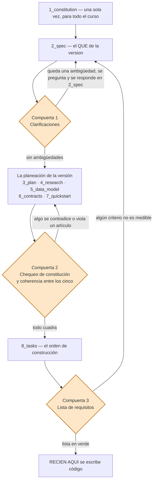
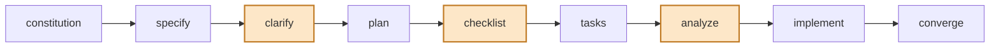
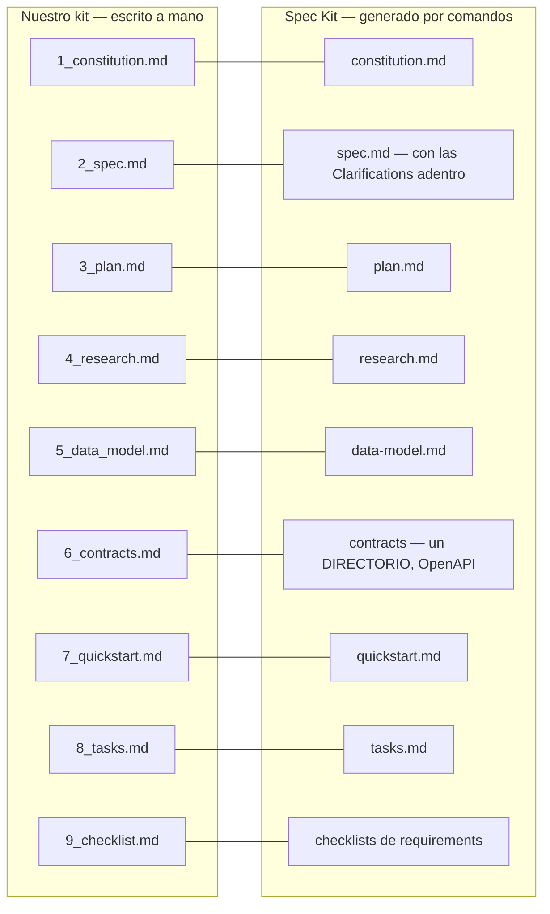

# SDD y Spec Kit — la metodología de este curso

> Aplicada aquí al **módulo Mapa de Conocimiento**. El método es el mismo en
> los cuatro módulos de proyectos de aula: lo que cambia es la
> tabla sobre la que se construye la versión 1.

> Documento conceptual: qué es el desarrollo dirigido por especificaciones
> (SDD), qué es un "spec kit", y cómo se usa EN este proyecto.

---

## 🎬 Antes de leer: el video del método

[](https://youtu.be/_MmsQMLg6yU)

> **▶️ [Spec Kit de GitHub: cómo el SDD está matando al "vibe coding"](https://youtu.be/_MmsQMLg6yU)**
> — episodio del podcast *BIM Praxis* (~16 min; voces generadas con
> NotebookLM). Cuenta, con otras palabras, EXACTAMENTE el método de este
> repositorio. **Resumen:**
>
> 1. **El "vibe coding" no tiene cimientos:** pedirle a la IA "hazme una
>    app" en dos líneas parece magia las primeras iteraciones, pero a la
>    tercera o cuarta el proyecto colapsa — dependencias circulares,
>    lógica destrozada. La causa técnica es la **degradación del
>    contexto**: el modelo prioriza lo último que usted dijo y pierde la
>    estrategia global.
> 2. **La constitución es el ancla:** un archivo con las leyes
>    innegociables del proyecto que se inyecta en CADA llamada a la IA.
>    Neutraliza el sesgo estadístico del modelo ("a la mínima te quiere
>    meter un React y una base de datos") y bloquea lo prohibido aunque
>    la conversación sea larga.
> 3. **La spec define el QUÉ sin tecnología** (historias de usuario y
>    criterios de aceptación), y la IA no asiente como un ejecutor
>    servicial: busca ambigüedades y casos límite que usted no pensó —
>    se pone la gorra de arquitecto.
> 4. **El plan y las tareas** convierten la spec en arquitectura técnica
>    y en un grafo de dependencias (qué depende de qué, qué puede ir en
>    paralelo), con la disciplina de escribir la prueba ANTES del código.
> 5. **El código pasa a ser un subproducto:** si toda la lógica vive en
>    los `.md`, cambiar de stack es regenerar — lo que vale oro es la
>    especificación. La competencia clave del profesional deja de ser
>    memorizar sintaxis y pasa a ser **claridad de pensamiento
>    estructural**: definir arquitecturas y comunicarse sin ambigüedades.
>
> **La traducción a este repositorio:** la "constitución" del video es
> nuestro `1_constitution.md`; su *specify* es `2_spec.md` (con historias
> y criterios de aceptación); su *plan* es `3_plan.md`; sus *tasks* son
> `8_tasks.md` con las fases verificables. Usted ya está trabajando así.

## 1. El problema que ataca SDD

El vicio clásico: escribir código primero y documentar después (o nunca).
Resultado: nadie sabe qué DEBERÍA hacer el sistema, las decisiones viven en
la cabeza de alguien, y cada cambio es arqueología.

**SDD (Spec-Driven Development)** lo invierte: primero se escribe la
**especificación** — QUÉ construir, CÓMO, con qué criterios de aceptación —
y el código viene después, A CUMPLIRLA. La spec es la fuente de verdad; el
código es su implementación.

La era de la IA lo volvió urgente: una IA puede escribir el código, pero
solo escribe EL CORRECTO si alguien le da una especificación precisa. En
este curso usted lo vive: la [GUIA_IA.md de la versión](spec_kit/versiones/v1_proyecto/GUIA_IA1.md) construye la versión
entregándole a una IA el spec kit — y nada más.

## 2. El spec kit de este proyecto (8 documentos y una lista de chequeo)

| # | Documento | Pregunta que responde | Qué encuentra adentro |
|---|---|---|---|
| 1 | `1_constitution.md` | ¿Qué reglas NUNCA se negocian? | Los artículos permanentes del proyecto (capas, SQL parametrizado, sin ORM, "un solo comando", cierre por tags). Es UNO solo para todas las versiones: nada de aquí cambia al pasar de versión. |
| 2 | `2_spec.md` | ¿QUÉ se construye en esta versión y cómo se sabe que quedó bien? | El propósito, el alcance (incluye / NO incluye), los requisitos funcionales y los **criterios de aceptación** medibles que definen "terminada". |
| 3 | `3_plan.md` | ¿CÓMO: stack, estructura, diseño de capas? | El inventario de archivos (los nuevos y los que CRECEN), la estructura de carpetas y el diseño ya aterrizado a código: qué clase va dónde y por qué. |
| 4 | `4_research.md` | ¿POR QUÉ así y no de otra forma? | Las decisiones numeradas (D1, D2…) con las **alternativas descartadas** y su razón — la memoria del proyecto, para no re-discutir lo ya decidido. |
| 5 | `5_data_model.md` | ¿Qué datos hay y qué puede tocar esta versión? | Tablas, columnas, llaves y datos semilla; y las fronteras: qué calcula la BD (triggers, defaults, SPs) y qué tiene PROHIBIDO escribir la API. |
| 6 | `6_contracts.md` | ¿Cuáles son los endpoints EXACTOS (verbos, códigos, formatos)? | Cada endpoint con su verbo, URL, body de ejemplo y TODOS sus códigos de respuesta con el JSON exacto — lo que un cliente puede exigir sin leer el código. |
| 7 | `7_quickstart.md` | ¿Cómo se arranca y se valida rápido? | El comando de arranque y el **smoke test**: la lista de curl que recorre los criterios de aceptación en minutos, con los valores esperados al lado. |
| 8 | `8_tasks.md` | ¿En qué ORDEN se construye, por fases verificables? | Las fases de construcción, cada una con sus tareas y su "**Verificar:**" — la regla es NO avanzar con una fase en rojo. |

A esos ocho se suma un noveno archivo, `9_checklist.md`, que **no describe
la versión: la revisa**. Es la compuerta que se pasa antes de escribir
código (§2.2), y por eso no se le entrega a la IA junto con los demás.

- **La constitución es una y permanente**; los documentos 2 a 8 se escriben
  POR VERSIÓN, en `versiones/vN_nombre/`.
- **La versión en curso:**
  [spec_kit/versiones/v1_proyecto/](spec_kit/versiones/v1_proyecto/2_spec.md)
  — la spec de la v1 ES el documento que se le entrega a la IA (o al
  estudiante) para construirla.

Un fragmento real de la spec de la v1 (note el estilo: verificable, con
criterios medibles):

```markdown
### RF5 — Actualizar parcialmente (PATCH + body parcial)
`PATCH /api/proyecto/{codigo}` con body de la petición ProyectoActualizar:
campos opcionales — solo se modifican los enviados. Devuelve
filasAfectadas; inexistente → 404; body vacío → 400.

## Criterios de aceptación
4. … un `PUT` sin el campo `nombre` responde 422 (reemplazo completo)
   mientras el mismo body en `PATCH` responde 200 (parcial).
```

### 2.1 Los 8 documentos: qué es, para qué sirve y cómo se hace cada uno

**1. `1_constitution.md` — la ley permanente.**
**Qué es:** los artículos innegociables del proyecto; se escribe UNA vez y
rige TODAS las versiones (en Spec Kit lo genera `/speckit.constitution`;
aquí se escribe a mano).
**Para qué sirve:** ancla el proyecto — y a la IA. Cuando alguien (humano o
agente) proponga "metamos tal cosa", la constitución responde ANTES de
discutir; por eso neutraliza el sesgo del modelo hacia lo que más vio en su
entrenamiento.
**Cómo se hace:** liste las decisiones que NO van a cambiar en el semestre
(capas, seguridad, idioma, forma de cerrar versiones); redáctelas como
artículos numerados, cortos y verificables; si un artículo no se puede
violar "por accidente", no necesita estar.

**Esqueleto:** encabezado con **la versión de la constitución y su
fecha** · `Artículo 1` … `Artículo N`, uno por regla, cortos y
verificables · y como último, el **artículo de enmiendas**: cómo se cambia
una regla (se propone en el `4_research.md` de la versión que la necesita,
y la constitución sube de versión). Una regla que nadie puede violar por
accidente no merece artículo.

```markdown
## Artículo 3 — SQL siempre parametrizado
Los valores viajan como @parametros de SQLAlchemy; JAMÁS se concatenan
en el SQL. `$"WHERE codigo = '{codigo}'"` es inyección esperando turno.
```

**2. `2_spec.md` — el QUÉ.**
**Qué es:** la especificación funcional de UNA versión: propósito, alcance,
requisitos funcionales (RF numerados) y criterios de aceptación.
**Para qué sirve:** define "terminada" de forma MEDIBLE — es el documento
que se le entrega a la IA o al estudiante para construir la versión, y el
que decide si pasó o no.
**Cómo se hace:** propósito en dos frases; RFs numerados SIN tecnología
(qué, no cómo); por cada RF, criterios con valores concretos (cuántas
filas, qué código HTTP, qué mensaje); y un "NO incluye" explícito — frena
la anticipación, que es el vicio favorito de la IA.

**Esqueleto:** `1. Propósito` (dos frases) · `2. Alcance`, con su **NO
incluye** explícito · `3. Requisitos funcionales` (RF1, RF2…) ·
`4. Requisitos no funcionales` · `5. Criterios de aceptación`, numerados y
medibles · `Clarificaciones` — **la compuerta 1** (§2.2): cada pregunta
con su respuesta, la fecha y qué RF cambió · `7. Definición de TERMINADA`.

```markdown
### RF5 — Actualizar parcialmente (PATCH + body parcial)
PATCH /api/proyecto/{codigo} con campos opcionales: solo se
modifican los enviados. Inexistente → 404; body vacío → 400.

## Criterios de aceptación
4. Un PUT sin el campo nombre responde 422 (reemplazo completo)
   mientras el MISMO body en PATCH responde 200 (parcial).
```

**3. `3_plan.md` — el CÓMO.**
**Qué es:** la traducción técnica de la spec: stack, inventario de archivos
y diseño de capas ya aterrizado a código.
**Para qué sirve:** que la arquitectura no se decida "sobre la marcha"
mientras se programa; una IA con plan no inventa estructura.
**Cómo se hace:** estructura de carpetas; tabla de archivos NUEVOS con su
papel; tabla de archivos que CRECEN y qué les crece (los intocables también
se declaran); y las decisiones de diseño de la versión — en la familia
diseño, con sus diagramas Mermaid.

**Esqueleto:** `1. Stack` · `2. Estructura de carpetas` ·
`3. Arquitectura`, con sus diagramas Mermaid · `4. Decisiones de diseño` ·
`5. Inventario`: tabla de archivos NUEVOS y tabla de los que CRECEN (los
intocables también se declaran; desde la v2, que es cuando ya hay algo que
crezca) · y como **última sección, el Chequeo de constitución** —
**la compuerta 2** (§2.2): artículo por artículo, cómo lo cumple ESTA
versión, y las desviaciones justificadas si las hubo, cada una con la
alternativa más simple que se descartó.

```markdown
**Crecen (los únicos existentes que se tocan):**
| Archivo | Qué crece |
|---|---|
| `main.py` | ★ dos AddScoped nuevos (la rebanada persona) |
| `ApiFacturas/requirements.txt` | ★ un paquete nuevo, si la versión lo exige |
```

**4. `4_research.md` — el PORQUÉ.**
**Qué es:** el registro de decisiones (D1, D2…) con sus alternativas
descartadas — lo que la industria llama ADRs (Architecture Decision
Records).
**Para qué sirve:** memoria del proyecto: no se re-discute lo decidido, y
quien llegue después (incluida la IA) entiende por qué el sistema es así y
no de otra forma.
**Cómo se hace:** por cada decisión: contexto (el problema) → opciones
consideradas (a, b, c) → decisión con su razón → consecuencias que se
aceptan. Se escribe CUANDO se decide, no semanas después.

**Esqueleto:** una sección por decisión, numerada **sin repetir entre
versiones** (`D-v2-1`, `D-v2-2`… — si la v1 y la v3 tienen ambas un "D4",
la trazabilidad se rompe), y cada una con: contexto → alternativas
(a, b, c) → decisión y su razón → consecuencias que se aceptan →
**estado**: *vigente* o *superada por vN*.

```markdown
## D4 — ¿Por qué PUT y PATCH separados?
**Alternativas:** (a) un solo endpoint "actualizar" · (b) PUT
(reemplazo completo) y PATCH (parcial) con peticiones distintas.
**Decisión: (b)** — la pareja enseña la semántica HTTP: el MISMO
body da 422 en PUT y 200 en PATCH.
```

**5. `5_data_model.md` — los datos y sus fronteras.**
**Qué es:** las tablas, columnas, llaves y semillas que ESTA versión usa, y
la frontera de responsabilidades entre la API y la BD.
**Para qué sirve:** evita el clásico "la API recalcula lo que la BD ya
calcula" — deja escrito qué columnas tiene PROHIBIDO tocar la API.
**Cómo se hace:** tabla por tabla (columna, tipo, regla); anote qué escribe
la BD sola (defaults, autonuméricos, triggers); semillas con valores
EXACTOS, porque el smoke test depende de ellas.

**Esqueleto:** `1. Las tablas que esta versión puede nombrar` (columna,
tipo, regla) · `2. Semillas exactas` — los valores que el smoke test da por
ciertos · `3. Invariantes`: tabla de quién es **dueño** de cada dato
calculado y quién tiene **prohibido** escribirlo · `4. Estados` de la
entidad, si los tiene, como diagrama Mermaid. Una versión que no agrega
datos propios igual llena el punto 3: dice de qué depende y qué no puede
tocar.

```markdown
| Tabla | PK | Semilla |
|---|---|---|
| proyecto | id | 14 filas del Excel del módulo |

`activo` lo escribe SOLO el DELETE: la API tiene PROHIBIDO recibirlo en
el cuerpo de un POST o de un PUT.
```

**6. `6_contracts.md` — el contrato HTTP exacto.**
**Qué es:** endpoint por endpoint: verbo, URL, body de ejemplo y TODOS los
códigos de respuesta con su JSON exacto.
**Para qué sirve:** es lo que un cliente (el front futuro, Postman, el
profesor) puede EXIGIR sin leer el código; al cerrar la versión, estos
contratos se congelan.
**Cómo se hace:** un bloque por endpoint; incluya los desenlaces de ERROR
(404, 422, 500) con su formato — el error también es contrato; los valores
de ejemplo salen de las semillas del 5_data_model.

**Esqueleto:** `0. Convenciones` — el sobre de respuesta y el catálogo de
errores, una sola vez · después un bloque por endpoint: verbo, URL, body y
**todos** sus códigos con el JSON exacto · y, cuando exista, el enlace al
contrato **legible por máquina** (el `openapi.json` que la documentación interactiva ya
publica). Ese enlace es lo que acerca nuestro `.md` en prosa al
`contracts/` del Spec Kit real, que es un directorio de contratos y no un
texto (§3.2).

```markdown
POST /api/proyecto
body { "codigo": "PR009", "nombre": "Webcam", "stock": 10,
       "valorunitario": 350000 }
→ 200 {estado, mensaje} · 422 si falta un campo o stock < 0 (con
  errores[]) · 500 si el código ya existe (PK duplicada, en detalle)
```

**7. `7_quickstart.md` — la validación en minutos.**
**Qué es:** el arranque en un comando más el smoke test: la lista de
comandos que recorre los criterios de aceptación con el valor esperado al
lado de cada uno.
**Para qué sirve:** "me funciona" deja de ser una opinión — cualquiera
valida la versión en minutos; y en las versiones siguientes se convierte en
la REGRESIÓN (lo viejo debe seguir pasando).
**Cómo se hace:** el comando de arranque; un comando por criterio, en
orden, con el resultado esperado como comentario; y una tabla "Si algo
falla" con las causas probables.

**Esqueleto:** `1. Arranque` (un comando) · `2. Smoke test` — un comando
por criterio, **numerado igual que los criterios de `2_spec.md`**, con el
valor esperado al lado · `3. Regresión` — desde la v2: los smokes de las
versiones anteriores, que deben seguir pasando · `4. Si algo falla`, con
las causas probables.

```bash
curl http://localhost:8031/api/proyecto        # total: 8
curl -i http://localhost:8031/api/proyecto/PR999   # → 404
```

**8. `8_tasks.md` — el orden, por fases verificables.**
**Qué es:** el plan de construcción dividido en fases, cada una con su
lista de tareas y su compuerta "**Verificar:**".
**Para qué sirve:** convierte el plan en un camino sin saltos: la compuerta
impide avanzar con una fase rota — es la versión artesanal del grafo de
dependencias que `/speckit.tasks` genera.
**Cómo se hace:** ordene de lo que no depende de nada hacia lo que depende
de todo (modelo → repositorio → servicio → controlador); cada fase termina
en un estado COMPROBABLE (`python -m compileall`); la verificación se escribe
como comando concreto, no como "revisar que funcione".

**Esqueleto:** `Fase 0` … `Fase N`, cada una con: casillas `- [ ]` por
tarea · la marca `[P]` donde dos tareas de verdad no dependen una de otra
(en una construcción por capas la mayoría son secuenciales, y está bien) ·
a qué **RF** sirve cada bloque · y su compuerta **Verificar:** con un comando concreto.
La última fase es siempre el cierre: regresión, criterios y tag.

```markdown
## Fase 2 — El modelo y las peticiones
- [ ] models/Proyecto.py (la entidad: 4 propiedades tipadas)
- [ ] models/ProyectoCrear.py (todo obligatorio, con [Required])

**Verificar:** `python -m compileall` compila sin errores.
```

### 2.2 El orden de armado y las tres compuertas

Los ocho documentos se escriben **en su orden numerado**: la constitución
primero (una sola vez), después la spec de la versión, después la
planeación, y de última las tareas. Lo que hay que agregarle a ese camino
—y es lo que separa un kit que sirve de una carpeta con ocho archivos— son
**tres compuertas**: puntos donde uno se detiene, revisa y no sigue hasta
que quede en verde.



Fíjese en el bloque del medio: los documentos **3 a 7 se escriben en
orden, pero se revisan juntos**. Se contradicen entre ellos con una
facilidad pasmosa — el contrato promete un campo que el modelo de datos no
tiene, el quickstart valida un criterio que la spec nunca pidió, el plan
inventa un archivo que ninguna tarea construye. Por eso la compuerta 2 no
revisa "el plan": revisa **los cinco a la vez**.

Las tres compuertas, en detalle:

| | Vive en | La pregunta que hace | Si falla |
|---|---|---|---|
| **1. Clarificaciones** | La sección de Clarificaciones de `2_spec.md` | ¿Hay algo que dos personas leerían distinto? | Se pregunta al dueño del problema y la respuesta se pliega DENTRO de la spec — no se resuelve improvisando en el código |
| **2. Chequeo de constitución** | Última sección de `3_plan.md` | ¿El plan respeta los artículos, uno por uno? ¿Los cinco documentos dicen lo mismo? | O se corrige el plan, o se enmienda la constitución (y sube de versión). Nunca "se deja pasar por esta vez" |
| **3. Lista de requisitos** | `9_checklist.md` de la versión | ¿Cada requisito es medible, único y verificable? | Se devuelve a la spec. **No se escribe código con la lista en rojo** |

> **La tercera vive en el `9_checklist.md` de cada versión**, junto a los
> otros documentos. Es control de calidad **sobre la ESPECIFICACIÓN, no
> sobre el código**: *¿cada criterio de aceptación dice un número o un
> código HTTP concreto? · ¿algún requisito usa "rápido", "amigable" o
> "eficiente" sin definirlos? · ¿hay dos requisitos que se contradicen? ·
> ¿algún criterio no se puede verificar con un comando?* Y las casillas
> las marca **una persona** (§3.4). Es, además, la mejor actividad de aula
> del método: los estudiantes se revisan la spec entre ellos con la lista,
> antes de escribir una línea de código.

### 2.3 Cómo se escribe un requisito que sirve

La mitad del valor del kit se juega aquí. Cuatro reglas:

1. **Sin tecnología en la spec.** El QUÉ no menciona SQLAlchemy, ni nombres de
   clase, ni archivos. Eso vive en el plan. Si el RF no se entiende sin
   saber el stack, está mal escrito.
2. **Medible o no es criterio.** Un criterio dice un número, un código de
   estado o un texto exacto. "Responde rápido" no es criterio; "responde
   200 con las 14 filas semilla" sí.
3. **Una cosa por requisito.** Si un RF necesita un "y" para explicarse,
   casi siempre son dos.
4. **La ambigüedad se MARCA, no se rellena.** Cuando algo no está
   definido, se escribe el marcador y se resuelve en la compuerta 1 —
   jamás se inventa la respuesta:

```markdown
### RF6 — Retirar el proyecto
DELETE /api/proyecto/{id} retira el proyecto del uso.
[NECESITA ACLARACIÓN: ¿borrado físico, o lógico marcando una columna
de estado? Afecta al criterio 5 y al contrato del DELETE.]
```

Esa costumbre —marcar en vez de rellenar— es la vacuna contra el vicio
central de la IA: **cuando no sabe, no pregunta; completa**. Y completa con
lo más frecuente en su entrenamiento, no con lo que su proyecto necesita.

| Así NO | Así SÍ |
|---|---|
| "El sistema debe validar correctamente los datos" | "Un POST sin el campo `nombre` responde **422** con `errores[]` y no toca la BD" |
| "Debe ser rápido" | "El listado responde en menos de 1 s con las 14 filas semilla" |
| "Manejar los errores adecuadamente" | "Código inexistente → **404** con `{estado, mensaje, detalle}`" |

### 2.4 La trazabilidad: de la historia al smoke test

Un kit bien armado permite seguir **una misma idea** a través de los ocho
documentos. Si una fila de esta tabla tiene un hueco, ahí hay un defecto:
un requisito sin contrato es una promesa vaga; un contrato sin tarea no lo
va a construir nadie; una tarea sin smoke test no se puede dar por
terminada.

| RF (`2_spec`) | Aclaración (`2_spec` §6) | Contrato (`6_contracts`) | Tarea (`8_tasks`) | Smoke (`7_quickstart`) | Criterio |
|---|---|---|---|---|---|
| RF1 — listar | C1, C2 | §2 `GET /api/proyecto` | Fase 5 · controlador | §2 comando 2 | 1 y 2 |
| RF5 — actualizar parcial | C6 | §6 `PATCH` | Fase 5 · controlador | §2 comando 4b | 4 |
| RF6 — eliminar | C5 | §7 `DELETE` | Fase 5 · controlador | §2 comando 4 | 4 |

**La prueba de fuego del kit:** tape el código y entregue solo estos
documentos. Si alguien —una persona o una IA— reconstruye la versión
completa y la valida, el kit está bien armado. Ese es, literalmente, el
experimento que hace la `GUIA_IA` de cada versión.

### 2.5 Cuándo un documento está TERMINADO

| Documento | Está terminado cuando… |
|---|---|
| `1_constitution.md` | Cada artículo se puede citar para ganar una discusión sin abrir el código |
| `2_spec.md` | No queda ni un `[NECESITA ACLARACIÓN]` y cada criterio tiene un valor concreto |
| `3_plan.md` | El chequeo de constitución está completo y el inventario nombra TODOS los archivos que se van a tocar |
| `4_research.md` | Cada decisión tiene al menos una alternativa descartada con su razón (si no hubo alternativa, no era una decisión) |
| `5_data_model.md` | Están las semillas exactas y dice quién tiene prohibido escribir cada dato calculado |
| `6_contracts.md` | Cada endpoint tiene sus desenlaces de ERROR, no solo el feliz |
| `7_quickstart.md` | Sus comandos recorren, en orden, TODOS los criterios de aceptación — y la regresión de las versiones anteriores |
| `8_tasks.md` | Cada fase termina en un comando que se puede correr, no en "revisar que funcione" |
| `9_checklist.md` | Todas las casillas marcadas **por una persona** — solo entonces empieza el código |

### 2.6 Orden y nombres: cómo se llama cada archivo

El **número del prefijo es el orden**, de lectura y de armado. El nombre
que va después del número es el del artefacto equivalente en Spec Kit —por
eso está en inglés (`spec`, `plan`, `research`, `data_model`, `contracts`,
`quickstart`, `tasks`)— mientras que el CONTENIDO va todo en español. Así,
quien pase de este curso a la herramienta real reconoce cada documento por
su nombre.

| Archivo | Dónde vive | Alcance |
|---|---|---|
| `1_constitution.md` | `docs/spec_kit/` | Todo el curso — hay UNO solo |
| `0_mapa_versiones.md` | `docs/spec_kit/versiones/` | La ruta completa de versiones (no es de Spec Kit: es la brújula del curso) |
| `2_spec.md` … `8_tasks.md` | `docs/spec_kit/versiones/vN_tema/` | UNA versión |
| `9_checklist.md` | `docs/spec_kit/versiones/vN_tema/` | UNA versión — la compuerta 3 |
| `GUIA_IAN.md` | `docs/spec_kit/versiones/vN_tema/` | Cómo reconstruir ESA versión con ayuda de IA. No es un artefacto de Spec Kit sino material del curso: por eso va sin número y con el número de la versión al final |

Tres reglas de nombre que no se rompen:

1. La carpeta de la versión es `vN_tema`, en minúsculas y con guion bajo
   (`v1_proyecto`). El tema dice qué agrega la versión.
2. **El número de un documento nunca cambia entre versiones:** el
   `6_contracts.md` de la v3 se llama igual que el de la v1. Se compara de
   una versión a otra sin buscar equivalencias.
3. Un documento no se renumera ni se renombra al cerrar la versión. Lo que
   está bajo un tag es historia: se lee, no se toca.

**La regla que une a los ocho:** si está en la spec y no en el código, el
código está incompleto; si está en el código y no en la spec, sobra — o
falta especificarlo.

**El ciclo de una versión:** leer la spec → seguir las tareas fase por
fase → correr el quickstart → si los criterios pasan, commit + tag (`v1`) →
solo entonces se escribe la spec de la siguiente versión.

## 3. GitHub Spec Kit: la herramienta (y por qué aquí vamos a mano)

Hasta aquí se describió el **método**. **Spec Kit** es la herramienta que
GitHub publicó (open source, licencia MIT) para ejecutarlo con agentes de
IA. La distinción vale para el examen: **SDD es la *metodología*** (el
"qué hacer") y **Spec Kit es *una* implementación** (el "con qué") — la
misma relación que hay entre "control de versiones" y "Git". Se puede
hacer SDD sin Spec Kit —este curso lo demuestra— pero no tiene sentido
Spec Kit sin SDD.

### 3.1 El enlace oficial: qué hay ahí

**<https://github.github.com/spec-kit/>** es el **manual** del toolkit (el
código vive aparte, en <https://github.com/github/spec-kit>). Vale la pena
abrirlo aunque nunca lo instale:

| Sección | Qué encuentra |
|---|---|
| **Quick Start** | El flujo completo, comando por comando, con el archivo que produce cada uno |
| **Installation** | Requisitos y el comando de instalación del CLI `specify` |
| **Reference** | Qué hace cada comando, qué archivo escribe y cuál NO |
| Extensiones y presets | Variantes del proceso aportadas por la comunidad |

Cítelo cuando alguien afirme "Spec Kit hace X": el toolkit cambia rápido
—los comandos `clarify`, `checklist`, `analyze` y `converge` no existían
en las primeras versiones— y el sitio es lo único que está al día.

### 3.2 Qué significa "instalarlo"

Spec Kit **no es una librería que se importe en el código**: no aparece en
`main.py` ni en el `/requirements.txt`, y no cambia en nada cómo corre la API. Es
un CLI (`specify`) que deposita **plantillas y comandos dentro del
proyecto** para que su agente de IA los ejecute. Requiere Python 3.11 o
superior, `uv` (o `pipx`) y un agente compatible (Claude Code, Copilot,
Gemini CLI…).

```bash
uv tool install specify-cli --from git+https://github.com/github/spec-kit.git
specify init mi_v1_proyecto --integration copilot
specify version
```

Hecho eso, dentro del agente aparecen los comandos `/speckit.*`. El flujo
completo, con las tres compuertas que a mano no existen marcadas aparte:



Y lo que deja cada comando en el disco:

| # | Comando | Qué produce |
|---|---|---|
| 1 | `/speckit.constitution` | `.specify/constitution.md` |
| 2 | `/speckit.specify` | `specs/<funcionalidad>/spec.md` |
| 3 | `/speckit.clarify` | **modifica** `spec.md`: pliega adentro las respuestas a sus preguntas |
| 4 | `/speckit.plan` | `plan.md` y —cuando la funcionalidad lo pide— `research.md`, `data-model.md`, `contracts/` y `quickstart.md` |
| 5 | `/speckit.checklist` | `checklists/requirements.md` |
| 6 | `/speckit.tasks` | `tasks.md`, ordenado por dependencias |
| 7 | `/speckit.analyze` | **nada**: un reporte de inconsistencias entre spec, plan y tareas |
| 8 | `/speckit.implement` | el código |
| 9 | `/speckit.converge` | agrega tareas a `tasks.md` si el código quedó corto frente a la spec |

Documento por documento, así se corresponde con NUESTRO kit numerado:



Dos diferencias de forma que conviene ver: `contracts` es un
**directorio** de contratos legibles por máquina (OpenAPI, esquemas) y no
un `.md` en prosa como nuestro `6_contracts.md`; y las aclaraciones no son
un documento aparte — viven **dentro** de `spec.md`.

### 3.3 Los tres comandos que NO producen documento, con ejemplo

Esto es lo que más confunde al principio: de los nueve comandos, solo
cinco dejan un archivo. **`clarify`, `analyze` y `converge` no crean
ningún `.md`** — y son, justamente, los que más valor agregan. Van los
tres con un ejemplo armado sobre la v1 de este repositorio.

#### `clarify` — pregunta ANTES de que usted planee

Lee la spec, detecta lo que está a medio definir y **pregunta**, una cosa
a la vez. Cuando usted responde, no le devuelve un texto para que lo
pegue: **edita `spec.md`** y deja la respuesta adentro.

```text
La spec dice:
    RF6 — Eliminar proyecto
    DELETE /api/proyecto/{codigo}. Devuelve filasEliminadas;
    inexistente -> 404.

clarify pregunta:
    El borrado de proyecto, ¿es físico o lógico?
      a) Físico: la fila desaparece de la tabla.
      b) Lógico: se marca inactiva y deja de listarse.
    Impacto si es (b): cambia el contrato del DELETE, obliga a una
    columna de estado en 5_data_model y reescribe el criterio 4.

Usted responde:  b

clarify NO crea un archivo: escribe dentro de 2_spec.md
    ## Clarificaciones
    C5 — DELETE, ¿físico o lógico? -> LÓGICO: la tabla proyecto gana
    una columna `activo`, el DELETE la pone en falso y TODAS las
    consultas filtran por ella. Cambia el contrato del DELETE y el
    criterio 5, y queda como Artículo 6 de la constitución.
```

**A mano, en este curso:** eso es exactamente la
[la sección de Clarificaciones de 2_spec.md](spec_kit/versiones/v1_proyecto/2_spec.md),
y el marcador `[NECESITA ACLARACIÓN: …]` (§2.3) hace las veces de
pregunta. La diferencia no es el resultado, es **quién detecta la
ambigüedad**: allá la busca el agente; aquí la busca usted — que es
justamente el músculo que el curso quiere entrenar.

#### `analyze` — le dice dónde se contradicen sus documentos

Se corre con la spec, el plan y las tareas ya escritos. **No toca nada**:
lee los tres y reporta. Es la revisión de coherencia de la compuerta 2,
hecha por máquina. Un reporte sobre una v1 mal armada se vería así:

| # | Severidad | Dónde | Qué encontró |
|---|---|---|---|
| 1 | ALTA | `2_spec` RF7 ↔ `6_contracts` | RF7 (diagnóstico) no tiene contrato: ningún endpoint lo describe |
| 2 | ALTA | `6_contracts` §7 ↔ `8_tasks` | El `DELETE` tiene contrato, pero ninguna fase lo construye |
| 3 | MEDIA | `2_spec` criterio 3 ↔ `7_quickstart` | El criterio 3 no tiene comando en el smoke test: no hay forma de verificarlo |
| 4 | MEDIA | `3_plan` §2 ↔ `8_tasks` | El plan dice que el servicio lanza `LookupError` y ninguna tarea lo escribe |
| 5 | BAJA | `6_contracts` §4 ↔ `5_data_model` | El ejemplo del POST usa `PR009`, y las semillas llegan hasta `PR008` — correcto, pero conviene decir que es un código nuevo a propósito |

Fíjese en algo: **ningún hallazgo es sobre el código**. Todos son
contradicciones entre documentos. Y la corrección no se escribe en el
reporte sino **en el documento dueño del problema**: el 1 y el 3 se
arreglan en la spec, el 2 y el 4 en las tareas. Con hallazgos de
severidad ALTA no se sigue.

**A mano, en este curso:** es la tabla de trazabilidad de §2.4 recorrida
fila por fila. **Cada hueco de esa tabla es un hallazgo de `analyze`.**

#### `converge` — compara el código TERMINADO contra la spec

Se corre al final, cuando usted ya cree que acabó. Revisa el código
contra la spec, el plan y las tareas; y si algo quedó corto **no lo
arregla**: agrega al final de `tasks.md` las tareas que faltan y le dice
que vuelva a implementar. Nunca borra ni edita código.

```text
Convergencia — v1

    Criterio 2  OK    GET /api/proyecto devuelve las 8 filas semilla
    Criterio 4  OK    el ciclo de los 5 verbos pasa completo
    Criterio 5  FALLA POST con stock 7.5 responde 400; la spec pide 422
    Criterio 6  FALLA no existe el proyecto pruebas/

Se agregan a 8_tasks.md:
    ## Convergencia
    - [ ] T15 Mover la validación de tipo a la petición (int?) -> 422
    - [ ] T16 Crear pruebas/ con el repositorio FALSO en memoria

Estado: NO convergido. Vuelva a implement y corra converge otra vez.
```

**A mano, en este curso:** es la última fase de
[8_tasks.md](spec_kit/versiones/v1_proyecto/8_tasks.md) —el
cierre— corriendo el smoke test del
[7_quickstart.md](spec_kit/versiones/v1_proyecto/7_quickstart.md).
Si un criterio no pasa, la versión **no se cierra ni se le pone el tag**:
se agregan tareas y se sigue. La regla del curso —"no se avanza con una
fase en rojo"— y `converge` dicen exactamente lo mismo.

> **Lo que revelan los tres juntos:** el trabajo de verdad no es *escribir*
> los documentos, sino **mantenerlos de acuerdo entre ellos y de acuerdo
> con el código**. Spec Kit automatiza esa vigilancia; a mano la hacemos
> con las tres compuertas (§2.2). Por eso un kit que nadie revisa es peor
> que no tener kit: da la ilusión de que hay una fuente de verdad.

### 3.4 Qué mejora frente a nuestro kit a mano — y qué no

| | A mano (este curso) | Con Spec Kit instalado |
|---|---|---|
| Redactar los documentos | Usted escribe cada `.md` | El agente los genera; usted corrige |
| Ambigüedades de la spec | Se descubren programando (tarde) | `/speckit.clarify` pregunta ANTES de planear |
| Calidad de los requisitos | Criterio del profesor | `checklists/requirements.md`: los requisitos se revisan como si fueran código |
| Coherencia entre documentos | Usted la vigila leyendo | `/speckit.analyze` la revisa y reporta |
| Orden de las tareas | Usted ordena las fases a mano | `tasks.md` sale ordenado por dependencias |
| "¿Ya está terminado?" | El smoke test del `7_quickstart.md` | `/speckit.converge` compara el código contra la spec y agrega lo que falte |
| Qué hace falta para usarlo | Un navegador y un editor | Python, `uv`, un agente de IA y permiso para instalar |
| Si la herramienta cambia | Nada: son `.md` | Hay que actualizarse (ya pasó: cuatro comandos nuevos) |

En una frase: **Spec Kit quita el trabajo mecánico —redactar, ordenar,
cotejar— y agrega tres compuertas que a mano no existen**: `clarify`,
`checklist` y `analyze`. La mejora es real y es grande.

Lo que NO mejora: **la calidad de sus decisiones**. Una spec generada a
partir de una idea vaga sigue siendo vaga — solo que bien formateada y con
más páginas. La herramienta acelera el pensamiento que usted ya hizo; no
lo reemplaza.

> **El detalle más interesante, el `checklist`:** es control de calidad
> sobre la ESPECIFICACIÓN, no sobre el código — ¿cada requisito es
> medible?, ¿hay ambigüedad?, ¿algún criterio no se puede verificar? Y las
> casillas las marca **una persona**: la documentación oficial dice que el
> agente puede ayudar a evaluar pero **no puede auto-aprobarse**, y que
> `implement` se frena si quedan casillas sin marcar.

### 3.5 Entonces, ¿por qué en este curso se hace a mano?

Cuatro razones, en orden de peso:

1. **Spec Kit automatiza la escritura, no la decisión.** Quien nunca
   redactó un criterio de aceptación no puede juzgar si el que generó la
   IA sirve — y termina aceptando specs sin leerlas, igual que se acepta
   código sin leerlo. Sería cambiar el *vibe coding* por **vibe
   speccing**: el mismo vicio, un piso más arriba.
2. **Los artefactos sobreviven a la herramienta.** Las decisiones con sus
   alternativas (ADR), el modelo de datos, el contrato, los criterios de
   aceptación y la trazabilidad son ingeniería de requisitos de hace
   décadas. Spec Kit es de 2025 y ya cambió bajo los pies de todos: aquí
   se aprende lo permanente, y la herramienta se demuestra.
3. **Corre donde usted está.** El kit a mano funciona con un chat web
   gratuito, sin CLI, sin agente, sin llave de API y sin permisos de
   instalación en la sala de la universidad.
4. **Es evaluable y comparable.** Los `.md` se leen y se califican, y los
   cursos comparten la misma estructura sobre la misma `mapa_local` con
   stacks distintos.

> **El experimento de cierre:** al terminar la ruta de versiones,
> regenerar la v1 con `specify init` y los comandos reales, y comparar el
> kit generado con el que usted escribió a mano. La prueba de que aprendió
> no es que la IA lo genere: es que usted pueda leerlo y decir qué le
> falta.

## 4. Las reglas de juego del curso

1. **La spec manda sobre el código.** Si el código hace algo que la spec no
   dice, sobra; si la spec pide algo que el código no hace, falta.
2. **No se anticipa** (YAGNI): la v1 no construye nada de la v3 "por si
   acaso". Cada versión introduce SU contenido cuando le toca.
   **YAGNI** son las siglas de *You Aren't Gonna Need It* — "no lo vas a
   necesitar": no se agrega una funcionalidad ni una línea de código hasta
   que hoy haga falta. No es pereza: lo que se escribe "por si acaso" hay
   que mantenerlo, probarlo y explicarlo desde el primer día, casi siempre
   adivinando mal la necesidad futura. Aquí la disciplina tiene además una
   consecuencia práctica: es lo que hace que cada versión sea pequeña y
   verificable — y es la regla que una IA rompe primero, porque su sesgo
   es agregar de más.
3. **Cerrado es cerrado:** una versión con tag no se reabre; los ajustes
   van a la siguiente (y se anotan como "deuda de spec" si aplica).
4. **Autocontenido:** el spec kit debe bastar para reconstruir la versión
   desde cero sin leer el código existente — esa es la prueba de calidad
   de la spec (y el experimento de la GUIA_IA).

## 5. Referencias

1. GitHub — *Spec Kit* (la herramienta que popularizó el término):
   <https://github.com/github/spec-kit>
2. **Documentación oficial de Spec Kit** — Quick Start, instalación y
   referencia de cada comando: <https://github.github.com/spec-kit/>
3. Especificación por el ejemplo: Adzic, G. — *Specification by Example*
   (Manning, 2011).
4. En este repositorio: el [spec kit completo](spec_kit/1_constitution.md)
   y la [GUIA_IA.md de la versión](spec_kit/versiones/v1_proyecto/GUIA_IA1.md) que lo pone a prueba.
