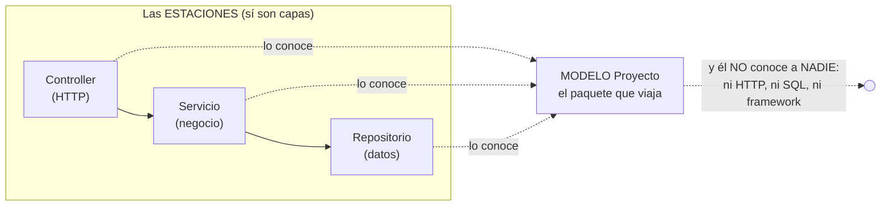

# SOLID, programación por capas y patrones de diseño

> Documento conceptual del curso. Los cinco principios SOLID, la arquitectura
> por capas y los patrones de diseño que este código usa: qué son, por qué
> importan, y dónde se ven (o se verán) en cada versión del proyecto.

---

## 1. Programación por capas

Organizar el sistema en **niveles con responsabilidades distintas**, donde
cada capa solo conoce a la inmediatamente inferior y siempre a través de un
contrato. Así se ve el **viaje de UNA petición** por dentro de la API — el
"diagrama de palitos" del curso:

```
            EL CLIENTE (navegador, Swagger, curl)
                 │
                 │  ① GET /api/proyecto/PR001
                 ▼
┌─────────────────────────────────────────────────────┐
│ CAPA 1 — CONTROLLER (HTTP)                          │
│ controllers/proyecto_controller.py                  │
│ Recibe la petición y traduce el resultado a códigos │
│ HTTP y JSON. NO tiene negocio. NO tiene SQL.        │
└────────────────┬────────────────────────────────────┘
                 │  ② servicio.obtener_por_codigo("PR001")
                 ▼
┌─────────────────────────────────────────────────────┐
│ CAPA 2 — SERVICIO (negocio)                         │
│ servicios/servicio_proyecto.py                      │
│ Las reglas del dominio: qué se puede y qué no (el   │
│ 404 "no existe" NACE aquí). NO conoce FastAPI.      │
│ NO sabe qué motor hay debajo.                       │
└────────────────┬────────────────────────────────────┘
                 │  ③ repositorio.obtener_por_codigo("PR001")
                 │     — a través de la INTERFAZ IRepositorioProyecto
                 ▼
┌─────────────────────────────────────────────────────┐
│ CAPA 3 — REPOSITORIO (datos)                        │
│ repositorios/repositorio_proyecto_postgresql.py     │
│ El SQL: traduce filas ↔ objetos. NO conoce HTTP.    │
│ NO decide negocio.                                  │
└────────────────┬────────────────────────────────────┘
                 │  ④ SELECT … FROM proyecto WHERE codigo = 'PR001'
                 ▼
          ┌───────────────┐
          │ BASE DE DATOS │  PostgreSQL — mapa_local
          └───────┬───────┘
                  │
   y la respuesta hace el viaje DE VUELTA:
   fila → dict (repositorio) → dict (servicio) → JSON + 200 (controller)
```

Qué hace — y qué tiene PROHIBIDO — cada capa:

| Capa | Su trabajo | Prohibido para ella | En la v1 |
|---|---|---|---|
| **Controller** | HTTP: rutas, códigos de estado, JSON | SQL y reglas de negocio | `controllers/proyecto_controller.py` |
| **Servicio** | Las reglas del negocio (¿existe? ¿se puede?) | Saber de HTTP o del motor de BD | `servicios/servicio_proyecto.py` |
| **Repositorio** | El SQL y el mapeo fila ↔ objeto | Saber de HTTP o decidir negocio | `repositorios/repositorio_proyecto_postgresql.py` |

**La regla de oro:** las dependencias apuntan en una sola dirección y cruzan
por **interfaces**. El controller conoce al servicio; el servicio conoce la
interfaz del repositorio; **nadie** conoce dos capas hacia abajo (el
controller no sabe que existe PostgreSQL).

**El mismo viaje cuando algo sale mal** — `GET /api/proyecto/PR999`:

1. El **repositorio** no encuentra la fila y devuelve `None` — un HECHO,
   sin opinión.
2. El **servicio** decide qué significa ese hecho: "ese proyecto no
   existe" — una DECISIÓN de negocio.
3. El **controller** la traduce al idioma HTTP: **404** con su JSON.

Cada capa aportó exactamente lo suyo: datos → hecho, negocio → decisión,
HTTP → código de estado.

**Justificación:** cada capa se puede cambiar, probar o reemplazar sin tocar
las otras. La prueba viva es el criterio 6 de la v1: el servicio se prueba con
un repositorio falso, sin base de datos.

Y el SISTEMA COMPLETO (la meta, v6) repite el patrón a lo grande:

```
CAPA 1: FRONT (v6)      → solo pinta y llama APIs
CAPA 2: APIs (v1…v5)    → solo JSON
CAPA 3: DATOS (v1…)     → PostgreSQL → +MariaDB → +SQL Server
```

### 1.1 ¿Y los MODELOS? ¿Por qué no aparecen como capa?

Pregunta legítima: la carpeta de modelos (`models/proyecto.py (Pydantic)`) existe en el
proyecto, pero la tabla de capas no la menciona. ¿Se olvidó? No — **el
modelo NO es una capa, y la diferencia ES la lección:**

- Las **capas son las ESTACIONES del viaje**: cada una le HACE algo a la
  petición (el controller traduce HTTP, el servicio decide, el
  repositorio consulta).
- El **modelo es LO QUE VIAJA entre estaciones**: el repositorio arma un
  `Proyecto` desde la fila, el servicio lo razona, el controller lo
  vuelve JSON. No procesa nada: ES el paquete. Por eso el diagrama de
  palitos no lo pinta como caja — el modelo va implícito en las flechas.



**Guía de lectura:** las tres estaciones lo conocen y él no conoce a
ninguna — a eso se le llama un elemento **transversal**. No viola la regla
de dependencias ("cada capa solo conoce a la de abajo") porque conocer un
modelo no acopla a nada: el modelo no arrastra dependencias, solo trae
datos con tipos.

**¿Entonces para qué se necesita?** Es el **idioma común** del sistema —
el contrato interno entre capas. Sin modelo, las capas se pasarían
diccionarios sueltos sin tipos, y el error de escribir `stok` en vez de
`presupuesto` no lo atraparía nadie hasta producción. Con modelo, lo atrapa el
lenguaje. En Python, además, los modelos Pydantic hacen doble turno: son el
dato tipado Y la frontera de validación (el 422 nace de ellos).

**La regla del modelo** (tan estricta como las de las capas): el modelo
tiene PROHIBIDO importar cosas del proyecto — ni HTTP, ni SQL, ni
conexiones. Sus flechas de dependencia solo ENTRAN; jamás SALEN.

## 2. Los cinco principios SOLID

SOLID (Robert C. Martin) son cinco reglas de diseño orientado a objetos para
que el software **aguante el cambio**. Este proyecto está diseñado para que
cada principio tenga su momento de demostración en la ruta de versiones:

### S — Responsabilidad Única (*Single Responsibility*)
> Una clase debe tener UNA sola razón para cambiar.

**En la v1:** el controller cambia si cambia el HTTP; el servicio si cambian
las reglas de negocio; el repositorio si cambia el SQL. Tres archivos, tres
razones de cambio, cero mezcla.

```python
# ❌ Sin S: un "controller" con tres razones de cambio (HTTP + negocio + SQL)
@router.get("/api/proyecto/{codigo}")
async def obtener(codigo: str):
    fila = await sesion.execute(text("SELECT ..."))    # SQL aquí = mezcla
    if fila is None:                                   # negocio aquí = mezcla
        return JSONResponse(status_code=404, ...)

# ✅ Con S (la v1): tres archivos, una razón de cambio cada uno
#   controllers/   → cambia solo si cambia el HTTP
#   servicios/     → cambia solo si cambian las reglas
#   repositorios/  → cambia solo si cambia el SQL
```

### O — Abierto/Cerrado (*Open/Closed*)
> Abierto a extensión, cerrado a modificación: agregar sin romper lo que hay.

**Su momento es la v3:** agregar MariaDB será escribir UNA clase nueva
(`RepositorioProyectoMysqlMariaDB`) y una línea en la fábrica — controllers y
servicios no se tocan. Si en la v3 hay que modificar el servicio, el diseño de
la v1 estuvo mal (por eso la v1 deja las interfaces listas).

```python
# La v3 AGREGARÁ sin modificar: una clase nueva con la misma interfaz...
class RepositorioProyectoMariaDB:
    """Los mismos 5 métodos que promete IRepositorioProyecto."""

# ...y el ensamblador (ÚNICO archivo tocado) elegirá el motor:
repositorio = (RepositorioProyectoMariaDB(cadena)
               if motor == "mariadb"
               else RepositorioProyectoPostgreSQL(cadena))
```

### L — Sustitución de Liskov (*Liskov Substitution*)
> Donde sirve el tipo base, debe servir CUALQUIER implementación, sin sorpresas.

**Su momento son la v3 y la v4:** los tres repositorios de proyecto
(PostgreSQL, MariaDB, SQL Server) deben ser **indistinguibles** desde el
servicio: mismos métodos, misma semántica, mismos errores. Cambiar
`DB_PROVIDER` y que nada se rompa ES la prueba de Liskov.

```python
# Ya se ve en la v1: el repositorio FALSO de la prueba (criterio 6)
class RepositorioFalso:
    """Sin base de datos: un diccionario en memoria, misma interfaz."""
    async def obtener_por_codigo(self, codigo: str) -> dict | None:
        return self._datos.get(codigo)
    # ...los otros 4 métodos...

servicio = ServicioProyecto(RepositorioFalso())   # ← el servicio NI SE ENTERA
```

### I — Segregación de Interfaces (*Interface Segregation*)
> Muchas interfaces pequeñas y específicas, no una gigante que obligue a
> implementar lo que no se usa.

**En la v1:** `IRepositorioProyecto` tiene exactamente los 5 métodos del CRUD
de proyecto — no un `IRepositorioUniversal` con 40 métodos. Cuando la v2
agregue persona, tendrá SU interfaz.

```python
# ✅ La interfaz de la v1: SOLO los 5 métodos del CRUD de proyecto
class IRepositorioProyecto(Protocol):
    async def obtener_todos(self, limite: int) -> list[dict]: ...
    async def obtener_por_codigo(self, codigo: str) -> dict | None: ...
    async def crear(self, datos: dict) -> bool: ...
    async def actualizar(self, codigo: str, datos: dict) -> int: ...
    async def eliminar(self, codigo: str) -> int: ...

# ❌ El anti-ejemplo: un IRepositorioUniversal de 40 métodos donde cada
#    clase implementa 35 con "raise NotImplementedError".
```

### D — Inversión de Dependencias (*Dependency Inversion*)
> Depender de abstracciones, no de implementaciones concretas.

**En la v1:** `ServicioProyecto` recibe **la interfaz** por constructor; solo
`ensamblador.py` (3 líneas) conoce la clase concreta. En la v3 ese ensamblador
se convierte en la fábrica real — el único archivo que sabe qué motores existen.

## 3. Cómo se refuerzan entre sí (el resumen para el examen)

| Sin este principio… | …pasa esto |
|---|---|
| Sin S | El "controller" de 800 líneas que hace HTTP + negocio + SQL: cambiar cualquier cosa arriesga todo |
| Sin O | Cada motor nuevo = editar el servicio con otro `if provider == …`: el archivo crece y se rompe |
| Sin L | El motor nuevo "casi" funciona igual → ifs especiales por motor → se perdió O |
| Sin I | Interfaces obesas → clases llenas de `raise NotImplementedError` |
| Sin D | El servicio importa PostgreSQL directo → no hay repositorio falso, no hay pruebas, no hay v3 |

Y las **capas** son SOLID a escala de arquitectura: S reparte responsabilidades
entre capas, D las comunica por contratos, O/L permiten reemplazar una capa
entera (otro motor, otro front) sin tocar las demás.

## 4. Ejemplo resumido de la v1 (todo junto)

```python
# D: el servicio depende de la ABSTRACCIÓN, recibida por constructor
class ServicioProyecto:
    def __init__(self, repositorio: IRepositorioProyecto):   # ← interfaz, no clase
        self._repositorio = repositorio

# El ÚNICO lugar que conoce la clase concreta (v3 lo convertirá en fábrica):
def crear_servicio_proyecto() -> IServicioProyecto:
    repositorio = RepositorioProyectoPostgreSQL(os.environ["DB_POSTGRES"])
    return ServicioProyecto(repositorio)
```

Tres líneas que compran, sin costo extra hoy, toda la ruta v3–v4.

## 5. Patrones de diseño (los que trabajan en este proyecto)

**¿Qué es un patrón de diseño?** Una solución **con nombre**, probada y
reutilizable, para un problema de diseño que aparece una y otra vez. No es
código para copiar y pegar: es la FORMA de una solución — qué clases y qué
interfaces participan, y quién conoce a quién — que cada proyecto escribe
en su propio código. El catálogo clásico es el del "Gang of Four" (GoF,
1994): 23 patrones en tres familias — **creacionales** (cómo se construyen
los objetos), **estructurales** (cómo se componen) y **de comportamiento**
(cómo colaboran). Otros, como Repositorio y DTO, vienen del catálogo de
arquitectura empresarial de Fowler (PoEAA, 2002).

La relación con lo anterior: **SOLID dice qué cualidades debe tener el
diseño; los patrones son recetas concretas que las consiguen; las capas
son el plano general donde unos y otras viven.** Y el nombre importa:
decir "esto es una fábrica abstracta" comunica un diseño completo en tres
palabras.

Los que trabajan en este código:

| Patrón | Familia | Dónde vive aquí |
|---|---|---|
| **Repositorio** (Repository) | arquitectónico (PoEAA) | `repositorios/`: todo el acceso a datos detrás de una interfaz |
| **Inyección de dependencias** | creacional (IoC) | los constructores + el ensamblador (`crear_servicio_proyecto()`) |
| **DTO** — modelo de petición | arquitectónico (PoEAA) | `models/`: un modelo Pydantic por verbo que valida la forma del body |
| **Fábrica** (Factory) | creacional (GoF) | hoy proto-fábrica; se vuelve fábrica real cuando lleguen más motores (v3 del mapa) |
| **Estrategia** (Strategy) | comportamiento (GoF) | implícito: implementaciones intercambiables tras cada interfaz |

### Repositorio — el negocio pide datos a un contrato, no a un motor

```python
# El contrato (repositorios/abstracciones/):
async def obtener_por_codigo(self, codigo: str) -> dict | None: ...

# ServicioProyecto lo usa SIN saber si detrás hay PostgreSQL o un
# diccionario en memoria (la prueba de capas del criterio 6).
```

### Inyección de dependencias — nadie construye lo que necesita

```python
class ServicioProyecto:
    def __init__(self, repositorio: IRepositorioProyecto):  # ← llega armado
        self._repositorio = repositorio

# El ÚNICO lugar que conoce la clase concreta es el ensamblador:
def crear_servicio_proyecto() -> IServicioProyecto:
    return ServicioProyecto(RepositorioProyectoPostgreSQL(cadena))
```

### DTO por verbo — el body aterriza en un modelo que solo valida forma

```python
class Proyecto(BaseModel):                       # POST: todo obligatorio
    codigo: str = Field(min_length=1, max_length=20)
    stock: int = Field(ge=0)
    # Un body inválido muere en 422 ANTES de tocar servicio o BD.

class ProyectoActualizar(BaseModel):             # PATCH: todo opcional
    ...
```

### Fábrica — UNA decisión de motor, en un solo lugar

```python
# La proto-fábrica de la v1 (ensamblador) se convertirá en fábrica real
# cuando lleguen más motores (v3 del mapa):
def crear_repositorio_proyecto(motor: str) -> IRepositorioProyecto:
    if motor == "mariadb":
        return RepositorioProyectoMariaDB(cadena_mariadb)
    return RepositorioProyectoPostgreSQL(cadena_postgres)
# Agregar un motor = UNA clase nueva y UNA rama aquí — nada más se toca.
```

### Estrategia — el patrón que va de regalo

La pareja "interfaz + implementaciones intercambiables"
(`RepositorioProyectoPostgreSQL`, el `RepositorioFalso` de la prueba — y
los motores que vengan) es la esencia de Strategy: quien usa la interfaz
jamás pregunta cuál implementación le tocó.

## 6. Referencias

1. Robert C. Martin — *Design Principles and Design Patterns* (el artículo
   original de los principios, 2000):
   <https://web.archive.org/web/20150906155800/http://www.objectmentor.com/resources/articles/Principles_and_Patterns.pdf>
2. Robert C. Martin — *Clean Architecture* (2017): capas, la regla de
   dependencia y SOLID aplicado a arquitectura.
3. Martin Fowler — *PresentationDomainDataLayering*:
   <https://martinfowler.com/bliki/PresentationDomainDataLayering.html>
4. Refactoring Guru (es) — patrones de diseño explicados:
   <https://refactoring.guru/es/design-patterns/what-is-pattern>
5. Gamma, Helm, Johnson y Vlissides — *Design Patterns* (GoF, 1994): el
   catálogo original de los 23 patrones.
6. Martin Fowler — *Patterns of Enterprise Application Architecture*
   (PoEAA, 2002): Repositorio, DTO y compañía.
7. En este repositorio: el [plan de la v1](spec_kit/versiones/v1_proyecto/3_plan.md)
   (§3 capas, §4.1 interfaces, §4.3 la proto-fábrica) y el
   [mapa de versiones](spec_kit/versiones/0_mapa_versiones.md) (dónde entra
   cada principio).
