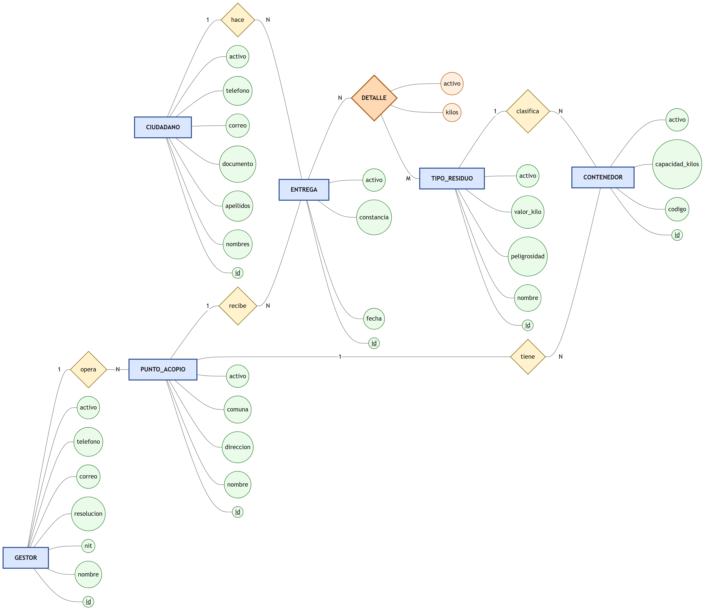
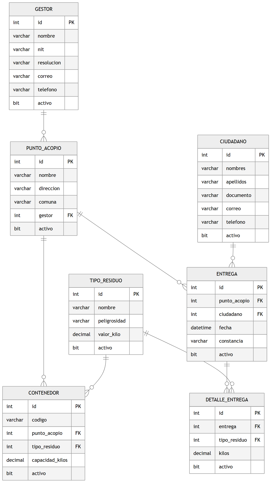

# Evaluación individual — Aplicación y Servicios Web

**Tecnología en Desarrollo de Software · Institución Universitaria ITM**

| | |
|---|---|
| **Grupo** | **580202009-8 — Aplicación y Servicios Web** |
| **Stack** | **API en C# / ASP.NET Core sobre SQL Server** · el **front, en la tecnología que usted quiera** |
| **Modalidad** | **Individual** |
| **Peso** | **20 %** |
| **Fecha** | **viernes 11 de septiembre de 2026** |
| **Hora** | **de 6:00 a 8:00 a. m.** |
| **Modo** | **remoto**, con conexión |
| **Entrega** | a las **8:00 a. m.**: lo que esté en su repositorio |

> **Lo primero, antes de leer el resto: cree el repositorio privado e
> invite a `ccastro2050`.** No es el primer paso del trabajo; es el
> requisito para empezar. Sin esa invitación su entrega no existe, y a las
> 8:00 a. m. ya no hay tiempo de arreglarlo.
>
> **Este enunciado es del grupo 580202009-8.** Los otros dos grupos
> trabajan un problema distinto.

---

## 1. Qué se evalúa

Dos cosas, y se califican por separado:

| | |
|---|---|
| **Lo que construye** — 60 % | La versión 1 funcionando, y **el rastro de cómo la construyó** |
| **Lo que sabe explicar** — 40 % | Las respuestas escritas, ancladas a su propio código |

El caso viene **resuelto en su parte de diseño**: el problema, el contexto,
el modelo entidad-relación, el modelo relacional normalizado y el script de
la base **se los entregan hechos**, junto con el plan de desarrollo, las
historias de usuario y el cronograma. Usted **no diseña la base ni redacta
los requisitos**: escribe el spec kit de la versión 1 y la construye.

---

## 2. Lo nuevo: un commit por cada fase

Esta evaluación **se lee en el historial de Git**.

> ### La regla
>
> Su `8_tasks.md` tiene **mínimo nueve fases**, y **cada fase deja al menos
> un commit**, con el mensaje empezando por el número de la fase.

```
Fase 3 — Interfaces y repositorio SQL Server

IRepositorioTipoResiduo y RepositorioTipoResiduoSqlServer, con las
consultas parametrizadas. Al probar el listado devolvia 500: faltaba
el using de Microsoft.Data.SqlClient. Corregido.
```

### Las nueve fases, y cómo se comprueba cada una

**Ninguna fase termina porque el código esté escrito: termina cuando se
probó.** Cada una trae su comprobación, y es una sola, de un minuto:

| Fase | Qué se hace | Cómo se comprueba |
|---|---|---|
| **0** | Base de datos y esqueleto | La base carga y usted **cuenta las filas** de las tres tablas |
| **1** | Los modelos (las clases entidad) | `dotnet build` compila |
| **2** | Las peticiones por verbo y la excepción | Compila; crear, reemplazar y actualizar son **tres clases distintas** |
| **3** | Interfaces y repositorios SQL Server | El repositorio **trae filas de verdad** de la base |
| **4** | Servicios y prueba de capas | La prueba de capas **pasa**, y el servicio no menciona HTTP |
| **5** | Controladores y `Program.cs` | Los **seis endpoints** responden, incluidos el **422** del PUT y el **200** del PATCH |
| **6** | El front | La pantalla **lista y crea**, y sigue en pie con la API apagada |
| **7** | Docker: un solo comando | `docker compose up -d --build` **desde cero** levanta los tres servicios |
| **8** | Cierre | `9_checklist.md` firmado y `RESPUESTAS.md` diligenciado |

El spec kit (`2_spec` … `8_tasks`) va **antes de la Fase 1**, y también deja
su commit. Nueve es el **mínimo**, no el máximo.

> **Si hace más de una versión**, cada una repite estas fases y deja sus
> propios commits: `Fase 3 (v2) — …`. Las fases no se heredan de la
> versión anterior.

### Cuando la fase no funciona — que es lo normal

**Se corrige y se comitea. Si vuelve a fallar, se corrige otra vez y se
comitea otra vez.** El mensaje dice **qué respondió el sistema**:

```
Fase 5 (correccion) — el PATCH respondia 422

PATCH /api/tipos-residuo/1 con {"nombre":"Baterias"} devolvia
422 "el campo peligrosidad es obligatorio". La peticion de PATCH
heredaba de la de reemplazo, que exige todos los campos. Se separo
en TipoResiduoActualizar con los campos opcionales. Ahora responde 200.
```

**Y no se quede atascado.** Si una fase no sale, **siga y vuelva después**,
dejando el rastro:

1. `Fase 4 — parcial: la prueba de capas falla, sigo con el controlador`
2. Avanza.
3. `Fase 4 (correccion) — la prueba de capas pasa`

> **Un historial con correcciones vale más que uno impecable.** Nueve
> commits perfectos, sin una sola corrección, en dos horas, con front y
> base de datos, no le pasa a nadie. Ese historial no dice «trabajé bien»:
> dice «subí al final lo que ya tenía». **Las correcciones suman. Lo que
> no suma es que no aparezcan.**

---

## 3. El problema

En Medellín se botan a la basura, cada mes, toneladas de aparatos
eléctricos y electrónicos: celulares viejos, cargadores, pantallas,
baterías de litio. Una batería de litio en un relleno sanitario contamina
suelo y agua durante años, y un celular tiene oro, cobre y cobalto que se
pierden para siempre.

Hay empresas autorizadas —los **gestores**— que operan **puntos de
acopio** donde el ciudadano lleva sus aparatos. Pero cada gestor lleva sus
cuentas aparte, casi siempre en papel: **nadie sabe cuántos kilos se
recogieron, de qué, ni en cuál punto**. Y sin ese dato no se puede
demostrar ante la autoridad ambiental que el material se recuperó, ni
pagarle al ciudadano lo que corresponde por lo que entregó.

Se necesita un sistema que registre **quién opera qué puntos, qué
contenedores tiene cada punto, quiénes entregan, y qué trajo cada
entrega**: los kilos, por tipo de residuo.

---

## 4. El contexto

| Quién | Qué hace con el sistema |
|---|---|
| **El gestor** | Registra sus puntos de acopio y los contenedores de cada uno |
| **El ciudadano** | Se registra y hace entregas |
| **El operario del punto** | Pesa lo que llega y registra la entrega con su detalle |
| **La autoridad ambiental** | Consulta cuántos kilos se recuperaron, por tipo y por punto |

Reglas del negocio que ya están decididas:

1. Un contenedor **pertenece a un solo punto** y recibe **un solo tipo de
   residuo**.
2. Una entrega es de **un ciudadano en un punto**, y puede traer **varios
   tipos** de residuo, cada uno con sus kilos.
3. El **valor por kilo** es del tipo de residuo, no de la entrega.
4. **Nada se borra de verdad.** Todas las tablas llevan `activo`, y borrar
   es marcar esa columna en `0`.
5. Los datos históricos **no se pierden**: la autoridad ambiental audita
   hacia atrás.

---

## 5. El modelo entidad-relación (MER)

Modelo **conceptual**, en notación de **Peter Chen**:

| Forma | Qué es |
|---|---|
| **Rectángulo** | Una entidad |
| **Rombo** | Una relación |
| **Elipse** | Un atributo |
| Atributo **subrayado** | La llave primaria |
| `1` / `N` / `M` | La cardinalidad |

Aquí **no hay claves foráneas**: en el modelo conceptual no existen
todavía. Aparecen al pasar al relacional (§6).



El rombo **`DETALLE`** está pintado distinto porque es **N : M**, y es el
único con **atributo propio**: los `kilos` cuelgan de la relación. Una
batería no pesa siempre lo mismo, y una entrega trae varios tipos: los
kilos no son de una entidad ni de la otra, son **de esa línea**. Al pasar
al modelo relacional, ese rombo se vuelve la tabla `detalle_entrega`.

### Cardinalidades, en palabras

| Relación | Se lee así |
|---|---|
| `GESTOR` **opera** `PUNTO_ACOPIO` | 1 : N — un gestor opera muchos puntos; cada punto es de un gestor |
| `PUNTO_ACOPIO` **tiene** `CONTENEDOR` | 1 : N — un punto tiene muchos contenedores; cada contenedor es de un punto |
| `TIPO_RESIDUO` **clasifica** `CONTENEDOR` | 1 : N — un tipo clasifica muchos contenedores; cada contenedor recibe un tipo |
| `CIUDADANO` **hace** `ENTREGA` | 1 : N — un ciudadano hace muchas entregas; cada entrega es de uno |
| `PUNTO_ACOPIO` **recibe** `ENTREGA` | 1 : N — un punto recibe muchas entregas; cada entrega es en un punto |
| `ENTREGA` **DETALLE** `TIPO_RESIDUO` | **N : M** — una entrega trae varios tipos y un tipo aparece en muchas entregas |

---

## 6. El modelo relacional (MR), normalizado

Modelo **lógico**, ya con llaves y tipos:



### 6.1 Del MER al MR

| Regla aplicada | Resultado |
|---|---|
| Cada entidad se vuelve una tabla | 6 tablas |
| Cada relación **uno a muchos** pone la llave foránea **en el lado «muchos»** | `punto_acopio.gestor`, `contenedor.punto_acopio`, `contenedor.tipo_residuo`, `entrega.punto_acopio`, `entrega.ciudadano` |
| Cada relación **muchos a muchos** se vuelve una tabla propia | `detalle_entrega` — la séptima |
| Los atributos de la relación viven en esa tabla | `kilos` va en `detalle_entrega` |

### 6.2 Por qué está en tercera forma normal

**1FN** — ningún campo guarda dos cosas. `entrega` no tiene una columna
«residuos» con `baterias, cables` adentro: cada tipo es una fila del
detalle.

**2FN** — ningún campo depende solo de una parte de la llave. Los `kilos`
no dependen solo del tipo de residuo ni solo de la entrega: dependen de la
línea completa.

**3FN** — ningún campo depende de otro que no sea la llave:

- Si `punto_acopio` guardara el **nombre** del gestor en vez de su
  identificador, tendríamos `punto_acopio.id → gestor → nombre`: una
  **dependencia transitiva**. Al corregir el nombre de un gestor habría
  que corregirlo en todos sus puntos, y basta olvidar uno para que la base
  diga dos cosas distintas.
- El **valor por kilo** está en `tipo_residuo`, no copiado en cada línea
  del detalle. Un solo dato, en un solo lugar.

### 6.3 Las tres tablas sin clave foránea

| Tabla | Filas de ejemplo | Por qué no tiene ninguna |
|---|---|---|
| `tipo_residuo` | 6 | Un tipo de residuo existe por sí solo |
| `gestor` | 4 | Una empresa existe aunque no tenga puntos |
| `ciudadano` | 8 | Una persona existe aunque no haya entregado nada |

**Estas tres son las de su versión 1.**

### 6.4 El borrado es lógico

Las siete tablas llevan `activo BIT NOT NULL DEFAULT 1`. `DELETE` marca
`activo = 0`; los listados filtran `WHERE activo = 1`; el segundo `DELETE`
responde **404**.

---

## 7. Su versión 1

**Las tres tablas sin clave foránea**: `tipo_residuo`, `gestor` y
`ciudadano`.

Para cada una, los seis endpoints sobre una **ruta específica** —
`/api/tipos-residuo`, `/api/gestores`, `/api/ciudadanos`; nunca
`/api/{tabla}`:

| Verbo | Ruta | Responde |
|---|---|---|
| GET | `/api/<recurso>` | 200 con `{recurso, limite, total, datos}` · **204** si no hay filas activas |
| GET | `/api/<recurso>/{id}` | 200 · **404** si no existe o está inactivo |
| POST | `/api/<recurso>` | 200 · **422** si falta un campo |
| PUT | `/api/<recurso>/{id}` | 200 · **422** si falta un campo (reemplazo completo) |
| PATCH | `/api/<recurso>/{id}` | 200 con el **mismo cuerpo** que el PUT rechaza |
| DELETE | `/api/<recurso>/{id}` | 200 · **404** al segundo intento |

> **La pareja PUT/PATCH es la lección de la versión.** El mismo cuerpo
> incompleto tiene que dar **422 por PUT** y **200 por PATCH**.

### Y su front — cada versión el suyo

**Una versión incluye SU FRONT.** No hay versiones de solo API.

Esto vale **haga usted una versión o varias**. Si decide repartir el
trabajo en dos —por ejemplo, la v1 con `tipo_residuo` y la v2 con
`gestor` y `ciudadano`—, **cada una entrega su parte del front**. Una v2
que agrega endpoints y no agrega pantalla no es una versión: es media.

**La API va en C# / ASP.NET Core sobre SQL Server** — eso no se negocia,
es el stack del curso. **El front lo escoge usted.**

Lo más corto es **Blazor**, porque las cuatro plantillas (§15) ya lo traen
y usted copia la estructura; pero si prefiere Flask, React, Angular o
HTML con JavaScript a secas, también vale. Solo tiene que cumplir tres
cosas:

1. **Muestra el listado** de las tres tablas y tiene formulario para crear
   y editar.
2. **Habla con la API por HTTP.** No se conecta a SQL Server: no tiene el
   driver ni las credenciales.
3. **Con la API apagada, la pantalla sigue en pie** y avisa en español.

---

## 8. Si el tiempo aprieta

Son **dos horas: de 6:00 a 8:00 a. m.** Si no alcanza, **recorte alcance y
déjelo escrito** en su `0_mapa_versiones.md`:

> «La v1 entrega `tipo_residuo` completa con front, y `gestor` sin front.
> `ciudadano` pasa a la v2.»

**Eso no es incumplir**: es la decisión que toma un equipo de verdad
cuando la fecha no se mueve. Lo que sí castiga la rúbrica es **entregar a
medias sin decirlo**.

---

## 9. El script de la base

**Ya está escrito**, y está completo al final de esta sección. Cópielo tal
cual a `db/bdraee.sql` en su repositorio. **No hay que escribir SQL de
creación de tablas.**

Los datos de ejemplo son **inventados** y así se declara dentro del propio
script: los correos usan `example.com`, los teléfonos el 555, y las
empresas y documentos no corresponden a nadie.

> **SQL Server no ejecuta solo los scripts que se le montan**, a diferencia
> de otros motores: alguien tiene que conectarse y correrlo. De eso se
> encarga el contenedor inicializador, igual que en
> `proyecto_aplicacion_y_servicios_web1`.

### 9.1 El script completo

```sql
-- ============================================================
-- Recolección de residuos electrónicos (RAEE)
-- Evaluación individual — Aplicación y Servicios Web
-- SQL Server 2022 (compatible 2016+)
--
-- ESTE SCRIPT SE LE ENTREGA HECHO. Es el artefacto dado de la
-- evaluación, igual que en el proyecto del curso el esquema viene
-- dado. Nadie tiene que diseñar la base ni escribir SQL de
-- creación de tablas.
--
-- Sale del modelo relacional del enunciado, ya normalizado hasta
-- 3FN. Las siete tablas y sus siete claves foráneas son
-- exactamente las del diagrama.
--
-- OJO — SQL Server NO ejecuta solo los scripts que se le montan,
-- a diferencia de otros motores: alguien tiene que conectarse y
-- correrlo. De eso se encarga el contenedor inicializador
-- (db/init.sh), que corre esto UNA vez y termina.
-- ============================================================

-- ============================================================
-- LIMPIEZA (en orden inverso al de creación, por las FK)
--
-- Estas líneas no dan error si la tabla no existe: `IF OBJECT_ID`
-- pregunta primero. En una base vacía simplemente no hacen nada.
-- ============================================================
IF OBJECT_ID('detalle_entrega', 'U') IS NOT NULL DROP TABLE detalle_entrega;
IF OBJECT_ID('entrega', 'U')         IS NOT NULL DROP TABLE entrega;
IF OBJECT_ID('contenedor', 'U')      IS NOT NULL DROP TABLE contenedor;
IF OBJECT_ID('punto_acopio', 'U')    IS NOT NULL DROP TABLE punto_acopio;
IF OBJECT_ID('ciudadano', 'U')       IS NOT NULL DROP TABLE ciudadano;
IF OBJECT_ID('gestor', 'U')          IS NOT NULL DROP TABLE gestor;
IF OBJECT_ID('tipo_residuo', 'U')    IS NOT NULL DROP TABLE tipo_residuo;
GO


-- ============================================================
-- LAS TRES TABLAS SIN CLAVE FORÁNEA
--
-- Estas tres son las de la VERSIÓN 1. No dependen de nadie: se
-- pueden crear, listar, actualizar y borrar sin tocar ninguna
-- otra tabla, y por eso son el punto de entrada del proyecto.
-- ============================================================

-- tipo_residuo: pantalla, batería, celular…
CREATE TABLE tipo_residuo (
    id            INT NOT NULL,
    nombre        VARCHAR(60) NOT NULL,
    -- 'alta', 'media' o 'baja': qué tan peligroso es manipularlo
    peligrosidad  VARCHAR(10) NOT NULL,
    -- Lo que el gestor paga por kilo. DECIMAL, no FLOAT: con dinero
    -- no se usa coma flotante, que redondea donde no debe.
    valor_kilo    DECIMAL(10,2) NOT NULL,
    -- El borrado es LÓGICO en todas las tablas: DELETE marca esta
    -- columna en 0 y los listados filtran los inactivos. La fila NO
    -- se va de la base.
    activo        BIT NOT NULL DEFAULT 1,
    CONSTRAINT pk_tipo_residuo PRIMARY KEY (id)
);
GO

-- gestor: la empresa autorizada para recoger
CREATE TABLE gestor (
    id          INT NOT NULL,
    nombre      VARCHAR(80) NOT NULL,
    nit         VARCHAR(20) NOT NULL,
    -- El número de la resolución ambiental que lo autoriza
    resolucion  VARCHAR(30) NOT NULL,
    correo      VARCHAR(70) NOT NULL,
    -- Teléfono es TEXTO, no número: lleva prefijos, espacios y
    -- extensiones, y nunca se suma ni se ordena aritméticamente.
    telefono    VARCHAR(45) NOT NULL,
    activo      BIT NOT NULL DEFAULT 1,
    CONSTRAINT pk_gestor PRIMARY KEY (id)
);
GO

-- ciudadano: quien lleva sus residuos
CREATE TABLE ciudadano (
    id         INT NOT NULL,
    nombres    VARCHAR(60) NOT NULL,
    apellidos  VARCHAR(60) NOT NULL,
    documento  VARCHAR(20) NOT NULL,
    correo     VARCHAR(70) NOT NULL,
    telefono   VARCHAR(45) NOT NULL,
    activo     BIT NOT NULL DEFAULT 1,
    CONSTRAINT pk_ciudadano PRIMARY KEY (id)
);
GO


-- ============================================================
-- LAS TABLAS CON CLAVE FORÁNEA
--
-- Fíjese en lo que NO tienen: `punto_acopio` guarda el
-- IDENTIFICADOR del gestor, no su nombre. Guardar el nombre aquí
-- sería una dependencia transitiva (punto_acopio → gestor →
-- nombre) y rompería la 3FN: al corregir el nombre de un gestor
-- habría que corregirlo en todos sus puntos, y bastaría olvidar
-- uno para que la base dijera dos cosas distintas.
-- ============================================================

-- punto_acopio: dónde se reciben los residuos
CREATE TABLE punto_acopio (
    id          INT NOT NULL,
    nombre      VARCHAR(80) NOT NULL,
    direccion   VARCHAR(120) NOT NULL,
    comuna      VARCHAR(45) NOT NULL,
    gestor      INT NOT NULL,
    activo      BIT NOT NULL DEFAULT 1,
    CONSTRAINT pk_punto_acopio PRIMARY KEY (id),
    CONSTRAINT fk_punto_gestor FOREIGN KEY (gestor) REFERENCES gestor(id)
);
GO

-- contenedor: el recipiente físico, para un tipo de residuo
CREATE TABLE contenedor (
    id              INT NOT NULL,
    codigo          VARCHAR(20) NOT NULL,
    punto_acopio    INT NOT NULL,
    tipo_residuo    INT NOT NULL,
    capacidad_kilos DECIMAL(8,2) NOT NULL,
    activo          BIT NOT NULL DEFAULT 1,
    CONSTRAINT pk_contenedor PRIMARY KEY (id),
    CONSTRAINT fk_cont_punto FOREIGN KEY (punto_acopio) REFERENCES punto_acopio(id),
    CONSTRAINT fk_cont_tipo  FOREIGN KEY (tipo_residuo) REFERENCES tipo_residuo(id)
);
GO

-- entrega: la visita de un ciudadano a un punto
CREATE TABLE entrega (
    id            INT NOT NULL,
    punto_acopio  INT NOT NULL,
    ciudadano     INT NOT NULL,
    fecha         DATETIME NOT NULL,
    -- El número del certificado que se le entrega al ciudadano
    constancia    VARCHAR(30) NOT NULL,
    activo        BIT NOT NULL DEFAULT 1,
    CONSTRAINT pk_entrega PRIMARY KEY (id),
    CONSTRAINT fk_ent_punto     FOREIGN KEY (punto_acopio) REFERENCES punto_acopio(id),
    CONSTRAINT fk_ent_ciudadano FOREIGN KEY (ciudadano)    REFERENCES ciudadano(id)
);
GO


-- ============================================================
-- LA TABLA QUE NACE DE LA RELACIÓN MUCHOS A MUCHOS
--
-- «Una entrega trae varios tipos de residuo y un tipo aparece en
-- muchas entregas» no cabe en `entrega` ni en `tipo_residuo`:
-- necesita su propia tabla.
--
-- Y los KILOS viven AQUÍ. No son del tipo de residuo (una batería
-- no pesa siempre lo mismo) ni de la entrega (que trae varios
-- tipos): son de ESTA LÍNEA. Es la misma forma de `factura` y
-- `detalle_factura` del proyecto del curso.
-- ============================================================
CREATE TABLE detalle_entrega (
    id            INT NOT NULL,
    entrega       INT NOT NULL,
    tipo_residuo  INT NOT NULL,
    kilos         DECIMAL(8,2) NOT NULL,
    activo        BIT NOT NULL DEFAULT 1,
    CONSTRAINT pk_detalle_entrega PRIMARY KEY (id),
    CONSTRAINT fk_det_entrega FOREIGN KEY (entrega)      REFERENCES entrega(id),
    CONSTRAINT fk_det_tipo    FOREIGN KEY (tipo_residuo) REFERENCES tipo_residuo(id)
);
GO


-- ============================================================
-- DATOS DE EJEMPLO
--
-- Son INVENTADOS, y se dice aquí para que nadie los cite como
-- reales. Están para que la API tenga qué devolver desde el
-- primer arranque: un listado vacío no deja ver si el endpoint
-- pinta bien sus campos.
--
-- Los correos van al dominio `example.com`, que la IANA reserva
-- para documentación y no le pertenece a nadie; los teléfonos
-- usan el 555, que no corresponde a ninguna línea real. Ninguna
-- persona ni ninguna empresa de esta lista existe.
-- ============================================================

-- tipo_residuo: 6 filas
INSERT INTO tipo_residuo (id, nombre, peligrosidad, valor_kilo) VALUES
    (1, 'Baterias de litio',        'alta',   3800.00),
    (2, 'Pantallas y monitores',    'alta',   1200.00),
    (3, 'Telefonos celulares',      'media',  5400.00),
    (4, 'Computadores portatiles',  'media',  4100.00),
    (5, 'Cables y conectores',      'baja',    900.00),
    (6, 'Electrodomesticos menores','baja',    650.00);
GO

-- gestor: 4 filas
INSERT INTO gestor (id, nombre, nit, resolucion, correo, telefono) VALUES
    (1, 'RAEE Andina S.A.S.',        '900222333-1', 'RES-2024-1180', 'contacto@example.com', '+57 604 555 0401'),
    (2, 'EcoCircular del Valle',     '900444555-2', 'RES-2024-2064', 'servicio@example.com', '+57 604 555 0402'),
    (3, 'Reciclatek Medellin',       '900666777-3', 'RES-2025-0312', 'soporte@example.com',  '+57 604 555 0403'),
    (4, 'Gestion Verde Antioquia',   '900888999-4', 'RES-2025-0755', 'info@example.com',     '+57 604 555 0404');
GO

-- ciudadano: 8 filas
INSERT INTO ciudadano (id, nombres, apellidos, documento, correo, telefono) VALUES
    (1001, 'Andres Felipe',    'Salazar Ruiz',    '1010101010', 'asalazar@example.com',  '+57 300 555 0501'),
    (1002, 'Luz Adriana',      'Cifuentes Mora',  '1020202020', 'lcifuentes@example.com','+57 300 555 0502'),
    (1003, 'Oscar Ivan',       'Betancur Loaiza', '1030303030', 'obetancur@example.com', '+57 300 555 0503'),
    (1004, 'Paula Andrea',     'Mosquera Diaz',   '1040404040', 'pmosquera@example.com', '+57 300 555 0504'),
    (1005, 'Ricardo Alfonso',  'Duque Henao',     '1050505050', 'rduque@example.com',    '+57 300 555 0505'),
    (1006, 'Nubia Esther',     'Padilla Serna',   '1060606060', 'npadilla@example.com',  '+57 300 555 0506'),
    (1007, 'Hector Mauricio',  'Lozano Cardona',  '1070707070', 'hlozano@example.com',   '+57 300 555 0507'),
    (1008, 'Claudia Patricia', 'Arango Velez',    '1080808080', 'carango@example.com',   '+57 300 555 0508');
GO

-- punto_acopio: 5 filas
INSERT INTO punto_acopio (id, nombre, direccion, comuna, gestor) VALUES
    (1, 'Punto Laureles',        'Circular 4 # 70-15',   'Laureles',   1),
    (2, 'Punto Belen',           'Carrera 76 # 30-40',   'Belen',      1),
    (3, 'Punto Robledo ITM',     'Calle 73 # 76A-354',   'Robledo',    2),
    (4, 'Punto Envigado',        'Carrera 43A # 38 Sur', 'Envigado',   3),
    (5, 'Punto Centro',          'Calle 51 # 45-20',     'La Candelaria', 4);
GO

-- contenedor: 9 filas
INSERT INTO contenedor (id, codigo, punto_acopio, tipo_residuo, capacidad_kilos) VALUES
    (1, 'LA-BAT-01', 1, 1,  80.00),
    (2, 'LA-PAN-01', 1, 2, 250.00),
    (3, 'LA-CEL-01', 1, 3,  40.00),
    (4, 'BE-BAT-01', 2, 1,  60.00),
    (5, 'BE-CAB-01', 2, 5, 120.00),
    (6, 'RO-PC-01',  3, 4, 200.00),
    (7, 'RO-CEL-01', 3, 3,  40.00),
    (8, 'EN-ELE-01', 4, 6, 300.00),
    (9, 'CE-PAN-01', 5, 2, 250.00);
GO

-- entrega: 8 filas
INSERT INTO entrega (id, punto_acopio, ciudadano, fecha, constancia) VALUES
    (1, 1, 1001, '2026-08-12 09:15:00', 'CONS-2026-0001'),
    (2, 1, 1002, '2026-08-12 11:40:00', 'CONS-2026-0002'),
    (3, 3, 1003, '2026-08-13 08:05:00', 'CONS-2026-0003'),
    (4, 2, 1004, '2026-08-14 15:30:00', 'CONS-2026-0004'),
    (5, 3, 1005, '2026-08-17 10:20:00', 'CONS-2026-0005'),
    (6, 4, 1006, '2026-08-18 14:00:00', 'CONS-2026-0006'),
    (7, 5, 1007, '2026-08-19 16:45:00', 'CONS-2026-0007'),
    (8, 1, 1008, '2026-08-20 09:00:00', 'CONS-2026-0008');
GO

-- detalle_entrega: 14 filas
-- Fíjese en la entrega 1: trae DOS tipos distintos. Ahí se ve por
-- qué los kilos no caben en `entrega`.
INSERT INTO detalle_entrega (id, entrega, tipo_residuo, kilos) VALUES
    (1,  1, 1,  2.40),
    (2,  1, 3,  0.85),
    (3,  2, 2, 14.20),
    (4,  3, 4,  3.10),
    (5,  3, 5,  1.75),
    (6,  4, 1,  4.60),
    (7,  4, 6,  9.30),
    (8,  5, 3,  1.10),
    (9,  5, 4,  2.95),
    (10, 6, 6, 22.50),
    (11, 7, 2, 18.75),
    (12, 7, 5,  3.40),
    (13, 8, 1,  1.95),
    (14, 8, 2, 11.60);
GO


-- ============================================================
-- Conteos esperados después de cargar:
--   tipo_residuo      6 filas   ← sin clave foránea
--   gestor            4 filas   ← sin clave foránea
--   ciudadano         8 filas   ← sin clave foránea
--   punto_acopio      5 filas   (1 clave foránea)
--   contenedor        9 filas   (2 claves foráneas)
--   entrega           8 filas   (2 claves foráneas)
--   detalle_entrega  14 filas   (2 claves foráneas)
-- ============================================================
```

---

## 10. La estructura de carpetas y archivos

En PowerShell:

```powershell
mkdir proyecto_evaluacion_raee
cd proyecto_evaluacion_raee

mkdir db,
      docs\spec_kit, docs\spec_kit\versiones\v1,
      api_raee, api_raee\Controllers, api_raee\Modelos,
      api_raee\Peticiones, api_raee\Servicios,
      api_raee\Repositorios, api_raee\Excepciones,
      api_raee\pruebas,
      front

New-Item docker-compose.yml, README.md, RESPUESTAS.md,
    db\bdraee.sql, db\init.sh,
    docs\spec_kit\1_constitution.md,
    docs\spec_kit\versiones\0_mapa_versiones.md,
    docs\spec_kit\versiones\v1\2_spec.md,
    docs\spec_kit\versiones\v1\3_plan.md,
    docs\spec_kit\versiones\v1\4_research.md,
    docs\spec_kit\versiones\v1\5_data_model.md,
    docs\spec_kit\versiones\v1\6_contracts.md,
    docs\spec_kit\versiones\v1\7_quickstart.md,
    docs\spec_kit\versiones\v1\8_tasks.md,
    docs\spec_kit\versiones\v1\9_checklist.md,
    api_raee\ApiRaee.csproj,
    api_raee\Program.cs,
    api_raee\Dockerfile,
    api_raee\appsettings.json,
    api_raee\Controllers\TipoResiduoController.cs,
    api_raee\Controllers\GestorController.cs,
    api_raee\Controllers\CiudadanoController.cs,
    api_raee\Modelos\TipoResiduo.cs,
    api_raee\Modelos\Gestor.cs,
    api_raee\Modelos\Ciudadano.cs,
    api_raee\Peticiones\TipoResiduoCrear.cs,
    api_raee\Peticiones\TipoResiduoReemplazo.cs,
    api_raee\Peticiones\TipoResiduoActualizar.cs,
    api_raee\Servicios\IServicioTipoResiduo.cs,
    api_raee\Servicios\ServicioTipoResiduo.cs,
    api_raee\Repositorios\IRepositorioTipoResiduo.cs,
    api_raee\Repositorios\RepositorioTipoResiduoSqlServer.cs,
    api_raee\Excepciones\NoEncontradoExcepcion.cs,
    api_raee\pruebas\PruebaCapas.csproj,
    api_raee\pruebas\Programa.cs
```

> Las peticiones, el servicio y el repositorio están listados solo para
> `tipo_residuo`. **Faltan los de las otras dos tablas**: agréguelos usted,
> con el mismo patrón. Que la estructura esté incompleta a propósito hace
> parte de la evaluación.

### Un spec kit por versión, una sola constitución

Fíjese en dónde queda cada cosa:

```
docs/spec_kit/
├── 1_constitution.md              ← UNA sola, para TODAS las versiones
└── versiones/
    ├── 0_mapa_versiones.md        ← qué entra en cada versión
    └── v1/
        ├── 2_spec.md  3_plan.md  4_research.md  5_data_model.md
        ├── 6_contracts.md  7_quickstart.md  8_tasks.md
        ├── 9_checklist.md
        └── GUIA_IA1.md          ← el plan de IA de ESTA versión
```

- **`1_constitution.md` es del proyecto, no de la versión.** Se escribe una
  vez y ninguna versión puede contradecirla. Si una versión necesita
  cambiarla, se propone en su `4_research.md` y la constitución sube de
  versión — pero **sigue siendo una sola**.
- **Todo lo demás es por versión.** Si usted hace una v2, crea
  `versiones/v2/` **con sus ocho documentos y su propio `9_checklist.md`
  firmado**. No se reutiliza el `2_spec` de la v1 «porque es parecido»:
  cada versión declara qué hace ella.
- **Y cada versión, su front** (§7).

**Lo que la estructura ya está diciendo:**

- `Modelos` y `Peticiones` son carpetas **distintas**: el modelo es lo que
  la base guarda, la petición es lo que el cliente manda;
- hay una interfaz por servicio y una por repositorio, **desde el primer
  día**;
- `pruebas` es un proyecto aparte, con su propio `.csproj`;
- `front` está **al lado** de `api_raee`, no adentro: son dos contenedores.

### Los puertos

| Servicio | Puerto |
|---|---|
| API | **8120** |
| Front | **8121** |
| SQL Server | **11475** |

---

## 11. Qué entrega

**Un repositorio de GitHub, y todo va adentro.** Lo que no esté en el
repositorio, no se calificó.

> ### El repositorio tiene que ser PRIVADO
>
> **Un repositorio público no se califica.** No es un descuento: no se
> recibe.
>
> Al crearlo, en *Settings → Collaborators → Add people*, invite a
> **`ccastro2050`**. Sin esa invitación el profesor no ve nada, y una
> entrega que no se puede abrir **no existe**.
>
> **El nombre:** `evaluacion_aplicacion_y_servicios_web`.
>
> **Y hágalo antes de empezar**, no al final: la invitación es lo primero.

| # | Entregable | Dónde |
|---|---|---|
| 1 | Los ocho documentos del spec kit, con el `8_tasks.md` de **nueve fases** | `docs/spec_kit/` |
| 2 | `9_checklist.md` firmado por usted | `docs/spec_kit/versiones/v1/` |
| 3 | La API sobre las tres tablas sin clave foránea | `api_raee/` |
| 4 | El front, en su propio contenedor | `front/` |
| 5 | `docker compose up -d --build` levanta todo | raíz |
| 6 | Las respuestas de sustentación, **en Markdown** | `RESPUESTAS.md` |
| 7 | **Al menos nueve commits, uno por fase**, más los de corrección | el historial |
| 8 | **`GUIA_IA1.md`**: el plan de IA de la versión —con qué herramienta, qué documentos le entrega, **el prompt**, cómo supervisa y qué hace cuando falla | `docs/spec_kit/versiones/v1/` |

> ### Todo va en Markdown, nada en Word
>
> El material se entrega en **`.md`** y **las respuestas se escriben en
> `RESPUESTAS.md`**, el archivo que ya viene en el andamiaje con las
> preguntas. Ese mismo archivo es el que usted entrega, lleno.
>
> **No se reciben respuestas en Word, ni en PDF, ni por correo.** Están
> dentro de su repositorio o no están.
>
> La razón es simple: así el profesor lee sus respuestas al lado de su
> código, en la misma pantalla, y puede comprobar cada archivo y cada
> línea que usted cite.

> ### Suba su trabajo a medida que avanza
>
> **Comitear no es entregar. Entregar es hacer `push`.** Lo que esté solo
> en su computador a la hora de cierre no se calificó, aunque el commit
> tenga la hora correcta.
>
> - **Haga `push` al cerrar cada fase.** Son nueve empujones en dos horas;
>   ninguno le cuesta más de dos segundos.
> - **El primero, en los primeros veinte minutos**, apenas termine la
>   Fase 0. Así, si algo está mal con el repositorio o con los permisos, se
>   entera cuando todavía hay tiempo — y no a las dos horas.
> - **Dejarlo todo para el final es el riesgo más caro de esta
>   evaluación**: en la jornada anterior, dos estudiantes llegaron al
>   cierre con el repositorio vacío.
>
> ### Un solo repositorio
>
> Si creó dos por error, **quédese con uno** y bórrele el otro o déjelo
> vacío y dígalo en sus respuestas. Dos repositorios con el mismo trabajo
> a medias no se califican: no hay forma de saber cuál es la entrega.


**Y el repositorio se explica solo.** Su `README.md` —que ya viene en el
andamiaje— tiene que permitirle a alguien **clonar el proyecto y
levantarlo sin preguntarle nada**: qué es, qué necesita instalado, el
comando para levantarlo, en qué puertos queda cada cosa, cómo comprobar
que quedó bien, y qué dejó por fuera de esta versión.

Un `README.md` vacío, o que solo repita el enunciado, es media entrega:
el proyecto puede funcionar y aun así no servirle a nadie más.

### Las tres compuertas

1. **Antes de programar:** ningún `[NECESITA ACLARACIÓN]` sin resolver.
2. **Antes de programar:** chequeo contra la constitución.
3. **Al cerrar:** `9_checklist.md` firmado por usted, no por un guion.

### Sobre la IA

**El código se genera con IA. Así es el método de este curso**, y nadie va
a preguntarle si la usó: se supone que sí.

Por eso la nota no está en el código, sino en lo que la IA no hace por
usted: **la especificación** —qué decidió, por qué, y qué marcó como
`[NECESITA ACLARACIÓN]`—, **el rastro de cómo construyó** (§2), y
**responder por su propio proyecto** con archivo, línea o commit.

**Y cada versión lleva su plan de IA.** En
`docs/spec_kit/versiones/v1/GUIA_IA1.md` —que ya viene en el andamiaje—
escriba, **antes de generar el código**: con qué herramienta va a
trabajar, qué documentos de su spec kit le entrega, **el prompt**, cómo
va a supervisar lo que le devuelva y qué hará cuando se equivoque.

**Da igual si usa un chat o un agente dentro del editor** —Copilot,
Cursor, Claude Code—: el plan es el mismo requisito, y con agente es donde
más importa, porque el repositorio muestra el resultado y nada del camino.

Si hace una v2, esa versión lleva su propio plan. El documento se lee al
lado de su `2_spec.md`.


---

## 12. Rúbrica

Dos bloques, y **ninguno salva al otro**. Cada criterio cae en dos
franjas: **Cumple (3.0 – 5.0)** según la calidad, o **No cumple (0 – 2.9)**.

### A. Lo que construyó — 60 %

| Criterio | Peso | Cumple |
|---|---|---|
| **Trazabilidad por fases** | **20 %** | Las nueve fases tienen su commit, en orden y repartidos en las dos horas; cada fase se probó, y cuando la comprobación falló hay commit de corrección diciendo qué respondió el sistema |
| **Spec kit construido** | 15 % | Los ocho documentos existen, están antes del código, las tres compuertas pasaron y el checklist está firmado |
| **Capas en el código** | 15 % | El controlador no sabe SQL, el servicio no sabe HTTP, las interfaces se usan, el front no toca la base |
| **El front** | 5 % | Lista y crea; sigue en pie con la API apagada |
| **Un solo comando** | 5 % | `docker compose up -d --build` levanta base, API y front desde cero |

### B. Lo que sabe explicar — 40 %

Se califica por las **respuestas escritas**, cada una anclada a su código o
a sus commits. Una respuesta correcta pero genérica **no puntúa**.

| Tema | Peso |
|---|---|
| **SDD y spec kit** | 10 % |
| **SOLID, capas y patrones** | 10 % |
| **P.O.O.** | 7 % |
| **Programación asincrónica** | 5 % |
| **Principios ACID** | 5 % |
| **Calidad de las pruebas** | 3 % |

### Puertas

| | |
|---|---|
| **Repositorio privado, con `ccastro2050` invitado** | Sin esto **no se califica** |
| **Las respuestas entregadas** | Sin ellas, la parte teórica es cero |

---

## 13. Lo que esta evaluación NO pide

- **Diseñar la base.** Ya está diseñada y normalizada.
- **Escribir las historias de usuario ni el cronograma.** Se los entregan.
- **Las cuatro tablas con clave foránea.** Son de versiones posteriores.
- **Autenticación, roles ni informes.**

---

## 14. Para empezar

**El spec kit completo va antes del código**, y se comitea antes de
empezar la Fase 1. Este es el orden:

| Orden | Qué escribe | Para qué sirve |
|---|---|---|
| 1 | `1_constitution.md` | Las reglas del proyecto. **Una sola**, para todas las versiones |
| 2 | `0_mapa_versiones.md` | Qué entra en la v1 y qué se aplaza |
| 3 | `2_spec.md` | **El QUÉ**: requisitos y criterios de aceptación medibles |
| 4 | `3_plan.md` | **El CÓMO**: las tres capas y la estructura |
| 5 | `4_research.md` | Las decisiones, con la alternativa descartada |
| 6 | `5_data_model.md` | Las tres tablas: campos, tipos y reglas |
| 7 | `6_contracts.md` | Los seis endpoints, con cuerpo y código de estado |
| 8 | `7_quickstart.md` | Cómo se levanta desde cero |
| 9 | `8_tasks.md` | **Sus nueve fases**: es su plan de commits |

El `9_checklist.md` se llena **al final**, en la Fase 8:
su trabajo es revisar los otros, y no puede revisarse lo que todavía no
existe.

> **Los ocho no tienen que ser largos.** En dos horas, un `4_research.md`
> de dos decisiones bien argumentadas vale más que diez páginas. Lo que se
> revisa es que **estén antes del código** y que **no se contradigan con
> él**.

### El orden de los pasos

**Paso cero, antes de todo lo demás:** cree el repositorio **privado**,
llámelo `evaluacion_aplicacion_y_servicios_web`, e invite a
`ccastro2050`. Eso se hace **antes de leer el problema**, no después.

1. Lea el problema, el contexto y **las historias de usuario**. Marque con
   `[NECESITA ACLARACIÓN]` todo lo que el material no diga, **o diga de
   dos maneras distintas**.
2. Cree la estructura (§10) y copie el script (§9.1) en `db/bdraee.sql`.
3. **Escriba el spec kit completo** —los nueve documentos de la tabla de
   arriba— y comitéelo. Ahí se gana o se pierde esta evaluación.
4. De ahí en adelante: **fase, prueba, commit.** Y si falla, corrección y
   commit.
5. Al cerrar, la Fase 8: `9_checklist.md` firmado y `RESPUESTAS.md`
   diligenciado, **antes de las 8:00 a. m.**
6. Abra la plantilla que prefiera (§15) al lado, y adáptela.

---

## 15. Las plantillas de las que puede partir

Todos son del mismo curso, con el mismo método, el mismo stack —**C# /
ASP.NET Core sobre SQL Server**— y **front en Blazor**. Ábralos y cópieles
la estructura: eso es lo que hace que dos horas alcancen.

**Puede partir de la que prefiera.** Las cuatro primeras tienen la misma
arquitectura sobre dominios distintos; escoja con la que se sienta más
cómodo y adáptela a este problema.

| Plantilla | Qué trae |
|---|---|
| **`proyecto_investigacion1`** | API en C# + **front en Blazor**, con pruebas de humo |
| **`proyecto_innovacion_curricular1`** | Lo mismo, sobre otro dominio |
| **`proyecto_mapa_conocimiento1`** | Lo mismo, sobre otro dominio |
| **`proyecto_gestion_profesoral1`** | Lo mismo, sobre otro dominio |
| **`proyecto_aplicacion_y_servicios_web1`** | El proyecto del curso: spec kit completo y `8_tasks.md` repartido por fases |

**Cuatro dominios distintos, la misma arquitectura.** Esa repetición es el
argumento de por qué esta evaluación cabe en dos horas: usted ya construyó
esto antes. Lo que cambia son los campos.

Los documentos de los temas que se evalúan están en la carpeta `docs/` de
cualquiera de ellos: `SDD_SPECKIT.md`, `SOLID_CAPAS_PATRONES.md`,
`PARADIGMA_POO.md`, `PROGRAMACION_ASINCRONICA.md`, `PRINCIPIOS_ACID.md` y
`CALIDAD_DE_PRUEBAS.md`.
