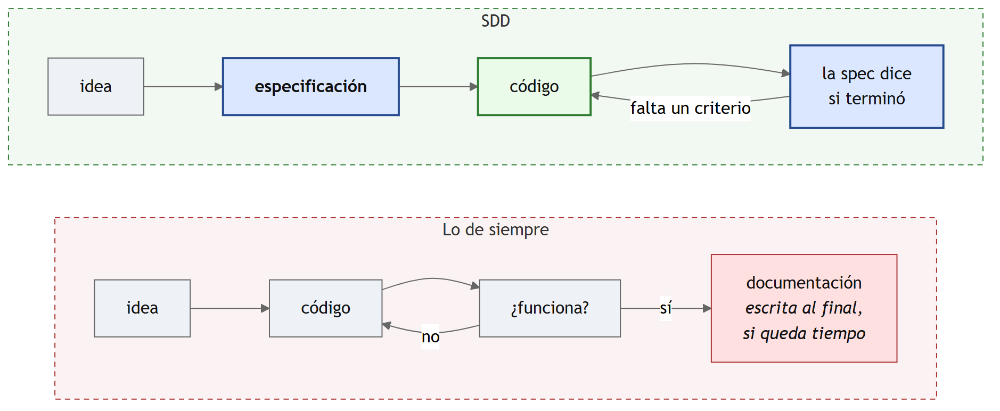
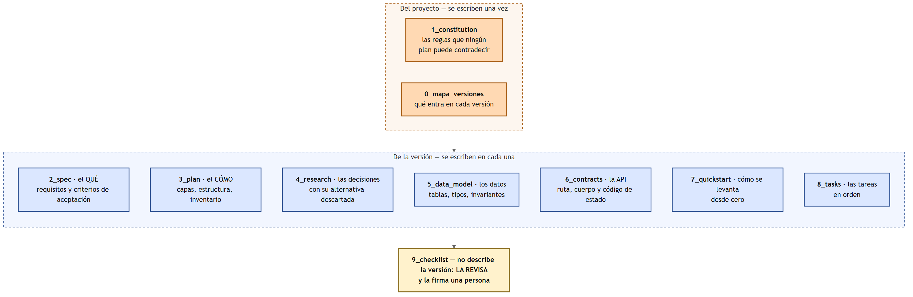
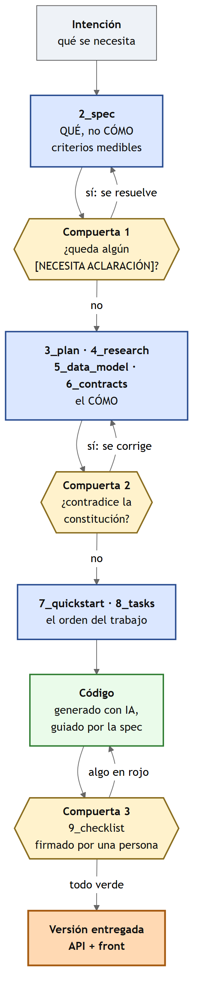

# Plan de Desarrollo de Software

## Recolección de residuos electrónicos (RAEE)

**Institución Universitaria ITM**
**Tecnología en Desarrollo de Software — Aplicación y Servicios Web**

| | |
|---|---|
| **Proyecto** | Recolección de residuos electrónicos (RAEE) |
| **Documento** | Plan de Desarrollo de Software |
| **Versión** | 1.0 |
| **Fecha** | 11 de septiembre de 2026 |

---

## Historial de revisiones

| Fecha | Versión | Descripción | Autor |
|---|---|---|---|
| 11-09-2026 | 1.0 | Primera versión del plan de desarrollo | Carlos Arturo Castro Castro |

---

## Tabla de contenido

1. Introducción — propósito, alcance, resumen
2. Vista general del proyecto — objetivos, suposiciones y restricciones, entregables
3. Organización del proyecto — participantes, roles y responsabilidades
4. Gestión del proceso — plan de fases, calendario, seguimiento
5. **La metodología: SDD con Spec Kit** — los nueve documentos y las tres compuertas
6. Referencias

---

## 1. Introducción

### a. Propósito

Este documento describe **cómo se va a construir** el sistema de recolección
de residuos electrónicos: qué se entrega, en qué orden, quién responde por cada
cosa y cómo se sabe que una versión terminó.

No describe el sistema —eso está en el enunciado y en las historias de
usuario—: describe **el trabajo**.

### b. Alcance

Cubre la construcción del sistema completo, repartida en versiones. La
**versión 1**, que es la que se construye en esta evaluación, cubre las
tres entidades que no dependen de ninguna otra —`tipo_residuo`,
`gestor` y `ciudadano`— **con su front**.

Las cuatro entidades restantes —`punto_acopio`, `contenedor`, `entrega` y
`detalle_entrega`— quedan para versiones posteriores, y su orden lo define
quien construye, en su mapa de versiones.

### c. Resumen

El sistema se construye con **desarrollo guiado por especificación**
(SDD): antes de escribir código se escribe la especificación de la
versión, se revisa contra la constitución del proyecto, y solo entonces se
programa. El código se genera con ayuda de una IA; **la especificación
no**.

---

## 2. Vista general del proyecto

### a. Propósito, alcance y objetivos

**El problema.** En Medellín se botan cada mes toneladas de aparatos
eléctricos y electrónicos. Hay gestores autorizados que operan puntos de
acopio, pero cada uno lleva sus cuentas en papel: nadie sabe cuántos kilos
se recogieron, de qué tipo, ni en cuál punto — y sin ese dato no se puede
demostrar ante la autoridad ambiental que el material se recuperó.

**Objetivos del sistema:**

| # | Objetivo | Cómo se sabe que se cumplió |
|---|---|---|
| 1 | Registrar los tipos de residuo, los gestores y los ciudadanos | Los tres CRUD responden con sus códigos de estado correctos |
| 2 | Mostrarlo en una pantalla usable | El listado y el formulario funcionan desde el navegador |
| 3 | No perder información | Nada se borra físicamente: `activo` en todas las tablas |
| 4 | Poder crecer | Cada versión agrega entidades sin reescribir las anteriores |

### b. Suposiciones y restricciones

**Suposiciones**

1. El esquema de la base **viene dado** y no se rediseña.
2. Los datos de ejemplo son inventados y sirven para probar, no para
   informar.
3. Quien construye tiene Docker Desktop, Git y un editor.

**Restricciones**

| # | Restricción | Por qué |
|---|---|---|
| R1 | El borrado es **lógico**, siempre | Los informes de facturación necesitan el histórico |
| R2 | Toda consulta SQL va **parametrizada** | Ningún dato del cliente se concatena a una consulta |
| R3 | La API es **específica por recurso** — `/api/gestores`, no `/api/{tabla}` | Una ruta genérica no se puede documentar ni versionar |
| R4 | Cada versión **incluye su front** | Una versión que el usuario no puede ver no es una versión |
| R5 | El front **no** habla con la base de datos | Es la separación que sostiene todo lo demás |
| R7 | **Cada versión tiene su front y su propio spec kit**; la constitución es una sola | Una versión sin pantalla no se puede mostrar |
| R6 | Todo levanta con **un solo comando** | Si armarlo es difícil, nadie lo va a probar |

### c. Entregables del proyecto

| # | Entregable | Descripción |
|---|---|---|
| 1 | **Plan de desarrollo de software** | Este documento |
| 2 | **Historias de usuario** | Lo que cada usuario necesita, con sus criterios de aceptación |
| 3 | **Cronograma** | Entregables, responsables, horas estimadas y reales |
| 4 | **Modelo de datos** | MER (Chen), modelo relacional normalizado y script de la base |
| 5 | **Spec kit de cada versión** | `1_constitution`, `0_mapa_versiones`, `2_spec` … `8_tasks` y `9_checklist` |
| 6 | **El software funcionando** | API + front + base, en contenedores |
| 7 | **Las pruebas** | Al menos una que verifique de verdad |

### d. Evolución de este plan

Este plan se actualiza al cerrar cada versión. Si una restricción tiene
que cambiar, **no se cambia aquí primero**: se propone en el
`4_research.md` de la versión que la necesita, y desde ahí sube.

---

## 3. Organización del proyecto

### a. Participantes

| Rol | Quién | Qué hace |
|---|---|---|
| **Cliente** | Coordinación ambiental del programa RAEE | Aprueba las historias y los criterios de aceptación |
| **Responsable del desarrollo** | El estudiante | Escribe la especificación, construye y responde |
| **Revisor** | El profesor del curso | Revisa la especificación y el resultado |

### b. Interfaces externas

Ninguna en la versión 1. El sistema no se conecta todavía con pasarelas de
pago ni con los cargadores físicos.

### c. Roles y responsabilidades

| Responsabilidad | De quién es |
|---|---|
| Escribir la especificación antes del código | Del responsable del desarrollo |
| Marcar lo que el material no dice | Del responsable del desarrollo |
| Firmar la lista de chequeo | De **una persona**, no de un guion |
| Aceptar o rechazar una versión | Del revisor |

---

## 4. Gestión del proceso

### a. Plan de las fases

| Fase | Qué pasa | Termina cuando |
|---|---|---|
| **Inicio** | Se lee el problema, el modelo y las historias; se marcan las dudas | No queda ningún `[NECESITA ACLARACIÓN]` sin resolver |
| **Elaboración** | Se escribe el spec kit de la versión y se revisa contra la constitución | El chequeo de constitución pasa |
| **Construcción** | Se programa la API, el front y las pruebas | Los criterios de aceptación se cumplen, uno por uno |
| **Transición** | Se cierra: quickstart probado desde cero y lista de chequeo firmada | El `9_checklist.md` está firmado |

**Las tres compuertas**, que son lo que separa una fase de la siguiente:

1. Antes de programar: ningún `[NECESITA ACLARACIÓN]` sin resolver.
2. Antes de programar: chequeo contra la constitución.
3. Al cerrar: lista de chequeo firmada por una persona.

### b. Calendario de la versión 1

La versión 1 se construye en **dos horas**. El detalle, entregable por
entregable, está en `CRONOGRAMA.xlsx`.

| Bloque | Fases del `8_tasks.md` | Commits esperados |
|---|---|---|
| **0 – 30 min** | Lectura, aclaraciones, spec kit y **Fase 0** | 2 |
| **30 – 70 min** | **Fases 1 a 5** — la API de los tres recursos | 5 |
| **70 – 100 min** | **Fases 6 y 7** — front y un solo comando | 2 |
| **100 – 120 min** | **Fase 8** — checklist firmado y respuestas | 1 |

Nueve commits en dos horas: **uno cada trece minutos**, más los de
corrección.

### c. Seguimiento y control

El seguimiento es **el historial de Git**, y en este proyecto es además un
criterio de calificación:

- **Un commit por cada fase** del `8_tasks.md`, con el mensaje empezando
  por `Fase N — …`.
- **Ninguna fase se cierra sin probarla.** Cuando la comprobación falla,
  se corrige y se comitea: `Fase N (corrección) — …`, diciendo qué
  respondió el sistema.
- **No hay que quedarse atascado**: se comitea lo que hay marcándolo como
  parcial, se sigue, y se vuelve después con su commit de corrección.
- El orden de los commits muestra si la especificación fue antes que el
  código, y si las capas se construyeron de abajo hacia arriba.

**Un historial con correcciones vale más que uno impecable.**

**El control de calidad** son los criterios de aceptación de las historias
de usuario: cada uno es una afirmación que se puede probar. Si un criterio
no se puede probar, está mal escrito y se devuelve.

---

## 5. La metodología: SDD con Spec Kit

### a. Qué es, en una frase

**Desarrollo guiado por especificación** (*Spec-Driven Development*, SDD)
significa que **la especificación se escribe primero y manda**: el código
sale de ella, no al revés, y la especificación es la que dice cuándo la
versión terminó.

Suena obvio, y sin embargo casi nunca se hace. Lo normal es lo de la
izquierda:

En el camino de la izquierda, la documentación se escribe al final —si
queda tiempo—, y por eso siempre miente un poco. En el de la derecha, el
documento **es el que manda**: si un criterio de aceptación no se cumple,
la versión no terminó, así el programa se vea bien.

### b. Por qué importa ahora más que antes

Porque el código lo genera una IA en minutos. Cuando escribir el código
era lo caro, la especificación parecía un lujo. Ahora que **el código es
barato**, lo caro es **saber qué pedir** — y una IA a la que se le pide mal
produce, rapidísimo, algo que no sirve.

La especificación es el sitio donde queda escrito qué se pidió, qué se
decidió y por qué. Ese es el trabajo que no se delega.

### c. Los nueve documentos

El *spec kit* de este curso son nueve documentos: dos del proyecto, que se
escriben una vez, y siete de cada versión.

| Documento | Responde a |
|---|---|
| `1_constitution` | ¿Qué reglas no puede violar **ningún** plan? |
| `0_mapa_versiones` | ¿Qué entra en cada versión y qué se aplaza? |
| `2_spec` | **¿QUÉ** tiene que hacer esta versión? Con criterios medibles |
| `3_plan` | **¿CÓMO** se organiza? Capas, estructura, inventario de archivos |
| `4_research` | ¿Qué se decidió, **qué se descartó** y por qué? |
| `5_data_model` | ¿Qué datos toca, con qué tipos y qué reglas? |
| `6_contracts` | ¿Qué ruta, qué cuerpo y qué **código de estado** devuelve cada endpoint? |
| `7_quickstart` | ¿Cómo se levanta esto desde cero? |
| `8_tasks` | ¿En qué **orden** se hace? |
| `9_checklist` | **No describe la versión: la revisa.** Y la firma una persona |

> El `9_checklist` es el único que no se le entrega a la IA junto con los
> demás. Su trabajo es revisar lo que los otros dicen; si lo escribe quien
> los escribió, no revisa nada.

### d. El ciclo y sus tres compuertas

Una compuerta es un punto donde **el trabajo no avanza** hasta que algo se
cumple. Son tres, y son lo que diferencia esta metodología de escribir
documentos por escribirlos:

| # | Compuerta | Cuándo | Qué pregunta |
|---|---|---|---|
| **1** | Aclaraciones | Antes de programar | ¿Queda algún `[NECESITA ACLARACIÓN]` sin resolver? |
| **2** | Constitución | Antes de programar | ¿Este plan contradice alguna regla del proyecto? |
| **3** | Lista de chequeo | Al cerrar | ¿Una **persona** revisó y firmó? |

**El marcador `[NECESITA ACLARACIÓN]` es el corazón del método.** Cuando el
material no dice algo —o lo dice de dos maneras distintas— hay dos
caminos: rellenar el hueco a ojo y seguir, o **marcarlo** y resolverlo.
El primero es el que produce sistemas que hacen algo parecido a lo que se
pedía. Una IA, dejada sola, siempre toma el primero: rellena el hueco con
lo más probable y sigue de largo, sin avisar.

### e. Qué hace la IA y qué no

| Lo hace la IA | No lo hace la IA |
|---|---|
| Escribir el código a partir del `2_spec` y el `6_contracts` | Decidir qué se especifica |
| Proponer alternativas para el `4_research` | Escoger, y responder por la escogida |
| Redactar borradores de los documentos | Detectar que el material se contradice |
| Explicar un error | Firmar el `9_checklist` |

Por eso los proyectos del curso traen una `GUIA_IA` en cada versión: el
prompt exacto, con los documentos que se le entregan. **La IA se usa; no
se le entrega el criterio.**

### f. De dónde sale esto

La idea es vieja —una especificación con criterios verificables es lo que
proponen las normas de requisitos desde hace décadas— y volvió al centro
con la programación asistida por IA. La herramienta que popularizó el
nombre es **GitHub Spec Kit**, que automatiza con comandos
(`/speckit.specify`, `/speckit.plan`, `/speckit.tasks`,
`/speckit.checklist`) lo que en este curso se hace **a mano y a
propósito**: aquí interesa que usted entienda para qué sirve cada
documento, no que un comando se los genere.

Ver las referencias, al final.

---

## 6. Referencias

**De la metodología**

1. GitHub. *Spec Kit — Toolkit to help you get started with
   Spec-Driven Development*. Repositorio en
   `https://github.com/github/spec-kit`. Es la herramienta que popularizó
   el nombre y de donde salen los comandos `/speckit.*`.
2. Adzic, Gojko. *Specification by Example: How Successful Teams Deliver
   the Right Software*. Manning, 2011. La idea de que los ejemplos
   concretos son la especificación, y no un adorno de ella.
3. ISO/IEC/IEEE 29148:2018, *Systems and software engineering — Life
   cycle processes — Requirements engineering*. La norma vigente sobre
   requisitos; reemplazó a la IEEE 830-1998. De ahí viene la exigencia de
   que un requisito sea **verificable**.
4. Cohn, Mike. *User Stories Applied: For Agile Software Development*.
   Addison-Wesley, 2004. El formato de las historias de usuario que usa
   este proyecto.

**Del curso**

5. `SDD_SPECKIT.md` — la metodología, explicada sobre el proyecto del
   semestre. **Es la referencia principal**, y está en la carpeta `docs/`
   de cualquiera de las plantillas del curso.
6. `SOLID_CAPAS_PATRONES.md`, `PARADIGMA_POO.md`,
   `PROGRAMACION_ASINCRONICA.md`, `PRINCIPIOS_ACID.md` y
   `CALIDAD_DE_PRUEBAS.md`, en la misma carpeta.
7. Plantillas de las que puede partir: `proyecto_investigacion1`,
   `proyecto_innovacion_curricular1`, `proyecto_mapa_conocimiento1`,
   `proyecto_gestion_profesoral1` y `proyecto_aplicacion_y_servicios_web1`.

**De esta evaluación**

8. Enunciado: «Evaluación individual — Aplicación y Servicios Web».
9. «Historias de usuario — Recolección de residuos electrónicos», v1.0.
10. «Cronograma — Recolección de residuos electrónicos», versión 1
    (`CRONOGRAMA.xlsx`).
