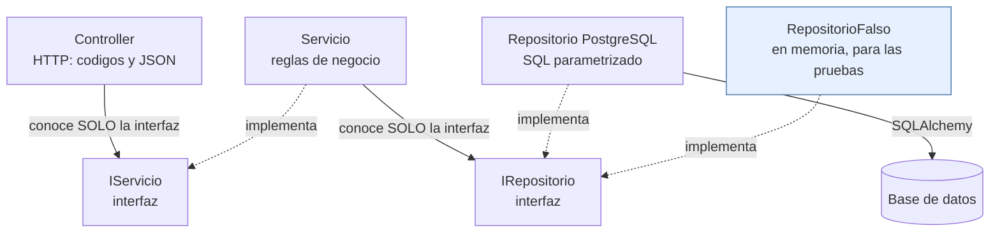

# Constitución del proyecto — Módulo Mapa de Conocimiento

> **Documento permanente.** Estas reglas rigen TODAS las versiones del
> proyecto. Cada versión tiene además su propia especificación en
> [versiones/](versiones/0_mapa_versiones.md); ante conflicto, la
> constitución gana.
>
> Este proyecto es el **ejemplo de referencia** del módulo Mapa de Conocimiento
> de los proyectos de aula. El QUÉ del módulo está en
> [modulo_mapa_conocimiento.md](../../ProyectosDeAula/docs/modulo_mapa_conocimiento.md)
> y el CÓMO se trabaja, en
> [0_METODOLOGIA.md](../../ProyectosDeAula/docs/0_METODOLOGIA.md).

---

## Artículo 1 — El proyecto se construye POR VERSIONES y la especificación manda

- El sistema crece por **versiones incrementales** (v1, v2, …), cada una
  con su spec kit propio. Una versión está TERMINADA solo cuando pasa sus
  criterios de aceptación; entonces se hace commit, **tag** (`v1`, `v2`…)
  y solo después se escribe la spec de la siguiente.
- **No se anticipa** (**YAGNI**, *You Aren't Gonna Need It* — "no lo vas a
  necesitar"): nada de JWT en la v1, ni dashboard en la v2, ni tablas de
  más antes de la versión que las pida. El código de cada versión solo
  puede nombrar lo que su spec nombra.
- **Cerrado es cerrado:** una versión con tag no se reabre; los ajustes van
  a la siguiente.
- Si el código hace algo que la spec no dice, sobra; si la spec pide algo
  que el código no hace, falta.

## Artículo 2 — Stack: Python y FastAPI, con el SQL a la vista

- Lenguaje **Python 3.12** sobre **FastAPI**: controladores con
  `APIRouter`, y **Pydantic** como frontera de entrada — los cuerpos se
  DECLARAN, no se validan con `if`.
- **No se usa un ORM.** El SQL se escribe a mano, queda a la vista y
  **siempre** va parametrizado con `:parametro` (jamás concatenando
  valores). El ejecutor es **SQLAlchemy en modo Core**, con `text()`: sirve
  de puente asíncrono al motor, pero **no genera SQL por nosotros**.
- Dependencias: `fastapi`, `uvicorn`, `sqlalchemy[asyncio]`, `asyncpg`,
  `greenlet` y `pydantic`. Nada más.
- La documentación interactiva la genera FastAPI sola en `/docs`.

> **Por qué sin ORM.** Un ORM escribiría el SQL por nosotros, y el punto del
> curso es justamente **ver ese SQL**. Lo que se pierde —migraciones,
> mapeo de relaciones— no hace falta aquí: la base viene dada (Artículo 5).

## Artículo 3 — Arquitectura en tres capas con interfaces, desde el día 1

```
HTTP → Controller (valida el body contra la PETICIÓN del verbo → 422)
     → IServicio<Entidad>       (interfaz — reglas de negocio)
     → IRepositorio<Entidad>    (interfaz — el servicio no sabe qué motor hay)
     → Repositorio<Entidad>PostgreSQL  (SQLAlchemy, SQL a mano parametrizado)
     → la base de datos
```

- El controlador no toca SQL; el servicio no conoce HTTP ni el motor; el
  repositorio no conoce HTTP. Los contratos entre capas son `interface`
  de Python.
- **Solo el ensamblador** (el registro de dependencias en `main.py`)
  conoce clases concretas. Todo lo demás recibe interfaces por
  constructor.
- El negocio comunica problemas con **excepciones**
  (`ArgumentException` → 400 · `NoEncontradoExcepcion` → 404) y el
  controlador las traduce a HTTP.

**La regla, dibujada.** Las flechas son las ÚNICAS dependencias
permitidas: cruzar capas o saltárselas viola la constitución.



Fíjese en el repositorio falso: como el servicio solo conoce la interfaz,
se le puede enchufar uno de mentiras y probarlo **sin base de datos**. Esa
prueba es un criterio de aceptación, no un adorno.

## Artículo 4 — Un solo comando

`docker compose up -d --build` deja TODO el sistema de la versión
funcionando, desde la primera versión. Sin pasos manuales y sin instalar
nada local más allá de Docker. El código va montado como volumen y corre
con `uvicorn --reload`: guardar un `.py` recompila y reinicia solo.

## Artículo 5 — La base de datos viene DADA

- La base `mapa_local` se crea **completa, con sus 21 tablas**, desde
  la v1, a partir del script provisto en `db/`. Se copia, no se genera.
- Los datos de los catálogos salen del Excel de referencia del módulo.
- Lo que crece por versiones es **la API**, no la base. El código de cada
  versión solo puede nombrar las tablas que su spec le permite.

## Artículo 6 — Borrado LÓGICO, siempre

- `DELETE` **nunca** borra la fila: marca `activo = FALSE`.
- Todos los listados **filtran los inactivos** por defecto.
- Toda tabla del módulo tiene su columna `activo BOOLEAN NOT NULL DEFAULT TRUE`.

Es regla de la metodología del proyecto de aula y de su rúbrica: un
borrado físico reprueba el criterio.

## Artículo 7 — Los secretos van en variables de entorno

**La regla del proyecto de aula:** ningún secreto —cadena de conexión,
contraseña de la base, secreto de firma del JWT— va escrito en el código
ni en archivos versionados. Van en **variables de entorno**, con el `.env`
fuera de git y un `.env.example` adentro. En la rúbrica, un secreto
quemado **anula el criterio de seguridad de la versión**.

**Y este proyecto es la excepción, declarada.** Aquí la contraseña de SQL
Server está escrita en **dos archivos versionados**, a propósito:

- el `docker-compose.yml`, que se la entrega a los contenedores;
- el `las variables del compose`, en la cadena de desarrollo — la que permite
  correr la API sin Docker. En Docker esa cadena la sobreescribe la
  variable de entorno, así que el valor del archivo solo sirve fuera.

Está así porque este repositorio es una **plantilla didáctica**: corre en
contenedores de juguete que se borran con `docker compose down -v`, nunca
se despliega, y su gracia es que un `git clone` y **un solo comando**
basten sin configurar nada antes.

Y conviene ver el precio de la excepción: **una contraseña repartida en dos
archivos es una contraseña que ya nadie sabe dónde está.** Con dos son
cuatro sitios donde cambiarla; con un `.env`, uno solo. Eso es
exactamente lo que se gana al hacerlo bien.

**¿Y cómo sabe la contraseña quien clone esto?** Para *correr* el sistema
no la necesita: el compose se la entrega a los contenedores y basta con
`docker compose up -d --build`. Solo hace falta para conectarse **por
fuera** —con SSMS o SQLTools contra `localhost:15460`— y entonces se lee
del `docker-compose.yml`, que está en el repositorio. El
`7_quickstart.md` y el `README.md` señalan dónde.

> **Esa parte NO se copia.** El proyecto de aula se publica en un servidor
> real en la v4: ahí la regla va completa desde la v1. De este ejemplo se
> copia el método, no las credenciales.

## Artículo 8 — Todo en español, y el código sustenta sus decisiones

- Nombres, rutas, mensajes, comentarios y documentación: **en español**.
- Los comentarios explican **por qué** está hecho así —la decisión y su
  consecuencia—, no qué hace cada palabra del lenguaje. Un comentario que
  repite la línea de abajo sobra; uno que explica por qué el repositorio
  no conoce HTTP, no.
- Se prefiere lo explícito sobre la metaproyectoción compacta, y no por
  didáctica: este código se revisa en Pull Requests y se sustenta
  oralmente, así que tiene que poder leerse sin descifrarlo.

## Artículo 9 — Contratos exactos

Los endpoints, formatos y códigos de estado de cada versión están en su
`6_contracts.md` y se cumplen **al pie de la letra** — incluido el
contraste didáctico `PUT` (reemplazo completo → 422 si falta un campo) vs
`PATCH` (parcial → 200 con el mismo cuerpo). El error también es contrato:
un 404 o un 422 tienen su formato exacto documentado.

## Artículo 10 — Convenciones fijas

| Cosa | Convención |
|---|---|
| Nombres de contenedor | Llevan el prefijo `paradigmas-mapa-`: los nombres, como los puertos, **no se repiten** entre proyectos |
| Puertos del proyecto | API **8031** · PostgreSQL **15460** · (reservado: front **8077** para la v4) |
| Base de datos | `mapa_local` |
| Rutas | `/` (diagnóstico) · `/docs` (documentación interactiva) · `/api/{tabla}` |
| Nombres | snake_case en español; interfaces con prefijo `I`; carpetas `controllers/ models/ models/ servicios/ repositorios/ excepciones/ pruebas/` (`models/` = clases entidad; `models/` = el cuerpo de cada verbo) |
| Sobre de respuesta | Lecturas: `{tabla, limite, total, datos}` · Errores: `{estado, mensaje, detalle}` (+ `errores:[…]` en el 422) |
| Errores | Cuerpo inválido (la petición) → **422** · `ArgumentException` → **400** · `NoEncontradoExcepcion` → **404** · `SqlException` y demás → **500** · lectura sin filas → **204** |
| Credenciales | Usuario `sa`. **La contraseña no se escribe en este documento:** en esta plantilla vive en el `docker-compose.yml` y en un proyecto real, en el `.env` (Artículo 7) |

## Artículo 11 — Cómo se enmienda esta constitución

Una regla se cambia **solo** así: se propone en el `4_research.md` de la
versión que la necesita, con su razón y sus consecuencias; si se acepta,
esta constitución **sube de versión** y se anota la fecha de enmienda. No
se corrige "de una" ni se deja pasar por excepción: si un plan la viola,
o se corrige el plan, o se enmienda esto.

---

*Versión 1.0.0 · Ratificada el 2026-08-29 · Última enmienda: ninguna*
