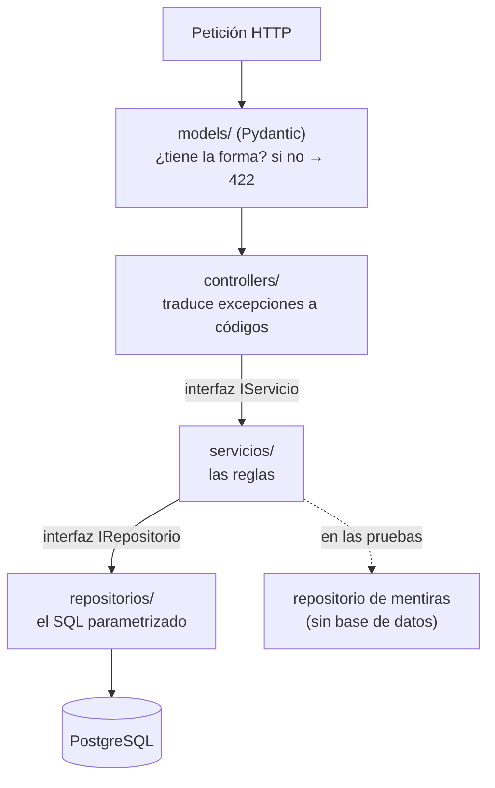

# Plan — Versión 1: cómo se arma la API

> **Versión 1** ([mapa](../0_mapa_versiones.md)) · Rige la
> [constitución](../../1_constitution.md).
>
> | Documento | Contenido |
> |---|---|
> | [2_spec.md](2_spec.md) | QUÉ construir y los criterios de aceptación |
> | [3_plan.md](3_plan.md) | CÓMO: el stack, las capas y sus decisiones |
> | [4_research.md](4_research.md) | Las decisiones, con lo que se descartó |
> | [5_data_model.md](5_data_model.md) | La tabla, sus semillas y quién escribe qué |
> | [6_contracts.md](6_contracts.md) | Los 7 endpoints exactos |
> | [7_quickstart.md](7_quickstart.md) | Arranque y smoke test |
> | [8_tasks.md](8_tasks.md) | El orden de construcción por fases |
> | [9_checklist.md](9_checklist.md) | La compuerta 3: se firma ANTES de programar |
> | [GUIA_IA1.md](GUIA_IA1.md) | Construirla con ayuda de una IA |

---

## 1. El stack, y por qué

| Pieza | Qué se usa | Por qué |
|---|---|---|
| Lenguaje | **Python 3.12** | El del curso |
| Web | **FastAPI** | Los cuerpos se **declaran** con Pydantic, y el 422 sale solo |
| Acceso a datos | **SQLAlchemy Core** (`text()`) | Un **ejecutor**, no un ORM: el SQL se escribe a mano y se lee |
| Motor | **PostgreSQL 16** | El de la serie de paradigmas |
| Documentación | **`/docs`**, de FastAPI | No se instala nada |
| Todo junto | **`docker compose`** | Un solo comando (Artículo 4) |

> **Por qué SIN ORM.** Un ORM escribiría el SQL por nosotros, y ver ese SQL
> es justamente el punto. Con `text()` la consulta está en el repositorio,
> se lee, se copia a un cliente de base de datos y se ejecuta igual. Lo que
> se pierde —migraciones, mapeo de relaciones— **no hace falta**: la base
> viene dada (Artículo 5).

## 2. La estructura

```
api_mapa/
├── main.py                     arma la app y registra el router. Nada más
├── controllers/                CAPA 1 — HTTP: códigos de estado y JSON
│   └── proyecto_controller.py
├── models/                     LA FRONTERA: Pydantic valida el cuerpo → 422
│   └── proyecto.py
├── servicios/                  CAPA 2 — negocio: no conoce HTTP ni el motor
│   ├── abstracciones/          la interfaz que la capa 1 conoce
│   ├── servicio_proyecto.py
│   └── ensamblador.py          el ÚNICO sitio que decide el motor
├── repositorios/               CAPA 3 — datos: el SQL a mano
│   ├── abstracciones/          la interfaz que la capa 2 conoce
│   └── repositorio_proyecto_postgresql.py
├── pruebas/                    el servicio con un repositorio de mentiras
├── requirements.txt
└── Dockerfile
```



## 3. Las decisiones de diseño

### 3.1 Un modelo por verbo, no uno para todo

`AreaConocimiento` (POST), `AreaConocimientoReemplazo` (PUT) y
`AreaConocimientoActualizar` (PATCH) son **tres clases**, no una con banderas.

La diferencia entre PUT y PATCH **no la decide un `if` en el servicio: la
decide el tipo**. En `Reemplazo` los tres campos son obligatorios; en
`Actualizar` los tres son opcionales. El mismo cuerpo responde 422 en uno y
200 en el otro, y no hay una línea de código que lo compare.

### 3.2 El 422 no se programa: se declara

```python
gran_area: str = Field(min_length=1, max_length=60)
```

Eso es todo. Si el cuerpo no cumple, FastAPI responde 422 **antes** de que el
controlador se entere. No hay validación a mano en ninguna capa — y por eso
no puede quedar desactualizada respecto al modelo.

### 3.3 Las dos interfaces, y para qué sirven de verdad

`IServicioAreaConocimiento` e `IRepositorioAreaConocimiento` son `Protocol`
de Python. **No las obliga el lenguaje**: Python no exige declararlas.

Sirven para algo comprobable: el servicio depende de la **interfaz** del
repositorio, así que en `pruebas/prueba_capas.py` se le enchufa un
repositorio que guarda en una lista, y **la prueba pasa con PostgreSQL
apagado**. Si el servicio conociera la clase concreta, eso sería imposible.

### 3.4 El servicio no sabe qué es un 404

Comunica los problemas con excepciones del lenguaje:

| El servicio lanza | El controlador responde |
|---|---|
| `ValueError` | **400** — la forma es válida, la regla no se cumple |
| `LookupError` | **404** |
| cualquier otra | **500** |

Que el servicio hablara de códigos HTTP lo ataría a la web, y dejaría de
poder usarse desde otro sitio.

### 3.5 El PATCH compone la consulta, y por qué eso NO es inyección

```python
asignaciones = ", ".join(f"{columna} = :{columna}" for columna in datos)
```

Lo que se compone son **nombres de columna**, y esas llaves vienen de un
modelo Pydantic —una lista cerrada, escrita por nosotros—, **no del
usuario**. Los **valores** siempre viajan como `:parametro`. Si las llaves
vinieran de lo que alguien mandó, esto sí sería una puerta abierta.

### 3.6 El borrado lógico, en una sola consulta

```sql
UPDATE proyecto SET activo = FALSE
WHERE id = :id AND activo = TRUE
```

Cero filas afectadas significa **"no existe o ya estaba inactiva"**, y eso es
exactamente el 404 del contrato. No hace falta consultar antes para saber si
existe: la condición ya lo pregunta.

### 3.7 `activo` es BOOLEAN, no BIT

El script del curso venía de otro dialecto. Aquí el tipo del motor es
`BOOLEAN`, y se usa `TRUE`/`FALSE`. **Calcar el tipo de otro motor porque
"así estaba" es cómo se acumulan las rarezas** que después nadie sabe
explicar.

### 3.8 El ensamblador: un solo sitio decide el motor

`crear_servicio_proyecto()` arma el servicio con su repositorio.
Los controladores lo llaman y no saben qué hay detrás. Hoy hay un motor; el
día que entre un segundo, **este archivo es el único que cambia**.

## 4. Chequeo de constitución

> **La compuerta 2** del método: antes de programar, cada artículo se revisa
> contra este plan.

| Artículo | ¿Se respeta? | Cómo |
|---|---|---|
| 1 — Por versiones, la spec manda | ✅ | Solo `proyecto`; las otras 18 tablas no se nombran |
| 2 — Python, FastAPI y el SQL a la vista | ✅ | `text()` con `:parametro`, sin ORM |
| 3 — Tres capas con interfaces | ✅ | Y se comprueba: la prueba corre sin base de datos |
| 4 — Un solo comando | ✅ | `docker compose up -d --build` |
| 5 — La base viene dada | ✅ | Las 19 tablas se crean completas; la API usa una |
| 6 — Borrado lógico | ✅ | `activo = FALSE`, y los listados filtran |
| 7 — Secretos en variables de entorno | ✅ | `DB_POSTGRES` en el compose (la excepción declarada) |
| 8 — Todo en español | ✅ | Salvo los mensajes de Pydantic, que los escribe el framework |
| 9 — Contratos exactos | ✅ | [6_contracts](6_contracts.md) escrito contra lo que responde |
| 10 — Convenciones fijas | ✅ | La ruta nombra la tabla; el JSON usa `snake_case` |

**Ningún artículo obliga a cambiar el plan.** La compuerta pasa.

---

## El stack del FRONT

| Pieza | Elección | Por qué |
|---|---|---|
| Front | **Flask 3 + Jinja2**, Python 3.12 | La plantilla se renderiza **en el servidor** y el navegador recibe HTML ya armado: quien llama a la API es el proceso del front, no el navegador |
| Cómo habla con la API | **`requests`** y JSON, nada más | Sin biblioteca compartida, sin `import` de la API, sin paquete común |
| Estilos | **CSS escrito a mano** | Cero dependencias. Un front que necesita internet para verse bien no arranca en un salón sin red |
| Puerto | **8079** | Registrado en `PUERTOS.md`, sin chocar con nadie |

> **Aquí la separación hay que cuidarla, porque nada la impone.** La API está
> en Python y el front también: un `sys.path.append("../api_mapa")` bastaría para
> importar sus modelos, y funcionaría.
>
> Por eso lo que se verifica no es el lenguaje, sino tres hechos: el front no
> tiene el driver de PostgreSQL, su servicio no depende de la base, y con la
> API apagada la pantalla queda en pie sin un solo dato.

**Una función por operación, no una genérica.** `cliente_api.py` tiene seis
funciones con nombre —`listar_proyectos`, `obtener_proyecto`, `crear_proyecto`,
`reemplazar_proyecto`, `actualizar_proyecto`, `eliminar_proyecto`— y sabe de una sola tabla.
Cuando lleguen más recursos habrá más funciones, no un `listar(recurso)`: es
la sección 6.1 de la metodología del curso, aplicada del lado del front.

**Y una pieza que este stack sí necesita:** FastAPI reporta sus errores de
validación en inglés y con el nombre de la columna. Eso está bien en la
documentación de la API y está mal delante de un usuario, así que
`cliente_api.py` los traduce, en un solo sitio.

### Las carpetas del front

```
front_flask/
├── app.py                       las vistas: ruta → pantalla. Nada más
├── cliente_api.py               la capa de datos del front: lo ÚNICO que habla HTTP
├── requirements.txt             Flask y requests. NO hay driver de base de datos
├── Dockerfile                   python:3.12-slim, sin asyncpg
├── templates/
│   ├── base.html                el marco y el menú
│   ├── inicio.html
│   └── proyectos/               lista.html y formulario.html
└── static/estilos.css           los estilos, escritos a mano
```

**Que en el `requirements.txt` no aparezca `asyncpg` no es un olvido: es la
comprobación** de que este proceso no puede llegar a PostgreSQL ni queriendo.
Son dos líneas —`flask` y `requests`— y las dos que faltan dicen más que las
dos que están.
