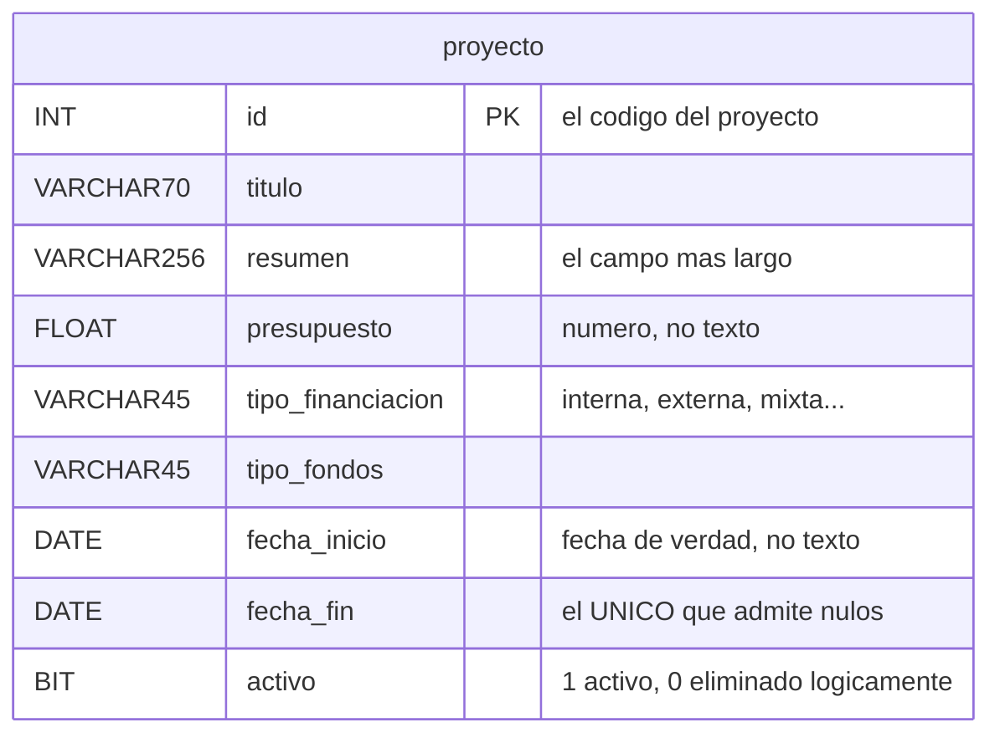

# Modelo de datos — Versión 1: la base dada y `proyecto`

## 1. La base viene completa; la v1 nombra una tabla

La base `mapa_local` se crea con sus **21 tablas** desde la primera versión
(Artículo 5): 18 del módulo y 3 de gestión de usuarios.

Lo que la v1 puede **nombrar en el código** es **una sola**: `proyecto`.

## 2. La tabla `proyecto`

| Columna | Tipo | Regla |
|---|---|---|
| `id` | `INT` | **PK** — el código del proyecto |
| `titulo` | `VARCHAR(70)` | No nulo |
| `resumen` | `VARCHAR(256)` | No nulo. El campo más largo de la tabla |
| `presupuesto` | `FLOAT` | No nulo. **Número, no texto** (C8) |
| `tipo_financiacion` | `VARCHAR(45)` | No nulo (interna, externa, mixta…) |
| `tipo_fondos` | `VARCHAR(45)` | No nulo |
| `fecha_inicio` | `DATE` | No nulo. **Fecha de verdad**, no texto |
| `fecha_fin` | `DATE` | **El único que admite nulos**: un proyecto en curso no ha terminado (C7) |
| `activo` | `BOOLEAN NOT NULL DEFAULT TRUE` | Borrado lógico (C4) |

**Esta es la tabla más rica en tipos de los cuatro módulos del curso**, y
por eso es la que mejor enseña que **el tipo también es regla**: un
`presupuesto` que llegue como `"mucho"` y una `fechaInicio` que llegue como
`"ayer"` son ambos **422**, y ninguno de los dos toca la base. Con una
tabla de puro texto eso no se puede demostrar.

## 3. Las semillas: ninguna, y a propósito

**`proyecto` arranca vacía**: el Excel de referencia no trae proyectos, y
no se inventan (C6).

Eso define el estado inicial y da forma al smoke test: el primer `GET`
responde **204**, y el recorrido completo corre desde cero en cualquier
máquina.

Los catálogos que **sí** vienen cargados, aunque la v1 no los nombre:

| Tabla | Filas |
|---|---|
| `area_conocimiento` | 218 |
| `area_aplicacion` | 21 |
| `objetivo_desarrollo_sostenible` | 17 |
| Todas las demás | 0 |

## 4. Invariantes: quién escribe qué

| Dato | Dueño | La API… |
|---|---|---|
| `id` | Quien crea el registro | Lo escribe **solo** en el `POST` |
| Los siete campos restantes | La API | Los escribe en `POST`, `PUT` y `PATCH` |
| `activo` | La API, pero **solo** por `DELETE` | **Tiene prohibido** recibirlo en el cuerpo |
| Las otras 20 tablas | Nadie, en la v1 | No las nombra |

## 5. Reglas de esta versión

1. Toda consulta va **parametrizada**.
2. Todo `SELECT` de listado lleva `WHERE activo = TRUE`.
3. La v1 no crea, altera ni borra objetos de la base.
